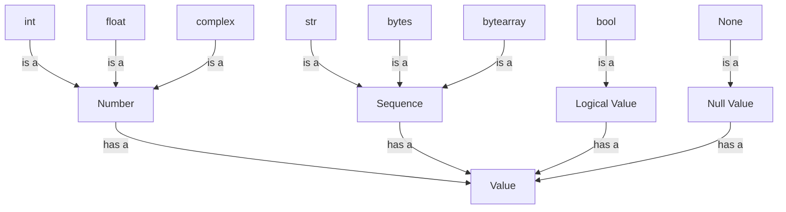

## Introduction
Python is a versatile and widely-used programming language that provides a variety of built-in **data types**. Understanding these data types is crucial for any aspiring Python developer, as they form the foundation of any Python program. In this section, we will delve into the world of Python data types, exploring their definitions, uses, and real-world applications.

Python's data types can be broadly categorized into several groups: **numeric types** (`int`, `float`, `complex`), **sequence types** (`str`, `bytes`, `bytearray`), **boolean type** (`bool`), and the **null type** (`None`). Each of these data types has its own unique characteristics, advantages, and use cases.

> **Note:** Python's dynamic typing system allows for flexible and efficient programming, but it also means that developers must be aware of the data types they are working with to avoid errors and ensure optimal performance.

## Core Concepts
Let's take a closer look at each of Python's built-in data types:

*   `int`: whole numbers, either positive, negative, or zero.
*   `float`: decimal numbers, which can be positive, negative, or zero.
*   `complex`: complex numbers, which have a real and imaginary part.
*   `str`: sequences of characters, such as words or sentences. Strings are immutable in Python.
*   `bytes`: sequences of integers in the range 0 <= x < 256, which can be used to represent binary data.
*   `bytearray`: mutable sequences of integers in the range 0 <= x < 256, which can be used to represent binary data.
*   `bool`: a logical value that can be either `True` or `False`.
*   `None`: a special value that represents the absence of a value.

> **Tip:** When working with Python's data types, it's essential to understand their **mutability**. Immutable data types, such as `str` and `tuple`, cannot be modified after creation, while mutable data types, such as `list` and `dict`, can be modified.

## How It Works Internally
Python's data types are implemented in C, which provides a high degree of flexibility and customization. When you create a variable in Python, you are essentially creating a reference to an object in memory. This object contains the actual data, as well as metadata such as the object's type and size.

For example, when you create an `int` variable, Python allocates a block of memory to store the integer value. The `int` object also contains metadata, such as the object's type and size, which is used by Python to manage the object's lifetime and behavior.

> **Warning:** Python's garbage collector automatically manages memory allocation and deallocation for you, but it's still important to understand how memory management works in Python to avoid common pitfalls such as memory leaks.

## Code Examples
Here are three complete and runnable code examples that demonstrate the use of Python's data types:

### Example 1: Basic Data Types
```python
# Create an integer variable
x = 5
print(type(x))  # Output: <class 'int'>

# Create a float variable
y = 3.14
print(type(y))  # Output: <class 'float'>

# Create a complex variable
z = 1 + 2j
print(type(z))  # Output: <class 'complex'>
```

### Example 2: String Manipulation
```python
# Create a string variable
s = "Hello, World!"
print(type(s))  # Output: <class 'str'>

# Use string methods to manipulate the string
print(s.upper())  # Output: HELLO, WORLD!
print(s.lower())  # Output: hello, world!
```

### Example 3: Boolean Logic
```python
# Create boolean variables
x = True
y = False

# Use boolean operators to perform logical operations
print(x and y)  # Output: False
print(x or y)   # Output: True
print(not x)    # Output: False
```

## Visual Diagram

This diagram illustrates the relationships between Python's built-in data types. The `int`, `float`, and `complex` types are all subclasses of the `Number` type, while the `str`, `bytes`, and `bytearray` types are all subclasses of the `Sequence` type. The `bool` type is a subclass of the `Logical Value` type, and the `None` type is a subclass of the `Null Value` type.

## Comparison
| Data Type | Description | Use Cases | Time Complexity | Space Complexity |
| --- | --- | --- | --- | --- |
| `int` | Whole numbers | Counting, indexing | O(1) | O(1) |
| `float` | Decimal numbers | Scientific computations, financial calculations | O(1) | O(1) |
| `complex` | Complex numbers | Scientific computations, signal processing | O(1) | O(1) |
| `str` | Sequences of characters | Text processing, data storage | O(n) | O(n) |
| `bytes` | Sequences of integers | Binary data storage, network communication | O(n) | O(n) |
| `bytearray` | Mutable sequences of integers | Binary data storage, network communication | O(n) | O(n) |
| `bool` | Logical values | Conditional statements, logical operations | O(1) | O(1) |
| `None` | Null value | Indicating absence of value, default values | O(1) | O(1) |

## Real-world Use Cases
Here are three real-world examples of using Python's data types:

1.  **Text Processing**: Python's `str` type is widely used in text processing applications, such as natural language processing, text analysis, and data mining. For example, the popular `NLTK` library uses Python's `str` type to represent text data.
2.  **Scientific Computing**: Python's `int`, `float`, and `complex` types are commonly used in scientific computing applications, such as numerical simulations, data analysis, and visualization. For example, the popular `NumPy` library uses Python's `int` and `float` types to represent numerical data.
3.  **Web Development**: Python's `str` type is widely used in web development applications, such as web scraping, data storage, and network communication. For example, the popular `Requests` library uses Python's `str` type to represent HTTP requests and responses.

## Common Pitfalls
Here are four common pitfalls to watch out for when working with Python's data types:

1.  **Type Confusion**: Failing to understand the differences between Python's data types can lead to type confusion errors. For example, attempting to add a `str` and an `int` together will result in a `TypeError`.
2.  **Mutation**: Failing to understand the mutability of Python's data types can lead to unexpected behavior. For example, modifying a `str` object after it has been created will result in a `TypeError`.
3.  **Encoding**: Failing to understand the encoding of Python's data types can lead to encoding errors. For example, attempting to read a `bytes` object as a `str` without specifying the encoding can result in a `UnicodeDecodeError`.
4.  **Null Values**: Failing to understand the use of `None` as a null value can lead to `NoneType` errors. For example, attempting to access an attribute of a `None` object will result in an `AttributeError`.

> **Interview:** What is the difference between `str` and `bytes` in Python? How would you convert a `str` to a `bytes` object?

## Interview Tips
Here are three common interview questions related to Python's data types, along with sample answers:

1.  **What is the difference between `int` and `float` in Python?**

    *   Weak answer: "Uh, I think `int` is for whole numbers and `float` is for decimal numbers?"
    *   Strong answer: "In Python, `int` represents whole numbers, while `float` represents decimal numbers. The main difference between the two is that `int` is an exact representation of a whole number, while `float` is an approximation of a decimal number due to the limitations of binary representation."
2.  **How would you convert a `str` to a `bytes` object in Python?**

    *   Weak answer: "Uh, I think you can just use the `bytes()` function?"
    *   Strong answer: "To convert a `str` to a `bytes` object in Python, you can use the `encode()` method, which returns a `bytes` object containing the encoded version of the string. For example, `my_str.encode('utf-8')` would return a `bytes` object containing the UTF-8 encoded version of the string."
3.  **What is the purpose of the `None` type in Python?**

    *   Weak answer: "Uh, I think it's just a null value or something?"
    *   Strong answer: "In Python, the `None` type is used to represent the absence of a value. It is commonly used as a default value for function arguments, as a return value for functions that do not return a value, and as a way to indicate that a variable has not been initialized. For example, `my_var = None` would set the value of `my_var` to `None`, indicating that it has not been initialized."

## Key Takeaways
Here are ten key takeaways to remember about Python's data types:

*   Python has several built-in data types, including `int`, `float`, `complex`, `str`, `bytes`, `bytearray`, `bool`, and `None`.
*   Each data type has its own unique characteristics, advantages, and use cases.
*   Understanding the differences between Python's data types is crucial for writing efficient and effective code.
*   Python's dynamic typing system allows for flexible and efficient programming, but it also means that developers must be aware of the data types they are working with to avoid errors and ensure optimal performance.
*   The `int`, `float`, and `complex` types are all subclasses of the `Number` type.
*   The `str`, `bytes`, and `bytearray` types are all subclasses of the `Sequence` type.
*   The `bool` type is a subclass of the `Logical Value` type.
*   The `None` type is a subclass of the `Null Value` type.
*   Python's data types have different time and space complexities, which can affect the performance of your code.
*   Understanding the mutability of Python's data types is essential for writing efficient and effective code.