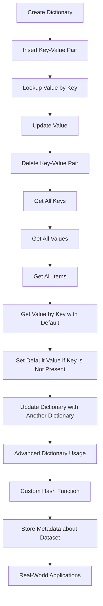

## Introduction
Dictionaries in Python are a fundamental data structure that stores mappings of unique keys to values. They are also known as associative arrays, hash tables, or maps. Dictionaries are essential in Python programming, and every engineer should understand how to use them effectively. In real-world applications, dictionaries are used to store configuration data, cache results, and represent complex data structures. For example, a web application might use a dictionary to store user session data, while a data processing pipeline might use a dictionary to store metadata about the data being processed.

## Core Concepts
A dictionary is an unordered collection of key-value pairs. Each key is unique and maps to a specific value. Dictionaries are implemented as hash tables, which allows for efficient lookup, insertion, and deletion of elements. The key concepts in dictionaries are:
* **Keys**: Unique identifiers for each value in the dictionary.
* **Values**: The data associated with each key in the dictionary.
* **Items**: The key-value pairs in the dictionary.
* **Hashing**: The process of mapping keys to indices in the underlying array.

> **Note:** Dictionaries are unordered, meaning that the order of the key-value pairs is not preserved. However, in Python 3.7 and later, dictionaries remember the order of items inserted.

## How It Works Internally
Dictionaries in Python are implemented as hash tables. When a key is inserted or looked up, Python uses a hash function to map the key to an index in the underlying array. The hash function is designed to minimize collisions, which occur when two different keys hash to the same index. When a collision occurs, Python uses a technique called chaining to store multiple key-value pairs at the same index.

Here is a step-by-step breakdown of how dictionaries work internally:
1. **Hashing**: The key is hashed using a hash function to produce an index.
2. **Indexing**: The index is used to access the underlying array.
3. **Chaining**: If a collision occurs, the key-value pair is stored in a linked list at the same index.
4. **Lookup**: When a key is looked up, the hash function is used to produce an index, and the linked list at that index is searched for the key.

> **Warning:** Dictionaries can be slow if the hash function is poorly designed or if the load factor is too high. The load factor is the ratio of the number of key-value pairs to the size of the underlying array.

## Code Examples
### Example 1: Basic Dictionary Usage
```python
# Create an empty dictionary
my_dict = {}

# Insert key-value pairs
my_dict['name'] = 'John'
my_dict['age'] = 30

# Lookup values by key
print(my_dict['name'])  # Output: John
print(my_dict['age'])   # Output: 30

# Update values
my_dict['age'] = 31
print(my_dict['age'])  # Output: 31

# Delete key-value pairs
del my_dict['age']
print(my_dict)  # Output: {'name': 'John'}
```

### Example 2: Using Dictionary Methods
```python
# Create a dictionary
my_dict = {'a': 1, 'b': 2, 'c': 3}

# Get all keys
keys = my_dict.keys()
print(keys)  # Output: dict_keys(['a', 'b', 'c'])

# Get all values
values = my_dict.values()
print(values)  # Output: dict_values([1, 2, 3])

# Get all items
items = my_dict.items()
print(items)  # Output: dict_items([('a', 1), ('b', 2), ('c', 3)])

# Get a value by key with a default value
print(my_dict.get('d', 'Not found'))  # Output: Not found

# Set a default value if the key is not present
my_dict.setdefault('d', 4)
print(my_dict)  # Output: {'a': 1, 'b': 2, 'c': 3, 'd': 4}

# Update the dictionary with another dictionary
my_dict.update({'e': 5, 'f': 6})
print(my_dict)  # Output: {'a': 1, 'b': 2, 'c': 3, 'd': 4, 'e': 5, 'f': 6}
```

### Example 3: Advanced Dictionary Usage
```python
# Create a dictionary with a custom hash function
class Person:
    def __init__(self, name, age):
        self.name = name
        self.age = age

    def __hash__(self):
        return hash(self.name)

    def __eq__(self, other):
        return self.name == other.name

people = {}
person = Person('John', 30)
people[person] = 'employee'
print(people)  # Output: {__main__.Person object at 0x...: 'employee'}

# Use a dictionary to store metadata about a dataset
metadata = {}
metadata['dataset_name'] = 'my_dataset'
metadata['columns'] = ['a', 'b', 'c']
metadata['rows'] = 1000
print(metadata)  # Output: {'dataset_name': 'my_dataset', 'columns': ['a', 'b', 'c'], 'rows': 1000}
```

## Visual Diagram

This diagram illustrates the core concepts and methods of dictionaries in Python, including creation, insertion, lookup, update, deletion, and advanced usage.

## Comparison
| Approach | Time Complexity | Space Complexity | Pros | Cons | Best For |
| --- | --- | --- | --- | --- | --- |
| Dictionary | O(1) average, O(n) worst-case | O(n) | Fast lookup, insertion, and deletion | Can be slow if hash function is poorly designed | Caching, metadata storage, configuration data |
| List | O(n) | O(n) | Simple implementation, easy to understand | Slow lookup and insertion | Small datasets, simple applications |
| Set | O(1) average, O(n) worst-case | O(n) | Fast lookup and insertion | Does not store values, only keys | Unique key storage, fast lookup |
| Tuple | O(1) | O(1) | Immutable, fast access | Limited size, cannot be changed | Small, fixed-size datasets, constant values |

> **Tip:** Choose the approach that best fits your use case, considering factors such as performance, space complexity, and ease of implementation.

## Real-world Use Cases
1. **Caching**: Dictionaries can be used to store cache data, such as user session data or query results, to improve performance and reduce database queries.
2. **Metadata storage**: Dictionaries can be used to store metadata about datasets, such as column names, data types, and row counts, to improve data understanding and analysis.
3. **Configuration data**: Dictionaries can be used to store configuration data, such as user preferences or application settings, to improve flexibility and customization.

> **Interview:** Can you explain how dictionaries are implemented in Python, and what are the trade-offs between using a dictionary and a list?

## Common Pitfalls
1. **Poorly designed hash function**: A poorly designed hash function can lead to slow lookup and insertion times, and even crashes.
2. **High load factor**: A high load factor can lead to slow lookup and insertion times, and even crashes.
3. **Using a dictionary as a list**: Using a dictionary as a list can lead to slow lookup and insertion times, and can be confusing to understand.
4. **Not handling collisions**: Not handling collisions can lead to incorrect results and crashes.

> **Warning:** Be careful when using dictionaries, and consider the potential pitfalls and trade-offs.

## Interview Tips
1. **Define a dictionary**: Define a dictionary and explain its key concepts, such as keys, values, and items.
2. **Explain dictionary methods**: Explain the different dictionary methods, such as `keys()`, `values()`, `items()`, `get()`, `setdefault()`, and `update()`.
3. **Discuss dictionary implementation**: Discuss the implementation of dictionaries in Python, including the use of hash tables and chaining.

> **Tip:** Practice explaining dictionary concepts and methods, and be prepared to discuss implementation details and trade-offs.

## Key Takeaways
* Dictionaries are a fundamental data structure in Python that stores mappings of unique keys to values.
* Dictionaries are implemented as hash tables, which allows for efficient lookup, insertion, and deletion of elements.
* The key concepts in dictionaries are keys, values, items, and hashing.
* Dictionary methods include `keys()`, `values()`, `items()`, `get()`, `setdefault()`, and `update()`.
* Dictionaries can be used for caching, metadata storage, and configuration data.
* The time complexity of dictionary operations is O(1) average, O(n) worst-case, and the space complexity is O(n).
* The load factor is the ratio of the number of key-value pairs to the size of the underlying array, and a high load factor can lead to slow lookup and insertion times.
* Dictionaries can be slow if the hash function is poorly designed or if the load factor is too high.
* The `get()` method returns the value for a given key if it exists in the dictionary, and a default value if it does not.
* The `setdefault()` method sets a default value for a given key if it does not exist in the dictionary.
* The `update()` method updates the dictionary with another dictionary or an iterable of key-value pairs.