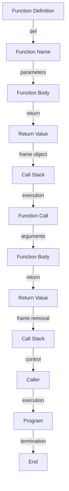

## Introduction
Functions are a fundamental concept in programming, and Python is no exception. In Python, functions are blocks of code that can be executed multiple times from different parts of a program. They are used to organize code, reduce repetition, and make code more readable and maintainable. Functions can take arguments, return values, and can be defined with default arguments, *args, **kwargs, and keyword-only arguments. In this article, we will delve into the world of Python functions, exploring their syntax, usage, and best practices.

> **Note:** Functions are essential in Python programming, and understanding how to define and use them is crucial for any aspiring Python developer.

## Core Concepts
A function in Python is defined using the `def` keyword followed by the function name and a list of arguments in parentheses. The `return` statement is used to specify the value that a function returns. Functions can also be defined with default arguments, which are used when no argument is provided. *args and **kwargs are special types of arguments that allow a function to accept a variable number of arguments.

*   **Function definition:** A function definition is a block of code that specifies the name, parameters, and body of a function.
*   **Function call:** A function call is an expression that invokes a function, passing arguments to it if necessary.
*   **Return statement:** The `return` statement is used to specify the value that a function returns.

> **Tip:** When defining a function, it's essential to consider the types of arguments it will accept and the values it will return.

## How It Works Internally
When a function is called, Python creates a new frame object, which contains the function's local variables, parameters, and return value. The frame object is then added to the call stack, which keeps track of the active functions. When a function returns, its frame object is removed from the call stack, and the control is passed back to the caller.

Here's a step-by-step breakdown of how a function works internally:

1.  **Function definition:** The function is defined using the `def` keyword, specifying its name, parameters, and body.
2.  **Function call:** The function is called, passing arguments to it if necessary.
3.  **Frame creation:** A new frame object is created, containing the function's local variables, parameters, and return value.
4.  **Call stack:** The frame object is added to the call stack, which keeps track of the active functions.
5.  **Execution:** The function's body is executed, using the arguments passed to it.
6.  **Return:** The function returns, specifying the value that it returns.
7.  **Frame removal:** The frame object is removed from the call stack, and the control is passed back to the caller.

> **Warning:** When using recursive functions, be careful not to exceed the maximum recursion depth, as this can cause a stack overflow.

## Code Examples

### Example 1: Basic Function
```python
def greet(name: str) -> None:
    """Prints a greeting message."""
    print(f"Hello, {name}!")

# Call the function
greet("John")  # Output: Hello, John!
```

### Example 2: Function with Default Arguments
```python
def greet(name: str, message: str = "Hello") -> None:
    """Prints a greeting message."""
    print(f"{message}, {name}!")

# Call the function with and without the message argument
greet("John")  # Output: Hello, John!
greet("John", "Hi")  # Output: Hi, John!
```

### Example 3: Function with *args and **kwargs
```python
def greet(name: str, *args: str, **kwargs: str) -> None:
    """Prints a greeting message."""
    print(f"Hello, {name}!")
    for arg in args:
        print(f"You like {arg}.")
    for key, value in kwargs.items():
        print(f"{key}: {value}")

# Call the function with *args and **kwargs
greet("John", "Python", "Java", language="English", country="USA")
# Output:
# Hello, John!
# You like Python.
# You like Java.
# language: English
# country: USA
```

## Visual Diagram


> **Note:** This diagram illustrates the internal workings of a function, from definition to execution and return.

## Comparison
| Approach | Time Complexity | Space Complexity | Pros | Cons | Best For |
| --- | --- | --- | --- | --- | --- |
| Recursive Function | O(n) | O(n) | Easy to implement, intuitive | Risk of stack overflow, slow for large inputs | Small to medium-sized problems |
| Iterative Function | O(n) | O(1) | Fast, efficient, no risk of stack overflow | More complex to implement, less intuitive | Large-sized problems, performance-critical code |
| Memoized Function | O(n) | O(n) | Fast, efficient, avoids redundant calculations | More complex to implement, uses extra memory | Problems with overlapping subproblems, dynamic programming |
| Generator Function | O(n) | O(1) | Fast, efficient, uses minimal memory | More complex to implement, less intuitive | Problems that require lazy evaluation, large datasets |

> **Tip:** When choosing an approach, consider the trade-offs between time complexity, space complexity, and ease of implementation.

## Real-world Use Cases

*   **Google's Search Algorithm:** Google's search algorithm uses a combination of recursive and iterative functions to crawl and index web pages.
*   **Facebook's News Feed:** Facebook's news feed uses a memoized function to efficiently retrieve and display user posts.
*   **Amazon's Recommendation Engine:** Amazon's recommendation engine uses a generator function to lazily evaluate and display product recommendations.

> **Interview:** When asked about real-world use cases, be prepared to provide specific examples and explain how functions are used in different contexts.

## Common Pitfalls

*   **Infinite Recursion:** When a recursive function calls itself without a base case, it can lead to a stack overflow.
*   **Unused Variables:** When a function defines variables that are not used, it can lead to unnecessary memory allocation and decreased performance.
*   **Deep Nesting:** When a function has deeply nested conditional statements, it can lead to decreased readability and maintainability.
*   **Type Errors:** When a function expects a specific type of argument but receives a different type, it can lead to type errors and decreased performance.

> **Warning:** Be careful when using recursive functions, and make sure to handle type errors and unused variables properly.

## Interview Tips

*   **Define a function:** Be prepared to define a simple function, such as a greeting function, and explain its syntax and usage.
*   **Explain recursion:** Be prepared to explain the concept of recursion, including the base case and the recursive case, and provide examples of recursive functions.
*   **Discuss memoization:** Be prepared to discuss the concept of memoization, including its benefits and drawbacks, and provide examples of memoized functions.

> **Note:** When answering interview questions, be prepared to provide clear and concise explanations, and use examples to illustrate your points.

## Key Takeaways

*   **Functions are blocks of code:** Functions are reusable blocks of code that can be executed multiple times from different parts of a program.
*   **Functions can take arguments:** Functions can take arguments, which are values passed to the function when it is called.
*   **Functions can return values:** Functions can return values, which are values passed back to the caller when the function returns.
*   **Recursive functions:** Recursive functions are functions that call themselves, and can be used to solve problems that have a recursive structure.
*   **Memoized functions:** Memoized functions are functions that store their results in a cache, and can be used to avoid redundant calculations.
*   **Generator functions:** Generator functions are functions that use the `yield` keyword to produce a sequence of values, and can be used to efficiently retrieve and process large datasets.
*   **Time complexity:** Time complexity refers to the amount of time it takes for an algorithm to complete, and is typically measured in terms of the number of operations performed.
*   **Space complexity:** Space complexity refers to the amount of memory used by an algorithm, and is typically measured in terms of the amount of memory allocated.
*   **Type errors:** Type errors occur when a function expects a specific type of argument but receives a different type, and can lead to decreased performance and errors.