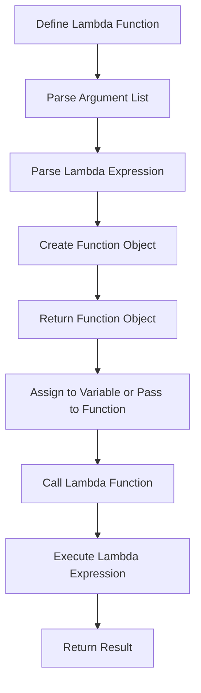

## Introduction
**Lambda functions**, also known as **anonymous functions**, are small, one-time use functions in Python. They are defined using the `lambda` keyword and can take any number of arguments, but can only have one expression. Lambda functions are often used when a small, short function is needed, and they can be defined inline within a larger expression. They are a key part of Python's functional programming capabilities and are used extensively in data processing, event handling, and more. Every engineer needs to know how to use lambda functions because they are a fundamental part of the Python language and are used in many real-world applications, such as data science, web development, and scientific computing.

## Core Concepts
A **lambda function** is a small, anonymous function that can be defined inline within a larger expression. It consists of three parts: the `lambda` keyword, an argument list, and an expression. The argument list is a comma-separated list of variables that will be passed to the function, and the expression is the code that will be executed when the function is called. Lambda functions are often used in combination with other functions, such as `map()`, `filter()`, and `reduce()`, to process data and perform complex operations. The key terminology to understand when working with lambda functions includes:
* **Anonymous function**: a function that is defined without a name
* **Lambda expression**: the code that is executed when a lambda function is called
* **Closure**: a function that has access to its own scope and the scope of its outer functions

> **Note:** Lambda functions are a key part of Python's functional programming capabilities and are used extensively in data processing, event handling, and more.

## How It Works Internally
When a lambda function is defined, Python creates a new function object that contains the lambda expression and the argument list. The function object is then returned and can be assigned to a variable or passed to another function. When the lambda function is called, Python executes the lambda expression and returns the result. The lambda expression has access to the argument list and any variables that are in scope when the lambda function is defined.

Here is a step-by-step breakdown of how lambda functions work internally:
1. The `lambda` keyword is encountered, and Python creates a new function object.
2. The argument list is parsed, and the variables are added to the function object's scope.
3. The lambda expression is parsed, and the code is added to the function object.
4. The function object is returned and can be assigned to a variable or passed to another function.
5. When the lambda function is called, Python executes the lambda expression and returns the result.

## Code Examples
### Example 1: Basic Lambda Function
```python
# Define a lambda function that takes one argument and returns its square
square = lambda x: x ** 2
print(square(5))  # Output: 25
```
This example shows how to define a basic lambda function that takes one argument and returns its square.

### Example 2: Lambda Function with Multiple Arguments
```python
# Define a lambda function that takes two arguments and returns their sum
sum = lambda x, y: x + y
print(sum(5, 10))  # Output: 15
```
This example shows how to define a lambda function that takes two arguments and returns their sum.

### Example 3: Lambda Function with a Default Argument
```python
# Define a lambda function that takes one argument and returns its square, with a default argument of 5
square = lambda x=5: x ** 2
print(square())  # Output: 25
print(square(10))  # Output: 100
```
This example shows how to define a lambda function that takes one argument and returns its square, with a default argument of 5.

> **Tip:** Lambda functions can be used in combination with other functions, such as `map()`, `filter()`, and `reduce()`, to process data and perform complex operations.

## Visual Diagram

This diagram shows the steps involved in defining and calling a lambda function.

## Comparison
| Approach | Time Complexity | Space Complexity | Pros | Cons | Best For |
| --- | --- | --- | --- | --- | --- |
| Lambda Function | O(1) | O(1) | Concise, easy to define, can be defined inline | Limited to one expression, can be difficult to read | Small, one-time use functions |
| Named Function | O(1) | O(1) | Can be reused, easier to read and debug | More verbose, requires a name | Larger, reusable functions |
| Closure | O(1) | O(n) | Can capture variables from outer scope, can be used to create higher-order functions | Can be difficult to understand and debug | Functions that need to capture variables from outer scope |
| Higher-Order Function | O(1) | O(n) | Can take functions as arguments, can be used to create abstract functions | Can be difficult to understand and debug | Functions that need to take functions as arguments |

> **Warning:** Lambda functions can be difficult to read and debug if they are too complex or if they are not properly commented.

## Real-world Use Cases
1. **Data Processing**: Lambda functions are often used in data processing to perform operations such as mapping, filtering, and reducing.
2. **Event Handling**: Lambda functions are often used in event handling to respond to events such as button clicks or keyboard input.
3. **Scientific Computing**: Lambda functions are often used in scientific computing to perform operations such as numerical integration or optimization.

> **Interview:** What is a lambda function, and how is it used in Python? A strong answer would include a definition of a lambda function, an explanation of how it is used, and an example of a lambda function in Python.

## Common Pitfalls
1. **Incorrect Argument List**: One common mistake is to define a lambda function with an incorrect argument list. For example, if a lambda function is defined with two arguments but is called with only one argument, a `TypeError` will be raised.
2. **Complex Lambda Expressions**: Another common mistake is to define a lambda function with a complex lambda expression. While lambda functions can be used to perform complex operations, they are best used for simple, one-time use functions.
3. **Variable Capture**: Lambda functions can capture variables from the outer scope, which can lead to unexpected behavior if not used carefully.
4. **Debugging**: Lambda functions can be difficult to debug if they are not properly commented or if they are too complex.

> **Tip:** To avoid common pitfalls, it is best to keep lambda functions simple and concise, and to use them only for one-time use functions.

## Interview Tips
1. **Define a Lambda Function**: Be able to define a lambda function in Python, including the `lambda` keyword, the argument list, and the lambda expression.
2. **Explain Lambda Functions**: Be able to explain how lambda functions work, including how they are defined, how they are called, and how they are used.
3. **Use Lambda Functions in Context**: Be able to use lambda functions in context, such as in data processing or event handling.

> **Note:** A strong answer to an interview question about lambda functions would include a clear definition, a concise example, and an explanation of how lambda functions are used in context.

## Key Takeaways
* Lambda functions are small, anonymous functions that can be defined inline within a larger expression.
* Lambda functions consist of three parts: the `lambda` keyword, an argument list, and a lambda expression.
* Lambda functions are often used in combination with other functions, such as `map()`, `filter()`, and `reduce()`, to process data and perform complex operations.
* Lambda functions can capture variables from the outer scope, which can lead to unexpected behavior if not used carefully.
* Lambda functions are best used for small, one-time use functions, and should be kept simple and concise.
* The time complexity of a lambda function is O(1), and the space complexity is O(1).
* Lambda functions are a key part of Python's functional programming capabilities, and are used extensively in data processing, event handling, and more.
* To avoid common pitfalls, it is best to keep lambda functions simple and concise, and to use them only for one-time use functions.