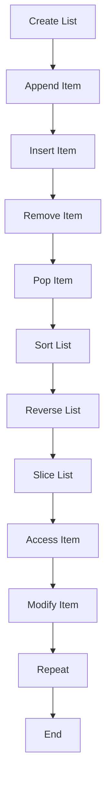

## Introduction
**Lists** are one of the most fundamental data structures in Python, used to store collections of items that can be of any data type, including strings, integers, floats, and other lists. Lists are **mutable**, meaning they can be modified after creation, and are **ordered**, meaning the order of the items in the list matters. Lists are used in a wide range of applications, from simple tasks like storing user input to complex tasks like data analysis and machine learning. Every engineer needs to know how to work with lists in Python, as they are a crucial part of the language.

> **Note:** Lists are a fundamental data structure in Python, and are used extensively in many applications.

## Core Concepts
A list in Python is a collection of items that can be of any data type. Lists are defined using square brackets `[]` and are **indexed**, meaning each item in the list has a unique index that can be used to access it. The index of an item in a list is its position in the list, starting from 0. For example, the list `[1, 2, 3]` has three items, with indices 0, 1, and 2, respectively.

**Key terminology:**

* **Indexing**: accessing an item in a list using its index.
* **Slicing**: accessing a subset of items in a list using a range of indices.
* **Append**: adding an item to the end of a list.
* **Extend**: adding multiple items to the end of a list.
* **Insert**: adding an item at a specific position in a list.
* **Remove**: removing the first occurrence of an item in a list.
* **Pop**: removing and returning an item from a list.
* **Sort**: sorting the items in a list in ascending or descending order.
* **Reverse**: reversing the order of the items in a list.

## How It Works Internally
When a list is created in Python, it is stored in memory as a contiguous block of memory. Each item in the list is stored in a separate memory location, and the list itself stores a reference to the first item in the list. When an item is added to the list, Python checks if there is enough space in the memory block to store the new item. If there is not enough space, Python creates a new, larger memory block and copies the existing items to the new block.

> **Warning:** When a list is modified, Python may need to create a new memory block and copy the existing items to the new block, which can be an expensive operation.

## Code Examples
### Example 1: Basic List Operations
```python
# Create a new list
my_list = [1, 2, 3]

# Access an item in the list using its index
print(my_list[0])  # prints 1

# Append an item to the end of the list
my_list.append(4)
print(my_list)  # prints [1, 2, 3, 4]

# Remove the first occurrence of an item in the list
my_list.remove(2)
print(my_list)  # prints [1, 3, 4]
```

### Example 2: Slicing and Sorting
```python
# Create a new list
my_list = [3, 1, 2, 4]

# Slice the list to get a subset of items
print(my_list[1:3])  # prints [1, 2]

# Sort the list in ascending order
my_list.sort()
print(my_list)  # prints [1, 2, 3, 4]

# Reverse the order of the items in the list
my_list.reverse()
print(my_list)  # prints [4, 3, 2, 1]
```

### Example 3: Inserting and Popping Items
```python
# Create a new list
my_list = [1, 2, 3]

# Insert an item at a specific position in the list
my_list.insert(1, 4)
print(my_list)  # prints [1, 4, 2, 3]

# Pop an item from the end of the list
popped_item = my_list.pop()
print(popped_item)  # prints 3
print(my_list)  # prints [1, 4, 2]
```

## Visual Diagram

The diagram shows the different operations that can be performed on a list in Python, and how they are related to each other.

## Comparison
| Operation | Time Complexity | Space Complexity | Pros | Cons |
| --- | --- | --- | --- | --- |
| Append | O(1) | O(1) | Fast, efficient | May require memory reallocation |
| Insert | O(n) | O(1) | Flexible, can insert at any position | Slow for large lists |
| Remove | O(n) | O(1) | Easy to use, fast for small lists | Slow for large lists |
| Pop | O(1) | O(1) | Fast, efficient | Only removes from the end of the list |
| Sort | O(n log n) | O(1) | Stable, efficient | Slow for large lists |
| Reverse | O(n) | O(1) | Fast, efficient | Only reverses the entire list |

## Real-world Use Cases
* **Google**: uses lists to store search results and rank them according to relevance.
* **Amazon**: uses lists to store product information and recommend products to customers.
* **Facebook**: uses lists to store user data and display it in a user-friendly format.

> **Tip:** Lists are a fundamental data structure in Python, and are used extensively in many applications. Mastering lists is essential for any Python developer.

## Common Pitfalls
* **Modifying a list while iterating over it**: this can cause unexpected behavior and errors.
* **Using the `insert` method with a large list**: this can be slow and inefficient.
* **Using the `remove` method with a large list**: this can be slow and inefficient.
* **Not checking the length of a list before accessing an item**: this can cause an `IndexError`.

> **Warning:** Modifying a list while iterating over it can cause unexpected behavior and errors. Use a copy of the list instead.

## Interview Tips
* **What is the time complexity of the `append` method?**: The answer is O(1), because the `append` method only needs to update the reference to the last item in the list.
* **How do you sort a list in Python?**: The answer is to use the `sort` method, which has a time complexity of O(n log n).
* **What is the difference between the `insert` and `append` methods?**: The answer is that the `insert` method inserts an item at a specific position in the list, while the `append` method adds an item to the end of the list.

> **Interview:** Can you explain the difference between the `insert` and `append` methods in Python?

## Key Takeaways
* **Lists are mutable and ordered**: lists can be modified after creation, and the order of the items in the list matters.
* **The `append` method has a time complexity of O(1)**: the `append` method is fast and efficient.
* **The `insert` method has a time complexity of O(n)**: the `insert` method can be slow for large lists.
* **The `remove` method has a time complexity of O(n)**: the `remove` method can be slow for large lists.
* **The `sort` method has a time complexity of O(n log n)**: the `sort` method is stable and efficient.
* **The `reverse` method has a time complexity of O(n)**: the `reverse` method is fast and efficient.
* **Lists are used extensively in many applications**: lists are a fundamental data structure in Python, and are used in many different contexts.