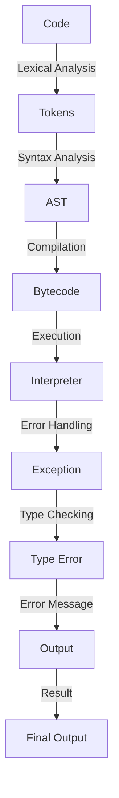

## Introduction
Python is a high-level, interpreted programming language that has gained immense popularity in recent years due to its simplicity, readability, and versatility. One of the most distinctive features of Python is its syntax, which is designed to be easy to read and write. In this section, we will delve into the basics of Python syntax, covering topics such as indentation, comments, variables, and dynamic typing. Understanding these concepts is crucial for any aspiring Python developer, as they form the foundation of the language.

> **Note:** Python's syntax is often referred to as "executable pseudocode" due to its simplicity and readability.

Python's syntax is relevant in real-world scenarios, as it is widely used in various industries such as web development, data science, artificial intelligence, and more. Companies like Google, Facebook, and Instagram use Python extensively in their production environments. For example, Google's YouTube video processing pipeline is built using Python.

## Core Concepts
### Indentation
In Python, indentation is used to define the structure of the code. It is a crucial aspect of Python syntax, as it determines the grouping of statements. Python uses a colon (:) to indicate the start of a block of code, and indentation is used to denote the body of the block.

### Comments
Comments in Python are used to add notes to the code, making it easier to understand and maintain. Comments start with the hash symbol (#) and continue until the end of the line.

### Variables
In Python, variables are used to store values. Python is dynamically typed, which means that the data type of a variable is determined at runtime, rather than at compile time. This makes Python a flexible language, but it also means that type errors can occur if not handled properly.

### Dynamic Typing
Dynamic typing is a key feature of Python. It allows for flexibility in programming, as the data type of a variable can change during runtime. However, it also means that type checking is not performed at compile time, which can lead to type-related errors if not handled properly.

## How It Works Internally
When Python code is executed, it is first parsed into an abstract syntax tree (AST). The AST is then compiled into bytecode, which is executed by the Python interpreter. The interpreter checks the syntax and semantics of the code, and if any errors are found, it raises an exception.

Here's a step-by-step breakdown of how Python executes code:

1. **Lexical Analysis**: The code is broken into tokens, such as keywords, identifiers, and literals.
2. **Syntax Analysis**: The tokens are parsed into an abstract syntax tree (AST).
3. **Compilation**: The AST is compiled into bytecode.
4. **Execution**: The bytecode is executed by the Python interpreter.

## Code Examples
### Example 1: Basic Indentation and Comments
```python
# This is a comment
def greet(name):
    # Print a greeting message
    print("Hello, " + name + "!")

greet("John")  # Output: Hello, John!
```
### Example 2: Variables and Dynamic Typing
```python
# Declare a variable
x = 5  # x is an integer

# Reassign the variable to a string
x = "Hello"  # x is now a string

# Print the value of x
print(x)  # Output: Hello
```
### Example 3: Advanced Example with Lists and Loops
```python
# Declare a list
fruits = ["Apple", "Banana", "Cherry"]

# Use a loop to print each fruit
for fruit in fruits:
    print(fruit)

# Output:
# Apple
# Banana
# Cherry
```
> **Tip:** Use the `type()` function to check the data type of a variable.

## Visual Diagram

The diagram illustrates the internal workings of the Python interpreter, from lexical analysis to execution and error handling.

## Comparison
| Language | Indentation | Comments | Dynamic Typing | Type Checking |
| --- | --- | --- | --- | --- |
| Python | Yes | # | Yes | Runtime |
| Java | No | // | No | Compile-time |
| JavaScript | No | // | Yes | Runtime |
| C++ | No | // | No | Compile-time |
| Ruby | Yes | # | Yes | Runtime |

> **Warning:** Dynamic typing can lead to type-related errors if not handled properly. Use type checking and exception handling to ensure robust code.

## Real-world Use Cases
1. **Web Development**: Python is widely used in web development, particularly with frameworks like Django and Flask.
2. **Data Science**: Python is a popular choice for data science and machine learning tasks, thanks to libraries like NumPy, pandas, and scikit-learn.
3. **Automation**: Python is often used for automating tasks, such as data processing, file management, and system administration.

## Common Pitfalls
1. **Indentation Errors**: Incorrect indentation can lead to syntax errors.
2. **Type Errors**: Dynamic typing can lead to type-related errors if not handled properly.
3. **Commenting**: Comments should be used to explain complex code, but excessive commenting can make the code harder to read.
4. **Variable Naming**: Poor variable naming can make the code harder to understand and maintain.

> **Interview:** Be prepared to answer questions about Python's syntax, dynamic typing, and common pitfalls.

## Interview Tips
1. **What is Python's syntax like?**: Explain Python's indentation-based syntax and dynamic typing.
2. **How does Python handle type checking?**: Discuss Python's runtime type checking and how it affects code robustness.
3. **What are some common pitfalls in Python programming?**: Mention indentation errors, type errors, and poor variable naming.

## Key Takeaways
* Python's syntax is designed to be easy to read and write.
* Indentation is used to define the structure of the code.
* Comments are used to add notes to the code.
* Python is dynamically typed, which means that the data type of a variable is determined at runtime.
* Dynamic typing can lead to type-related errors if not handled properly.
* Use type checking and exception handling to ensure robust code.
* Python is widely used in web development, data science, and automation tasks.
* Common pitfalls include indentation errors, type errors, and poor variable naming.