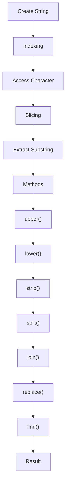

## Introduction
Strings are a fundamental data type in Python, used to represent text. Understanding how to manipulate and process strings is crucial for any Python developer. In this section, we'll delve into the world of string indexing, slicing, and methods, exploring their significance, real-world relevance, and why every engineer needs to know this.

Strings are used extensively in various applications, including text processing, data analysis, and web development. **Mastering string manipulation** is essential for tasks like data cleaning, text preprocessing, and natural language processing. Whether you're working on a simple script or a complex web application, strings are an integral part of your code.

## Core Concepts
To work with strings effectively, you need to understand the core concepts of indexing, slicing, and methods.

* **Indexing**: In Python, strings are indexed, meaning each character has a unique position in the string. Indexing allows you to access individual characters using their position.
* **Slicing**: Slicing is a technique used to extract a subset of characters from a string. It's a powerful tool for manipulating strings and can be used to perform tasks like substring extraction and string splitting.
* **Methods**: Python provides a range of string methods that can be used to manipulate and process strings. These methods include `upper()`, `lower()`, `strip()`, `split()`, `join()`, `replace()`, and `find()`.

> **Tip:** When working with strings, it's essential to understand the difference between mutable and immutable data types. In Python, strings are immutable, meaning they cannot be changed in-place.

## How It Works Internally
When you create a string in Python, it's stored in memory as a sequence of Unicode characters. Each character has a unique code point, which is used to represent the character.

Here's a step-by-step breakdown of how string indexing and slicing work:

1. **Indexing**: When you access a character in a string using its index, Python looks up the character at that position in the string.
2. **Slicing**: When you slice a string, Python creates a new string that contains the characters in the specified range.
3. **Methods**: When you call a string method, Python executes the method's code, which performs the desired operation on the string.

> **Warning:** Be careful when using slicing with negative indices, as it can lead to unexpected results.

## Code Examples
Here are three complete and runnable code examples that demonstrate string indexing, slicing, and methods:

### Example 1: Basic String Indexing and Slicing
```python
# Create a string
my_string = "Hello, World!"

# Access a character using its index
print(my_string[0])  # Output: H

# Slice the string to extract a substring
print(my_string[7:])  # Output: World!
```

### Example 2: Real-World String Processing
```python
# Create a string
my_string = "   This is a test string   "

# Remove leading and trailing whitespace using strip()
print(my_string.strip())  # Output: This is a test string

# Split the string into a list of words using split()
print(my_string.split())  # Output: ['This', 'is', 'a', 'test', 'string']
```

### Example 3: Advanced String Manipulation
```python
# Create a string
my_string = "Hello, World!"

# Replace a substring using replace()
print(my_string.replace("World", "Universe"))  # Output: Hello, Universe!

# Find the index of a substring using find()
print(my_string.find("World"))  # Output: 7
```

## Visual Diagram

This diagram illustrates the flow of string indexing, slicing, and methods.

## Comparison
Here's a comparison table of different string manipulation techniques:

| Technique | Time Complexity | Space Complexity | Pros | Cons |
| --- | --- | --- | --- | --- |
| Indexing | O(1) | O(1) | Fast, efficient | Limited to single character access |
| Slicing | O(k) | O(k) | Flexible, easy to use | Can be slow for large strings |
| Methods | O(n) | O(n) | Powerful, convenient | Can be slow for large strings |
| Regular Expressions | O(n) | O(n) | Flexible, powerful | Can be complex, hard to read |

> **Note:** The time and space complexities listed are approximate and may vary depending on the specific use case.

## Real-world Use Cases
Here are three real-world examples of string manipulation:

1. **Text Processing**: Google's search algorithm relies heavily on string manipulation to process and rank search results.
2. **Data Analysis**: Data scientists use string manipulation to clean and preprocess data, often using techniques like tokenization and stemming.
3. **Web Development**: Web developers use string manipulation to process user input, validate form data, and generate dynamic content.

## Common Pitfalls
Here are four common mistakes to watch out for when working with strings:

1. **Off-by-One Errors**: When indexing or slicing strings, it's easy to make off-by-one errors, which can lead to incorrect results.
2. **Null or Empty Strings**: Failing to check for null or empty strings can lead to errors or exceptions.
3. **Inconsistent Case**: Not accounting for inconsistent case in strings can lead to incorrect results or errors.
4. **Escaping Characters**: Failing to escape special characters in strings can lead to errors or security vulnerabilities.

> **Warning:** Be careful when using string concatenation, as it can lead to performance issues for large strings.

## Interview Tips
Here are three common interview questions related to string manipulation:

1. **Reverse a String**: Write a function to reverse a string without using built-in methods.
2. **Find the Longest Palindrome**: Write a function to find the longest palindrome in a given string.
3. **Validate a String**: Write a function to validate a string against a set of rules, such as checking for null or empty strings.

> **Interview:** When answering string manipulation questions, be sure to explain your thought process and provide clear, concise code examples.

## Key Takeaways
Here are ten key takeaways to remember:

* **Strings are immutable**: Strings cannot be changed in-place.
* **Indexing is fast**: Indexing is an O(1) operation.
* **Slicing is flexible**: Slicing can be used to extract substrings and perform other string operations.
* **Methods are powerful**: String methods can be used to perform a wide range of string operations.
* **Regular expressions are complex**: Regular expressions can be powerful, but they can also be complex and hard to read.
* **Off-by-one errors are common**: Be careful when indexing or slicing strings to avoid off-by-one errors.
* **Null or empty strings can cause errors**: Always check for null or empty strings before performing string operations.
* **Inconsistent case can lead to errors**: Account for inconsistent case when working with strings.
* **Escaping characters is important**: Always escape special characters in strings to avoid errors or security vulnerabilities.
* **String manipulation is crucial**: Mastering string manipulation is essential for any Python developer.