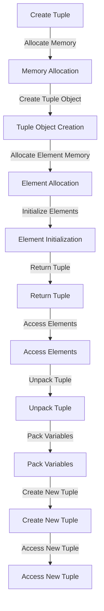

## Introduction
Tuples are a fundamental data structure in Python, which allows storing multiple values in a single object. They are **immutable**, meaning that once created, their contents cannot be modified. Tuples are useful when you need to store a collection of items that should not be changed, such as a record or a row in a database. In real-world applications, tuples are commonly used in data analysis, scientific computing, and web development. For example, tuples can be used to represent a point in 3D space, a color with its RGB values, or a user's credentials.

> **Note:** Tuples are similar to lists, but they are immutable, which makes them more memory-efficient and thread-safe.

## Core Concepts
A tuple is an ordered collection of values, which can be of any data type, including strings, integers, floats, and other tuples. Tuples are defined by enclosing a sequence of values in parentheses `()`. The values in a tuple are called **elements**, and each element can be accessed by its **index**, which is a zero-based integer. The **length** of a tuple is the number of elements it contains.

> **Warning:** Tuples are immutable, which means that once created, their contents cannot be modified. Attempting to modify a tuple will raise a `TypeError`.

## How It Works Internally
When a tuple is created, Python allocates a block of memory to store its elements. The memory layout of a tuple is similar to that of a list, but with some differences. A tuple has a fixed length, which is stored in the tuple object's header. The elements of a tuple are stored in a contiguous array, and each element is a pointer to the actual object.

Here is a step-by-step breakdown of what happens when you create a tuple:

1. Memory allocation: Python allocates a block of memory to store the tuple object.
2. Tuple object creation: Python creates a tuple object, which includes the tuple's length and a pointer to the array of elements.
3. Element allocation: Python allocates memory for each element in the tuple.
4. Element initialization: Python initializes each element with its corresponding value.

> **Tip:** Tuples are more memory-efficient than lists because they have a fixed length, which allows Python to optimize memory allocation.

## Code Examples

### Example 1: Basic Tuple Creation
```python
# Create a tuple with three elements
my_tuple = (1, 2, 3)

# Access the elements of the tuple
print(my_tuple[0])  # Output: 1
print(my_tuple[1])  # Output: 2
print(my_tuple[2])  # Output: 3

# Attempt to modify the tuple (this will raise a TypeError)
try:
    my_tuple[0] = 10
except TypeError as e:
    print(e)  # Output: 'tuple' object does not support item assignment
```

### Example 2: Tuple Packing and Unpacking
```python
# Create a tuple with three elements
my_tuple = (1, 2, 3)

# Unpack the tuple into three variables
a, b, c = my_tuple

# Print the values of the variables
print(a)  # Output: 1
print(b)  # Output: 2
print(c)  # Output: 3

# Pack the variables into a new tuple
new_tuple = (a, b, c)

# Print the new tuple
print(new_tuple)  # Output: (1, 2, 3)
```

### Example 3: Named Tuples
```python
# Import the namedtuple function from the collections module
from collections import namedtuple

# Create a named tuple with three fields
Person = namedtuple('Person', ['name', 'age', 'city'])

# Create a named tuple object
person = Person('John', 30, 'New York')

# Access the fields of the named tuple
print(person.name)  # Output: John
print(person.age)    # Output: 30
print(person.city)   # Output: New York
```

## Visual Diagram

The diagram illustrates the process of creating a tuple, accessing its elements, unpacking the tuple, and packing the variables into a new tuple.

## Comparison
| Approach | Time Complexity | Space Complexity | Pros | Cons | Best For |
| --- | --- | --- | --- | --- | --- |
| Lists | O(n) | O(n) | Mutable, flexible | Less memory-efficient | Dynamic data structures |
| Tuples | O(1) | O(n) | Immutable, memory-efficient | Less flexible | Static data structures |
| Named Tuples | O(1) | O(n) | Immutable, readable | Less flexible | Data structures with named fields |
| Dictionaries | O(1) | O(n) | Mutable, flexible | Less memory-efficient | Data structures with key-value pairs |
| Sets | O(1) | O(n) | Mutable, unique elements | Less flexible | Data structures with unique elements |

## Real-world Use Cases
1. **Data Analysis**: Tuples can be used to represent rows in a dataset, where each element in the tuple corresponds to a column in the dataset.
2. **Scientific Computing**: Tuples can be used to represent points in 3D space, where each element in the tuple corresponds to a coordinate (x, y, z).
3. **Web Development**: Tuples can be used to represent user credentials, where each element in the tuple corresponds to a field (username, password, email).

## Common Pitfalls
1. **Modifying a Tuple**: Attempting to modify a tuple will raise a `TypeError`. To avoid this, use a list instead of a tuple.
```python
# Wrong way
my_tuple = (1, 2, 3)
my_tuple[0] = 10  # Raises TypeError

# Right way
my_list = [1, 2, 3]
my_list[0] = 10  # Works fine
```
2. **Unpacking a Tuple with Incorrect Number of Variables**: Unpacking a tuple with an incorrect number of variables will raise a `ValueError`. To avoid this, use the `*` operator to unpack the remaining elements into a list.
```python
# Wrong way
my_tuple = (1, 2, 3)
a, b = my_tuple  # Raises ValueError

# Right way
my_tuple = (1, 2, 3)
a, *b = my_tuple  # Works fine
```
3. **Using Tuples as Dictionary Keys**: Tuples can be used as dictionary keys, but they must be immutable. To avoid this, use a frozenset instead of a set.
```python
# Wrong way
my_dict = {}
my_set = {1, 2, 3}
my_dict[my_set] = 10  # Raises TypeError

# Right way
my_dict = {}
my_frozenset = frozenset({1, 2, 3})
my_dict[my_frozenset] = 10  # Works fine
```
4. **Using Named Tuples with Duplicate Field Names**: Using named tuples with duplicate field names will raise a `ValueError`. To avoid this, use unique field names.
```python
# Wrong way
from collections import namedtuple
Person = namedtuple('Person', ['name', 'age', 'name'])  # Raises ValueError

# Right way
from collections import namedtuple
Person = namedtuple('Person', ['name', 'age', 'city'])  # Works fine
```

## Interview Tips
1. **What is the difference between a tuple and a list?**: A tuple is an immutable collection of values, while a list is a mutable collection of values.
2. **How do you create a tuple?**: You can create a tuple by enclosing a sequence of values in parentheses `()`.
3. **What is a named tuple?**: A named tuple is a tuple with named fields, which can be accessed by their names instead of their indices.

> **Interview:** What is the time complexity of accessing an element in a tuple?
> **Answer:** The time complexity of accessing an element in a tuple is O(1), because tuples are stored in a contiguous array and accessing an element is a simple array access.

## Key Takeaways
* Tuples are immutable collections of values.
* Tuples are more memory-efficient than lists because they have a fixed length.
* Tuples can be used as dictionary keys, but they must be immutable.
* Named tuples are tuples with named fields, which can be accessed by their names instead of their indices.
* The time complexity of accessing an element in a tuple is O(1).
* The space complexity of a tuple is O(n), where n is the number of elements in the tuple.
* Tuples are useful in data analysis, scientific computing, and web development.
* Tuples can be used to represent rows in a dataset, points in 3D space, and user credentials.
* Tuples can be unpacked into variables, but the number of variables must match the number of elements in the tuple.