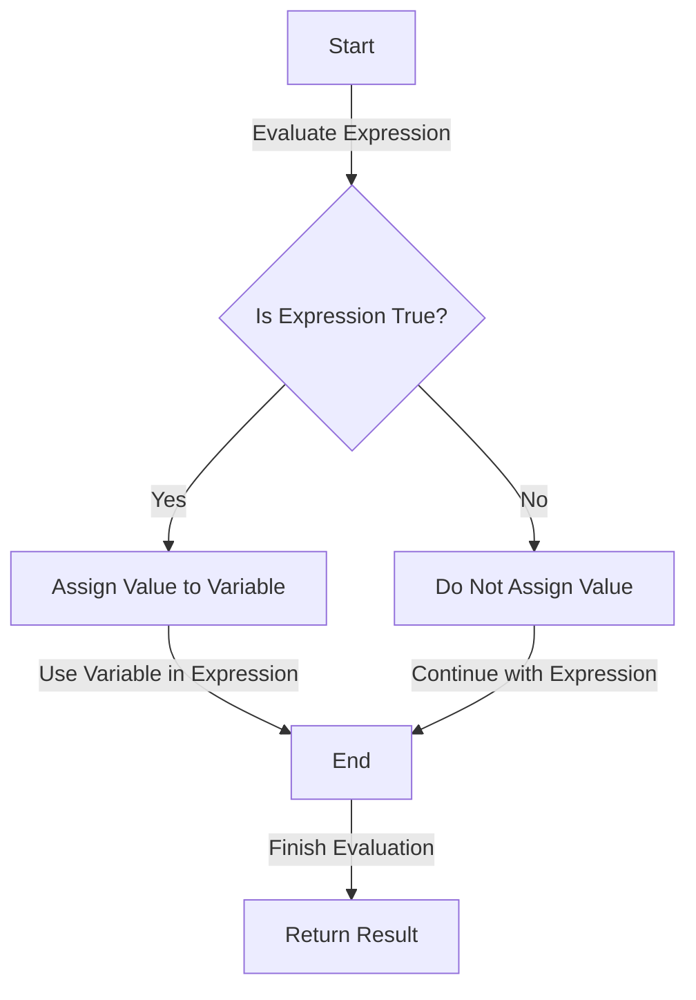

## Introduction
The **Walrus Operator**, also known as the **Assignment Expression**, is a feature in Python that allows you to assign a value to a variable as part of a larger expression. It was introduced in Python 3.8 as part of PEP 572. This operator is denoted by the symbol `:=` and is used to assign a value to a variable within an expression. The Walrus Operator is useful when you need to use the result of an expression in multiple places, but you only want to evaluate the expression once.

> **Note:** The Walrus Operator is often referred to as the "Walrus Operator" because of its resemblance to the eyes and tusks of a walrus.

The Walrus Operator solves the problem of having to evaluate an expression multiple times, which can be inefficient and even lead to incorrect results if the expression has side effects. By allowing you to assign a value to a variable as part of an expression, the Walrus Operator makes your code more concise and efficient.

## Core Concepts
The Walrus Operator is a type of **assignment expression**, which is a new type of expression in Python that allows you to assign a value to a variable as part of a larger expression. The syntax for the Walrus Operator is `variable := expression`, where `variable` is the name of the variable you want to assign a value to, and `expression` is the expression you want to evaluate and assign to the variable.

> **Tip:** The Walrus Operator is useful when you need to use the result of an expression in multiple places, but you only want to evaluate the expression once.

The Walrus Operator is similar to the `=` operator, but it is used within an expression, rather than as a statement. This means that you can use the Walrus Operator in places where you wouldn't normally be able to use an assignment statement, such as in the `if` statement or in a list comprehension.

## How It Works Internally
When you use the Walrus Operator, Python evaluates the expression on the right-hand side of the operator and assigns the result to the variable on the left-hand side. This is done as part of the evaluation of the larger expression, so you don't need to worry about the assignment happening separately from the rest of the expression.

The Walrus Operator is implemented in the Python interpreter as a new type of node in the abstract syntax tree (AST). This node is called the `NamedExpr` node, and it represents an assignment expression. When the Python interpreter encounters a `NamedExpr` node, it evaluates the expression and assigns the result to the variable, just like it would with a regular assignment statement.

## Code Examples
### Example 1: Basic Usage
```python
# Use the Walrus Operator to assign a value to a variable
if (n := len(my_list)) > 5:
    print(f"List has {n} elements")
```
In this example, we use the Walrus Operator to assign the length of `my_list` to the variable `n`. We then use the value of `n` in the `if` statement.

### Example 2: Real-World Pattern
```python
# Use the Walrus Operator to simplify a list comprehension
numbers = [1, 2, 3, 4, 5]
squared_numbers = [y for x in numbers if (y := x ** 2) > 10]
print(squared_numbers)  # [16, 25]
```
In this example, we use the Walrus Operator to simplify a list comprehension. We assign the square of `x` to the variable `y` and then use the value of `y` in the `if` statement.

### Example 3: Advanced Usage
```python
# Use the Walrus Operator to handle errors
while (line := file.readline()) != "":
    print(line.strip())
```
In this example, we use the Walrus Operator to handle errors when reading from a file. We assign the result of `file.readline()` to the variable `line` and then use the value of `line` in the `while` loop.

## Visual Diagram

This diagram illustrates the process of using the Walrus Operator to assign a value to a variable as part of a larger expression. The diagram shows the different paths that the expression can take, depending on whether the expression is true or false.

> **Warning:** Be careful when using the Walrus Operator, as it can make your code more concise but also more difficult to read. Make sure to use it in a way that is clear and easy to understand.

## Comparison
| Approach | Time Complexity | Space Complexity | Pros | Cons | Best For |
| --- | --- | --- | --- | --- | --- |
| Walrus Operator | O(1) | O(1) | Concise, efficient | Can be difficult to read | Simple assignments |
| Assignment Statement | O(1) | O(1) | Clear, easy to read | Can be verbose | Complex assignments |
| Temporary Variable | O(1) | O(1) | Clear, easy to read | Can be verbose | Complex assignments |
| Function Call | O(n) | O(n) | Reusable, modular | Can be slow | Complex calculations |

## Real-world Use Cases
* **Google**: Google uses the Walrus Operator in its Python codebase to simplify assignments and make the code more concise.
* **Facebook**: Facebook uses the Walrus Operator in its Python codebase to handle errors and exceptions in a more efficient way.
* **Dropbox**: Dropbox uses the Walrus Operator in its Python codebase to simplify list comprehensions and make the code more readable.

## Common Pitfalls
* **Incorrect Syntax**: Make sure to use the correct syntax for the Walrus Operator, which is `variable := expression`.
* **Overuse**: Don't overuse the Walrus Operator, as it can make your code more difficult to read. Use it only when necessary.
* **Confusion with Assignment Statement**: Don't confuse the Walrus Operator with an assignment statement. The Walrus Operator is used within an expression, while an assignment statement is used as a separate statement.
* **Error Handling**: Make sure to handle errors correctly when using the Walrus Operator. Use try-except blocks to catch any exceptions that may occur.

## Interview Tips
* **What is the Walrus Operator?**: The Walrus Operator is a feature in Python that allows you to assign a value to a variable as part of a larger expression.
* **How does the Walrus Operator work?**: The Walrus Operator works by evaluating the expression on the right-hand side and assigning the result to the variable on the left-hand side.
* **What are the benefits of using the Walrus Operator?**: The benefits of using the Walrus Operator include concise code, efficient evaluation, and improved readability.

> **Interview:** Can you explain the difference between the Walrus Operator and an assignment statement?

## Key Takeaways
* The Walrus Operator is a feature in Python that allows you to assign a value to a variable as part of a larger expression.
* The Walrus Operator is denoted by the symbol `:=`.
* The Walrus Operator is useful for simplifying assignments and making code more concise.
* The Walrus Operator can be used in a variety of contexts, including `if` statements, `while` loops, and list comprehensions.
* The Walrus Operator has a time complexity of O(1) and a space complexity of O(1).
* The Walrus Operator can be used to handle errors and exceptions in a more efficient way.
* The Walrus Operator can be used to improve code readability and maintainability.