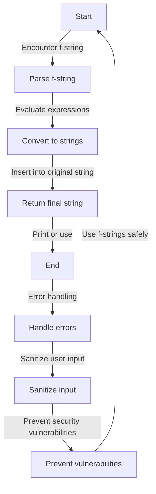

## Introduction
**f-strings** are a powerful feature in Python that allows you to embed expressions inside string literals. They were introduced in Python 3.6 as a more readable and efficient way to format strings. f-strings are useful for creating strings that contain dynamic values, such as variables, function calls, or calculations. In this section, we will explore the basics of f-strings, their real-world relevance, and why every engineer needs to know about them. 
> **Tip:** f-strings are a great way to simplify your code and make it more readable.

## Core Concepts
An f-string is a string literal that starts with the letter 'f' or 'F' before the string. Inside the string, you can use curly braces `{}` to embed expressions. These expressions can be variables, function calls, or any other valid Python expression. 
> **Note:** The expressions are evaluated at runtime, not at compile time.

The syntax for f-strings is as follows:
```python
f"string {expression}"
```
Here, `string` is the literal string and `expression` is the Python expression that you want to evaluate.

Some key terminology to remember:
* **Format spec**: The format spec is the part of the f-string that comes after the colon (`:`) inside the curly braces. It specifies how the value should be formatted.
* **Expression**: The expression is the Python code that is evaluated and inserted into the string.

## How It Works Internally
When you use an f-string, Python evaluates the expressions inside the curly braces and inserts the results into the string. This process happens at runtime, not at compile time.

Here is a step-by-step breakdown of how f-strings work internally:
1. The Python interpreter encounters an f-string.
2. The interpreter evaluates the expressions inside the curly braces.
3. The results of the expressions are converted to strings using the `__str__` or `__repr__` method.
4. The formatted strings are inserted into the original string.
5. The final string is returned.

> **Warning:** Be careful when using f-strings with user-input data, as they can lead to security vulnerabilities if not properly sanitized.

## Code Examples
### Example 1: Basic f-string usage
```python
name = "John"
age = 30
print(f"My name is {name} and I am {age} years old.")
```
This code will output: `My name is John and I am 30 years old.`

### Example 2: Using format specs
```python
pi = 3.14159
print(f"The value of pi is {pi:.2f}")
```
This code will output: `The value of pi is 3.14`

### Example 3: Using the `=` format spec for debugging
```python
x = 5
y = 10
print(f"{x=}, {y=}")
```
This code will output: `x=5, y=10`

## Visual Diagram

This diagram shows the steps involved in using f-strings, from parsing the f-string to handling errors and preventing security vulnerabilities.

## Comparison
| Approach | Time Complexity | Space Complexity | Pros | Cons | Best For |
|----------|----------------|-----------------|------|------|----------|
| f-strings | O(n) | O(n) | Readable, efficient, flexible | Can lead to security vulnerabilities if not properly sanitized | General-purpose string formatting |
| `str.format()` | O(n) | O(n) | More verbose than f-strings, but still efficient | Less readable than f-strings | Legacy code, compatibility with older Python versions |
| `%` operator | O(n) | O(n) | Less readable than f-strings, less efficient | Can lead to security vulnerabilities if not properly sanitized | Legacy code, compatibility with older Python versions |
| `template` library | O(n) | O(n) | More verbose than f-strings, but still efficient | Less readable than f-strings, requires additional library | Specialized use cases, such as templating engines |

## Real-world Use Cases
1. **Logging**: f-strings can be used to create log messages with dynamic values, such as user IDs, timestamps, or error messages.
2. **Data analysis**: f-strings can be used to create strings that contain dynamic values, such as data points, calculations, or statistical results.
3. **Web development**: f-strings can be used to create HTML templates with dynamic values, such as user names, passwords, or database queries.

## Common Pitfalls
1. **Security vulnerabilities**: f-strings can lead to security vulnerabilities if not properly sanitized, especially when used with user-input data.
2. **Performance issues**: f-strings can lead to performance issues if used excessively or with complex expressions.
3. **Readability issues**: f-strings can lead to readability issues if used with complex expressions or long strings.
4. **Compatibility issues**: f-strings are not compatible with older Python versions, so they may not work in legacy code.

> **Interview:** Can you explain the difference between f-strings and `str.format()`?

## Interview Tips
1. **What are f-strings?**: Be prepared to explain the basics of f-strings, including their syntax, usage, and benefits.
2. **How do f-strings work internally?**: Be prepared to explain the step-by-step process of how f-strings work internally, including parsing, evaluation, and insertion.
3. **What are some common pitfalls of using f-strings?**: Be prepared to explain some common pitfalls of using f-strings, including security vulnerabilities, performance issues, and readability issues.

## Key Takeaways
* f-strings are a powerful feature in Python that allows you to embed expressions inside string literals.
* f-strings are useful for creating strings that contain dynamic values, such as variables, function calls, or calculations.
* f-strings can lead to security vulnerabilities if not properly sanitized, especially when used with user-input data.
* f-strings are more readable and efficient than `str.format()` and the `%` operator.
* f-strings are not compatible with older Python versions, so they may not work in legacy code.
* f-strings can be used in a variety of real-world use cases, including logging, data analysis, and web development.
* f-strings can lead to performance issues if used excessively or with complex expressions.
* f-strings can lead to readability issues if used with complex expressions or long strings.