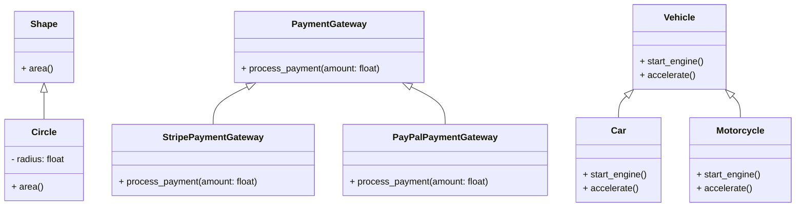

## Introduction
**Abstract Base Classes** (ABCs) are a fundamental concept in Object-Oriented Programming (OOP) that allows developers to define a blueprint for other classes to follow. In Python, ABCs are implemented using the `abc` module, which provides a way to define abstract base classes and abstract methods. ABCs are essential in creating a robust and maintainable codebase, as they enable developers to define a common interface for a group of related classes.

In real-world scenarios, ABCs are used extensively in frameworks and libraries, such as Django and NumPy, to provide a standardized way of interacting with different components. For instance, in Django, the `Model` class is an abstract base class that defines the common interface for all models, allowing developers to create custom models that inherit from it.

> **Note:** ABCs are not meant to be instantiated directly, but rather serve as a base class for other classes to inherit from.

## Core Concepts
To understand ABCs, it's essential to grasp the following core concepts:

* **Abstract Base Class (ABC):** A class that cannot be instantiated and is designed to be inherited by other classes.
* **Abstract Method:** A method that is declared in an ABC but has no implementation. Concrete subclasses must provide an implementation for abstract methods.
* **Concrete Subclass:** A class that inherits from an ABC and provides an implementation for all abstract methods.

Mental models and analogies can help make these concepts more accessible:

* Think of an ABC as a blueprint for a house. The blueprint defines the overall structure and layout, but it's not a physical house that you can live in. Concrete subclasses are like the actual houses built using the blueprint.
* Abstract methods are like empty rooms in the blueprint. The blueprint defines the space, but it's up to the builder (concrete subclass) to fill in the details.

## How It Works Internally
When you define an ABC using the `abc` module, Python creates a new class that inherits from `object`. The `abc` module uses a metaclass to create the ABC, which allows it to enforce the abstract method contract.

Here's a step-by-step breakdown of what happens when you use an ABC:

1. You define an ABC using the `abc` module, specifying the abstract methods.
2. Python creates a new class that inherits from `object`.
3. The `abc` module uses a metaclass to create the ABC, which enforces the abstract method contract.
4. When you try to instantiate the ABC, Python raises a `TypeError`, indicating that the class cannot be instantiated.
5. When you define a concrete subclass, Python checks that the subclass provides an implementation for all abstract methods. If not, it raises a `TypeError`.

> **Warning:** Failing to provide an implementation for an abstract method in a concrete subclass can lead to runtime errors.

## Code Examples
Here are three complete, runnable examples that demonstrate the use of ABCs:

### Example 1: Basic Usage
```python
from abc import ABC, abstractmethod

class Shape(ABC):
    @abstractmethod
    def area(self):
        pass

class Circle(Shape):
    def __init__(self, radius):
        self.radius = radius

    def area(self):
        return 3.14 * self.radius ** 2

circle = Circle(5)
print(circle.area())  # Output: 78.5
```

### Example 2: Real-World Pattern
```python
from abc import ABC, abstractmethod

class PaymentGateway(ABC):
    @abstractmethod
    def process_payment(self, amount):
        pass

class StripePaymentGateway(PaymentGateway):
    def process_payment(self, amount):
        # Implement Stripe payment processing logic
        print(f"Processing payment of ${amount} using Stripe")

class PayPalPaymentGateway(PaymentGateway):
    def process_payment(self, amount):
        # Implement PayPal payment processing logic
        print(f"Processing payment of ${amount} using PayPal")

stripe_gateway = StripePaymentGateway()
stripe_gateway.process_payment(100)  # Output: Processing payment of $100 using Stripe
```

### Example 3: Advanced Usage
```python
from abc import ABC, abstractmethod

class Vehicle(ABC):
    @abstractmethod
    def start_engine(self):
        pass

    @abstractmethod
    def accelerate(self):
        pass

class Car(Vehicle):
    def start_engine(self):
        print("Starting car engine")

    def accelerate(self):
        print("Accelerating car")

class Motorcycle(Vehicle):
    def start_engine(self):
        print("Starting motorcycle engine")

    def accelerate(self):
        print("Accelerating motorcycle")

car = Car()
car.start_engine()  # Output: Starting car engine
car.accelerate()  # Output: Accelerating car
```

## Visual Diagram


This diagram illustrates the relationships between the abstract base classes and their concrete subclasses.

> **Tip:** Use diagrams like this to visualize the relationships between classes and identify potential areas for improvement.

## Comparison
| Approach | Time Complexity | Space Complexity | Pros | Cons | Best For |
| --- | --- | --- | --- | --- | --- |
| Abstract Base Classes | O(1) | O(1) | Provides a clear interface, enforces implementation of abstract methods | Can be overused, leading to complex class hierarchies | Large-scale applications with multiple related classes |
| Interfaces | O(1) | O(1) | Provides a clear interface, allows for multiple inheritance | Not enforced at runtime, can lead to runtime errors | Small-scale applications with simple class relationships |
| Mixins | O(1) | O(1) | Provides a way to reuse code, allows for multiple inheritance | Can lead to complex class hierarchies, makes it difficult to understand the code | Applications with complex class relationships and a need for code reuse |
| Concrete Classes | O(1) | O(1) | Provides a simple, straightforward way to implement classes | Does not provide a clear interface, can lead to code duplication | Small-scale applications with simple class relationships |

## Real-world Use Cases
Here are three real-world examples of using ABCs:

* **Django:** Django uses ABCs extensively to provide a standardized way of interacting with different components, such as models, views, and templates.
* **NumPy:** NumPy uses ABCs to provide a common interface for different types of arrays, such as `ndarray` and `matrix`.
* **Scikit-learn:** Scikit-learn uses ABCs to provide a common interface for different machine learning algorithms, such as `Classifier` and `Regressor`.

## Common Pitfalls
Here are four common mistakes to watch out for when using ABCs:

* **Not providing an implementation for an abstract method:** This can lead to runtime errors and make it difficult to understand the code.
* **Overusing ABCs:** This can lead to complex class hierarchies and make it difficult to understand the code.
* **Not using ABCs when necessary:** This can lead to code duplication and make it difficult to maintain the code.
* **Not documenting ABCs:** This can make it difficult for other developers to understand the code and use the ABCs correctly.

> **Warning:** Failing to document ABCs can lead to confusion and make it difficult for other developers to use the code.

## Interview Tips
Here are three common interview questions related to ABCs, along with tips for answering them:

* **What is an abstract base class, and how is it used?**
	+ Weak answer: "An abstract base class is a class that cannot be instantiated."
	+ Strong answer: "An abstract base class is a class that provides a common interface for a group of related classes. It is used to define a blueprint for other classes to follow and to provide a way to enforce implementation of abstract methods."
* **How do you decide when to use an abstract base class?**
	+ Weak answer: "I use an abstract base class when I need to define a common interface for a group of classes."
	+ Strong answer: "I use an abstract base class when I need to define a common interface for a group of related classes and when I want to enforce implementation of abstract methods. I also consider the complexity of the class hierarchy and the need for code reuse."
* **Can you give an example of a real-world use case for an abstract base class?**
	+ Weak answer: "I used an abstract base class in a project to define a common interface for a group of classes."
	+ Strong answer: "I used an abstract base class in a project to define a common interface for a group of related classes, such as models, views, and templates. This allowed me to enforce implementation of abstract methods and to provide a way to reuse code across different components of the application."

> **Interview:** Be prepared to explain the benefits and trade-offs of using ABCs, as well as how to decide when to use them.

## Key Takeaways
Here are the key takeaways from this discussion of ABCs:

* **ABCs provide a clear interface:** ABCs define a common interface for a group of related classes, making it easier to understand and use the code.
* **ABCs enforce implementation of abstract methods:** ABCs ensure that concrete subclasses provide an implementation for all abstract methods, reducing the risk of runtime errors.
* **ABCs allow for code reuse:** ABCs provide a way to reuse code across different components of an application, reducing code duplication and improving maintainability.
* **ABCs can be overused:** ABCs can lead to complex class hierarchies and make it difficult to understand the code if not used judiciously.
* **ABCs are essential for large-scale applications:** ABCs are critical for large-scale applications with multiple related classes, as they provide a way to define a common interface and enforce implementation of abstract methods.
* **ABCs are used extensively in frameworks and libraries:** ABCs are used extensively in frameworks and libraries, such as Django and NumPy, to provide a standardized way of interacting with different components.
* **ABCs require careful consideration:** ABCs require careful consideration of the complexity of the class hierarchy and the need for code reuse to ensure that they are used effectively.