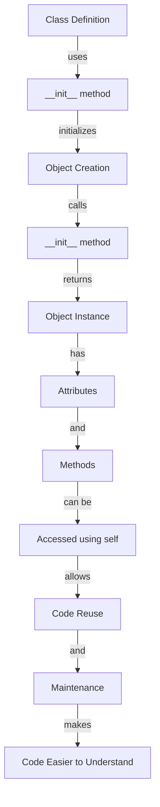

## Introduction
**Classes** are a fundamental concept in object-oriented programming (OOP) that allow developers to create custom data types. In Python, classes are defined using the `class` keyword and are used to encapsulate data and behavior. The `__init__` method, also known as the constructor, is a special method that is called when an object is created from a class. The `self` parameter is a reference to the current instance of the class and is used to access variables and methods from the class.

> **Note:** Classes are essential in Python programming, and understanding how to use them effectively is crucial for any Python developer.

In real-world applications, classes are used to model complex systems and relationships. For example, a bank might use classes to represent customers, accounts, and transactions. Classes provide a way to organize code, promote code reuse, and make it easier to maintain and extend large programs.

## Core Concepts
* **Class**: A class is a blueprint or template that defines the properties and behavior of an object.
* **Object**: An object is an instance of a class, and has its own set of attributes (data) and methods (functions).
* **`__init__` method**: The `__init__` method is a special method that is called when an object is created from a class. It is used to initialize the attributes of the class.
* **`self` parameter**: The `self` parameter is a reference to the current instance of the class and is used to access variables and methods from the class.

> **Tip:** When defining a class, it's a good practice to include a docstring that describes the purpose of the class and its methods.

## How It Works Internally
When a class is defined, Python creates a new namespace for the class. The namespace contains the class's attributes and methods. When an object is created from a class, Python creates a new instance of the class and calls the `__init__` method to initialize the object's attributes.

Here's a step-by-step breakdown of how it works:

1. The class is defined using the `class` keyword.
2. The `__init__` method is called when an object is created from the class.
3. The `__init__` method initializes the object's attributes using the `self` parameter.
4. The object's attributes and methods are accessed using the `self` parameter.

> **Warning:** If the `__init__` method is not defined, Python will raise a `TypeError` when trying to create an object from the class.

## Code Examples
### Example 1: Basic Class Definition
```python
class Person:
    def __init__(self, name, age):
        self.name = name
        self.age = age

    def greet(self):
        print(f"Hello, my name is {self.name} and I am {self.age} years old.")

# Create an object from the Person class
person = Person("John", 30)
person.greet()
```
### Example 2: Real-World Pattern - Bank Account
```python
class BankAccount:
    def __init__(self, account_number, balance):
        self.account_number = account_number
        self.balance = balance

    def deposit(self, amount):
        self.balance += amount
        print(f"Deposited ${amount} into account {self.account_number}. New balance: ${self.balance}")

    def withdraw(self, amount):
        if amount > self.balance:
            print("Insufficient funds.")
        else:
            self.balance -= amount
            print(f"Withdrew ${amount} from account {self.account_number}. New balance: ${self.balance}")

# Create an object from the BankAccount class
account = BankAccount("1234567890", 1000)
account.deposit(500)
account.withdraw(200)
```
### Example 3: Advanced Usage - Inheritance
```python
class Vehicle:
    def __init__(self, make, model, year):
        self.make = make
        self.model = model
        self.year = year

    def description(self):
        print(f"This vehicle is a {self.year} {self.make} {self.model}.")

class Car(Vehicle):
    def __init__(self, make, model, year, doors):
        super().__init__(make, model, year)
        self.doors = doors

    def description(self):
        super().description()
        print(f"It has {self.doors} doors.")

# Create an object from the Car class
car = Car("Toyota", "Corolla", 2015, 4)
car.description()
```
## Visual Diagram

The diagram shows the relationship between a class definition, the `__init__` method, object creation, and the resulting object instance.

> **Note:** The `__init__` method is a crucial part of the class definition, as it initializes the object's attributes and sets the stage for the object's behavior.

## Comparison
| Approach | Time Complexity | Space Complexity | Pros | Cons | Best For |
| --- | --- | --- | --- | --- | --- |
| Class Definition | O(1) | O(1) | Easy to define and use, promotes code reuse | Can be overused, leading to tight coupling | Small to medium-sized programs |
| Object-Oriented Programming | O(n) | O(n) | Encourages modular, reusable code, easy to maintain | Can be complex, steep learning curve | Large, complex programs |
| Functional Programming | O(n) | O(n) | Emphasizes immutability, easy to reason about | Can be less efficient, limited support in some languages | Data processing, scientific computing |
| Prototype-Based Programming | O(1) | O(1) | Flexible, easy to use, promotes code reuse | Can be less efficient, limited support in some languages | Rapid prototyping, small programs |

## Real-world Use Cases
* **Google's PageRank Algorithm**: Google uses a class-based approach to calculate the importance of web pages. Each web page is represented as an object, and the PageRank algorithm is implemented as a method that operates on these objects.
* **Amazon's Product Recommendation System**: Amazon uses a combination of object-oriented programming and machine learning to recommend products to customers. Each product is represented as an object, and the recommendation algorithm is implemented as a method that operates on these objects.
* **Facebook's News Feed Algorithm**: Facebook uses a class-based approach to generate the news feed for each user. Each user is represented as an object, and the news feed algorithm is implemented as a method that operates on these objects.

> **Interview:** Can you explain the difference between a class and an object? How would you use classes to model a real-world system?

## Common Pitfalls
* **Tight Coupling**: Classes that are tightly coupled are difficult to maintain and extend. To avoid this, use inheritance and polymorphism to decouple classes.
* **Overuse of Classes**: Using classes for every small problem can lead to over-engineering and make the code harder to understand. Use classes only when necessary, and prefer simpler approaches when possible.
* **Incorrect Use of `self`**: The `self` parameter is used to access variables and methods from the class. Using it incorrectly can lead to bugs and unexpected behavior.
* **Not Using `__init__`**: The `__init__` method is used to initialize the object's attributes. Not using it can lead to errors and unexpected behavior.

## Interview Tips
* **What is the difference between a class and an object?**: A class is a blueprint or template that defines the properties and behavior of an object, while an object is an instance of a class.
* **How do you use classes to model a real-world system?**: Use classes to represent the entities and relationships in the system, and define methods that operate on these entities to model the system's behavior.
* **What is the purpose of the `__init__` method?**: The `__init__` method is used to initialize the object's attributes and set the stage for the object's behavior.

## Key Takeaways
* **Classes are used to define custom data types**: Classes are used to encapsulate data and behavior, and provide a way to create custom data types.
* **The `__init__` method is used to initialize objects**: The `__init__` method is called when an object is created from a class, and is used to initialize the object's attributes.
* **The `self` parameter is used to access variables and methods**: The `self` parameter is used to access variables and methods from the class, and is essential for object-oriented programming.
* **Classes can be used to model real-world systems**: Classes can be used to represent the entities and relationships in a system, and define methods that operate on these entities to model the system's behavior.
* **Tight coupling can be avoided using inheritance and polymorphism**: Classes that are tightly coupled are difficult to maintain and extend. Using inheritance and polymorphism can help to decouple classes and make the code more maintainable.
* **Overuse of classes can lead to over-engineering**: Using classes for every small problem can lead to over-engineering and make the code harder to understand. Use classes only when necessary, and prefer simpler approaches when possible.