## Introduction
In **Python**, attributes are data members of a class that are used to describe the characteristics of an object. There are two types of attributes in Python: **instance attributes** and **class attributes**. Understanding the difference between these two types of attributes is crucial for any Python developer, as it can significantly impact the behavior and performance of their code. In this section, we will explore what instance attributes and class attributes are, why they matter, and their real-world relevance. 
> **Note:** Instance attributes are unique to each instance of a class, while class attributes are shared among all instances of a class.

## Core Concepts
**Instance attributes** are attributes that are defined inside a class but are unique to each instance of the class. They are used to store data that is specific to each instance, such as a person's name or age. On the other hand, **class attributes** are attributes that are defined inside a class and are shared among all instances of the class. They are used to store data that is common to all instances, such as a company's name or address. 
> **Warning:** Using class attributes incorrectly can lead to unexpected behavior and bugs, as changes to a class attribute will affect all instances of the class.

## How It Works Internally
When a class is defined, Python creates a new namespace for the class. This namespace contains all the attributes and methods defined in the class. When an instance of the class is created, Python creates a new namespace for the instance. This namespace contains all the instance attributes and methods defined in the class, as well as a reference to the class namespace. 
> **Tip:** You can use the `__dict__` attribute to inspect the namespace of an object and see its attributes.

Here is a step-by-step breakdown of how instance attributes and class attributes work internally:

1. **Class definition**: When a class is defined, Python creates a new namespace for the class.
2. **Instance creation**: When an instance of the class is created, Python creates a new namespace for the instance.
3. **Attribute access**: When an attribute is accessed, Python checks the instance namespace first. If the attribute is not found, it checks the class namespace.
4. **Attribute assignment**: When an attribute is assigned, Python checks the instance namespace first. If the attribute is not found, it creates a new attribute in the instance namespace.

## Code Examples
### Example 1: Basic instance attributes
```python
class Person:
    def __init__(self, name, age):
        self.name = name  # instance attribute
        self.age = age  # instance attribute

person1 = Person("John", 30)
person2 = Person("Jane", 25)

print(person1.name)  # prints "John"
print(person2.name)  # prints "Jane"
```
### Example 2: Class attributes
```python
class Company:
    company_name = "ABC Inc."  # class attribute

    def __init__(self, department):
        self.department = department  # instance attribute

company1 = Company("Sales")
company2 = Company("Marketing")

print(company1.company_name)  # prints "ABC Inc."
print(company2.company_name)  # prints "ABC Inc."

# changing the class attribute affects all instances
Company.company_name = "XYZ Inc."
print(company1.company_name)  # prints "XYZ Inc."
print(company2.company_name)  # prints "XYZ Inc."
```
### Example 3: Advanced usage
```python
class Employee:
    company_name = "ABC Inc."  # class attribute

    def __init__(self, name, age, department):
        self.name = name  # instance attribute
        self.age = age  # instance attribute
        self.department = department  # instance attribute

    def get_company_name(self):
        return self.company_name  # accessing class attribute

employee1 = Employee("John", 30, "Sales")
employee2 = Employee("Jane", 25, "Marketing")

print(employee1.get_company_name())  # prints "ABC Inc."
print(employee2.get_company_name())  # prints "ABC Inc."

# changing the class attribute affects all instances
Employee.company_name = "XYZ Inc."
print(employee1.get_company_name())  # prints "XYZ Inc."
print(employee2.get_company_name())  # prints "XYZ Inc."
```

## Visual Diagram

```mermaid
flowchart TD
    A[Class Definition] --> B[Instance Creation]
    B --> C[Attribute Access]
    C --> D[Instance Namespace]
    D --> E[Class Namespace]
    E --> F[Attribute Assignment]
    F --> G[Instance Namespace]
    G --> H[Class Namespace]
    H --> I[Attribute Access]
    I --> J[Instance Namespace]
    J --> K[Class Namespace]
    K --> L[Attribute Assignment]
    L --> M[Instance Namespace]
    M --> N[Class Namespace]
    N --> O[Attribute Access]
    O --> P[Instance Namespace]
    P --> Q[Class Namespace]
    Q --> R[Attribute Assignment]
    R --> S[Instance Namespace]
    S --> T[Class Namespace]
    T --> U[Attribute Access]
    U --> V[Instance Namespace]
    V --> W[Class Namespace]
    W --> X[Attribute Assignment]
    X --> Y[Instance Namespace]
    Y --> Z[Class Namespace]
    Z --> A
    style A fill:#f9f,stroke:#333,stroke-width:4px
    style B fill:#f9f,stroke:#333,stroke-width:4px
    style C fill:#f9f,stroke:#333,stroke-width:4px
    style D fill:#f9f,stroke:#333,stroke-width:4px
    style E fill:#f9f,stroke:#333,stroke-width:4px
    style F fill:#f9f,stroke:#333,stroke-width:4px
    style G fill:#f9f,stroke:#333,stroke-width:4px
    style H fill:#f9f,stroke:#333,stroke-width:4px
    style I fill:#f9f,stroke:#333,stroke-width:4px
    style J fill:#f9f,stroke:#333,stroke-width:4px
    style K fill:#f9f,stroke:#333,stroke-width:4px
    style L fill:#f9f,stroke:#333,stroke-width:4px
    style M fill:#f9f,stroke:#333,stroke-width:4px
    style N fill:#f9f,stroke:#333,stroke-width:4px
    style O fill:#f9f,stroke:#333,stroke-width:4px
    style P fill:#f9f,stroke:#333,stroke-width:4px
    style Q fill:#f9f,stroke:#333,stroke-width:4px
    style R fill:#f9f,stroke:#333,stroke-width:4px
    style S fill:#f9f,stroke:#333,stroke-width:4px
    style T fill:#f9f,stroke:#333,stroke-width:4px
    style U fill:#f9f,stroke:#333,stroke-width:4px
    style V fill:#f9f,stroke:#333,stroke-width:4px
    style W fill:#f9f,stroke:#333,stroke-width:4px
    style X fill:#f9f,stroke:#333,stroke-width:4px
    style Y fill:#f9f,stroke:#333,stroke-width:4px
    style Z fill:#f9f,stroke:#333,stroke-width:4px
```

The diagram illustrates the process of attribute access and assignment in Python. It shows how Python checks the instance namespace first and then the class namespace when accessing an attribute.

## Comparison
| Approach | Time Complexity | Space Complexity | Pros | Cons | Best For |
|----------|----------------|-----------------|------|------|----------|
| Instance Attributes | O(1) | O(n) | Unique to each instance, flexible | More memory-intensive | Large-scale applications with many instances |
| Class Attributes | O(1) | O(1) | Shared among all instances, memory-efficient | Less flexible, can lead to unexpected behavior | Small-scale applications with few instances |
| Hybrid Approach | O(1) | O(n) | Combines benefits of instance and class attributes | More complex, harder to maintain | Complex applications with varying requirements |
| Dictionary-based Approach | O(1) | O(n) | Flexible, scalable | Less efficient, more complex | Large-scale applications with dynamic attribute requirements |

## Real-world Use Cases
1. **Google's MapReduce**: Google's MapReduce framework uses instance attributes to store data specific to each map or reduce task, while using class attributes to store shared data such as the input and output file paths.
2. **Amazon's Dynamo**: Amazon's Dynamo database uses class attributes to store metadata such as the table name and schema, while using instance attributes to store data specific to each item in the table.
3. **Facebook's HipHop Virtual Machine**: Facebook's HipHop Virtual Machine (HHVM) uses instance attributes to store data specific to each request, while using class attributes to store shared data such as the application configuration.

## Common Pitfalls
1. **Incorrectly using class attributes**: Using class attributes incorrectly can lead to unexpected behavior and bugs, as changes to a class attribute will affect all instances of the class.
2. **Not using instance attributes**: Not using instance attributes can lead to less flexible and less scalable code, as all instances will share the same attributes.
3. **Not checking for attribute existence**: Not checking for attribute existence can lead to `AttributeError` exceptions, as Python will raise an exception if an attribute does not exist.
4. **Using `__dict__` incorrectly**: Using `__dict__` incorrectly can lead to unexpected behavior and bugs, as `__dict__` is a dictionary that stores an object's attributes.

## Interview Tips
1. **What is the difference between instance attributes and class attributes?**: The interviewer wants to assess your understanding of the difference between instance attributes and class attributes.
2. **How do you use instance attributes and class attributes in your code?**: The interviewer wants to assess your ability to apply instance attributes and class attributes in real-world scenarios.
3. **What are some common pitfalls when using instance attributes and class attributes?**: The interviewer wants to assess your awareness of common mistakes and your ability to avoid them.

## Key Takeaways
* **Instance attributes are unique to each instance of a class**, while **class attributes are shared among all instances of a class**.
* **Use instance attributes for data that is specific to each instance**, and **use class attributes for data that is common to all instances**.
* **Be aware of the potential pitfalls when using instance attributes and class attributes**, such as **incorrectly using class attributes** or **not using instance attributes**.
* **Use `__dict__` correctly** to inspect an object's attributes and avoid unexpected behavior.
* **Use a hybrid approach** that combines instance attributes and class attributes to achieve flexibility and scalability.
* **Consider the time and space complexity** of your approach when using instance attributes and class attributes.