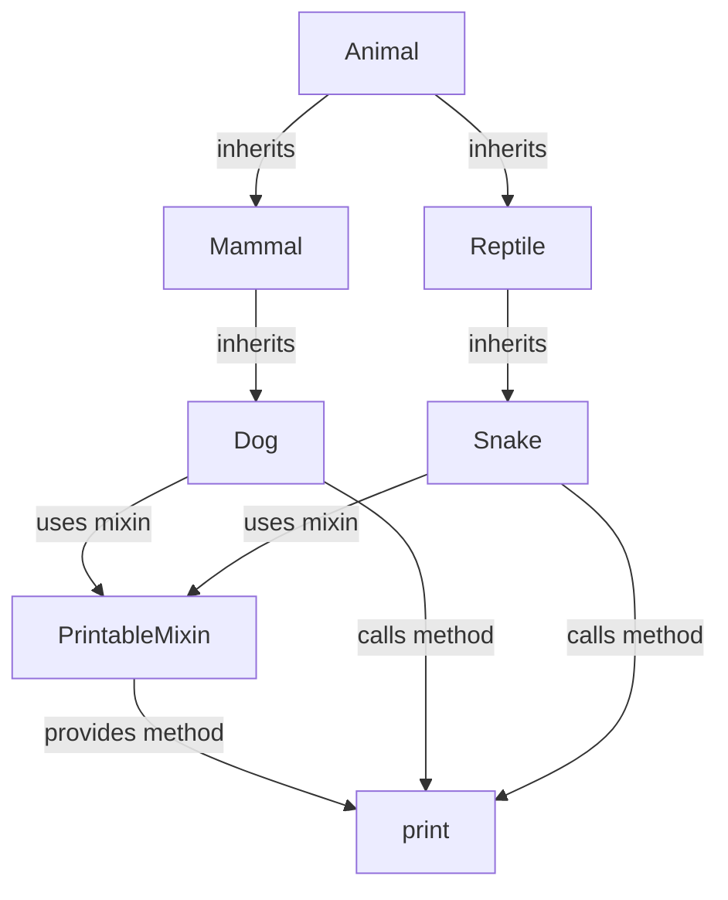

## Introduction
**Multiple Inheritance** and **Mixins** are fundamental concepts in object-oriented programming (OOP) that allow for more flexibility and code reuse. Multiple inheritance refers to a class inheriting behavior from multiple parent classes, while mixins are classes that provide a set of methods that can be used by other classes without being their parent class. In this section, we will explore why these concepts matter, their real-world relevance, and why every engineer needs to know about them.

Multiple inheritance and mixins are crucial in OOP because they enable developers to create complex class hierarchies and promote code reuse. By inheriting behavior from multiple classes, a subclass can combine the functionality of its parent classes, reducing code duplication and improving maintainability. Mixins, on the other hand, provide a way to add functionality to a class without affecting its inheritance hierarchy.

> **Note:** In Python, multiple inheritance is supported, but it can lead to the **diamond problem**, where a class inherits conflicting methods from its parent classes. Mixins help avoid this issue by providing a way to compose classes without inheritance.

## Core Concepts
To understand multiple inheritance and mixins, it's essential to grasp the following core concepts:

*   **Inheritance**: The process of creating a new class based on an existing class, inheriting its attributes and methods.
*   **Multiple Inheritance**: A class inheriting behavior from multiple parent classes.
*   **Mixins**: Classes that provide a set of methods that can be used by other classes without being their parent class.
*   **Method Resolution Order (MRO)**: The order in which Python resolves method calls in multiple inheritance scenarios.

> **Tip:** When using multiple inheritance, it's crucial to understand the MRO to avoid unexpected behavior.

## How It Works Internally
In Python, multiple inheritance works by creating a new class that inherits attributes and methods from its parent classes. When a method is called on an instance of the subclass, Python uses the MRO to resolve the method call.

Here's a step-by-step breakdown of how multiple inheritance works internally:

1.  **Class Creation**: A new class is created, inheriting from one or more parent classes.
2.  **Method Resolution**: When a method is called on an instance of the subclass, Python checks the subclass's namespace for the method.
3.  **MRO Resolution**: If the method is not found in the subclass's namespace, Python uses the MRO to resolve the method call, searching the parent classes in order.

> **Warning:** Multiple inheritance can lead to the diamond problem, where a class inherits conflicting methods from its parent classes. Mixins help avoid this issue.

## Code Examples
Here are three complete and runnable code examples demonstrating multiple inheritance and mixins in Python:

### Example 1: Basic Multiple Inheritance
```python
# Define parent classes
class Animal:
    def __init__(self, name):
        self.name = name

    def eat(self):
        print(f"{self.name} is eating.")

class Mammal:
    def __init__(self, name, fur_color):
        self.name = name
        self.fur_color = fur_color

    def sleep(self):
        print(f"{self.name} is sleeping.")

# Define subclass inheriting from parent classes
class Dog(Animal, Mammal):
    def __init__(self, name, fur_color, breed):
        Animal.__init__(self, name)
        Mammal.__init__(self, name, fur_color)
        self.breed = breed

    def bark(self):
        print(f"{self.name} is barking.")

# Create an instance of the subclass
dog = Dog("Max", "Golden", "Golden Retriever")

# Call methods on the instance
dog.eat()
dog.sleep()
dog.bark()
```

### Example 2: Using Mixins
```python
# Define a mixin class
class PrintableMixin:
    def print(self):
        for attr, value in self.__dict__.items():
            print(f"{attr}: {value}")

# Define a class using the mixin
class Book(PrintableMixin):
    def __init__(self, title, author, pages):
        self.title = title
        self.author = author
        self.pages = pages

# Create an instance of the class
book = Book("To Kill a Mockingbird", "Harper Lee", 281)

# Call the mixin method on the instance
book.print()
```

### Example 3: Advanced Multiple Inheritance with Mixins
```python
# Define parent classes
class Vehicle:
    def __init__(self, brand, model):
        self.brand = brand
        self.model = model

class ElectricMixin:
    def __init__(self, battery_capacity):
        self.battery_capacity = battery_capacity

    def charge(self):
        print(f"Charging {self.brand} {self.model}...")

# Define subclass inheriting from parent classes and using mixin
class ElectricCar(Vehicle, ElectricMixin):
    def __init__(self, brand, model, battery_capacity):
        Vehicle.__init__(self, brand, model)
        ElectricMixin.__init__(self, battery_capacity)

    def drive(self):
        print(f"Driving {self.brand} {self.model}...")

# Create an instance of the subclass
car = ElectricCar("Tesla", "Model S", 100)

# Call methods on the instance
car.charge()
car.drive()
```

## Visual Diagram

This diagram illustrates the inheritance hierarchy and mixin usage in the code examples. The `Animal` class inherits from `Mammal` and `Reptile`, which in turn inherit from `Dog` and `Snake`. The `Dog` and `Snake` classes use the `PrintableMixin` to provide the `print` method.

> **Tip:** When designing class hierarchies, consider using mixins to provide additional functionality without affecting the inheritance hierarchy.

## Comparison
Here's a comparison of multiple inheritance and mixin approaches in Python:

| Approach | Time Complexity | Space Complexity | Pros | Cons | Best For |
| --- | --- | --- | --- | --- | --- |
| Multiple Inheritance | O(n) | O(n) | Flexible, promotes code reuse | Can lead to diamond problem | Complex class hierarchies |
| Mixins | O(1) | O(1) | Provides additional functionality without affecting inheritance | Can lead to tight coupling | Adding functionality to existing classes |
| Single Inheritance | O(1) | O(1) | Simple, easy to understand | Limited flexibility | Simple class hierarchies |
| Composition | O(1) | O(1) | Flexible, promotes loose coupling | Can lead to over-engineering | Complex systems with many interacting components |

> **Interview:** When asked about multiple inheritance and mixins, be prepared to explain the pros and cons of each approach and provide examples of when to use them.

## Real-world Use Cases
Here are three real-world examples of multiple inheritance and mixins in production systems:

1.  **Django**: The popular Python web framework uses multiple inheritance to create complex class hierarchies for its models and views.
2.  **Scikit-learn**: The machine learning library uses mixins to provide additional functionality to its estimators, such as the `PrintableMixin` for printing estimator parameters.
3.  **PyTorch**: The deep learning framework uses multiple inheritance to create complex class hierarchies for its models and modules.

> **Note:** When using multiple inheritance and mixins in production systems, it's essential to consider the trade-offs between flexibility, maintainability, and performance.

## Common Pitfalls
Here are four common pitfalls to watch out for when using multiple inheritance and mixins:

1.  **Diamond Problem**: When a class inherits conflicting methods from its parent classes, leading to unexpected behavior.
2.  **Tight Coupling**: When a class is tightly coupled to its parent classes or mixin, making it difficult to modify or replace.
3.  **Over-Engineering**: When a class hierarchy becomes overly complex, leading to maintenance and performance issues.
4.  **Method Overriding**: When a subclass overrides a method from its parent class, potentially leading to unexpected behavior.

> **Warning:** Be cautious when using multiple inheritance and mixins, as they can lead to complex class hierarchies and tight coupling.

## Interview Tips
Here are three common interview questions related to multiple inheritance and mixins, along with weak and strong answer examples:

1.  **What is the diamond problem, and how do you avoid it?**
    *   Weak answer: "I'm not sure what the diamond problem is."
    *   Strong answer: "The diamond problem occurs when a class inherits conflicting methods from its parent classes. To avoid it, I use mixins or composition to provide additional functionality without affecting the inheritance hierarchy."
2.  **How do you design a class hierarchy using multiple inheritance and mixins?**
    *   Weak answer: "I just add classes and methods as needed."
    *   Strong answer: "I consider the trade-offs between flexibility, maintainability, and performance when designing a class hierarchy. I use multiple inheritance to create complex class hierarchies and mixins to provide additional functionality without affecting the inheritance hierarchy."
3.  **What are the pros and cons of using multiple inheritance versus composition?**
    *   Weak answer: "I'm not sure."
    *   Strong answer: "Multiple inheritance provides flexibility and promotes code reuse, but can lead to tight coupling and the diamond problem. Composition provides loose coupling and flexibility, but can lead to over-engineering. I consider the specific use case and trade-offs when choosing between multiple inheritance and composition."

> **Tip:** When answering interview questions, be prepared to explain the pros and cons of multiple inheritance and mixins, and provide examples of when to use them.

## Key Takeaways
Here are six key takeaways to remember when using multiple inheritance and mixins in Python:

*   **Multiple inheritance** provides flexibility and promotes code reuse, but can lead to the diamond problem.
*   **Mixins** provide additional functionality without affecting the inheritance hierarchy, but can lead to tight coupling.
*   **Method resolution order (MRO)** is essential to understand when using multiple inheritance.
*   **Composition** provides loose coupling and flexibility, but can lead to over-engineering.
*   **Tight coupling** can occur when a class is tightly coupled to its parent classes or mixin.
*   **Over-engineering** can occur when a class hierarchy becomes overly complex.

> **Note:** When using multiple inheritance and mixins, consider the trade-offs between flexibility, maintainability, and performance, and be prepared to explain the pros and cons of each approach.