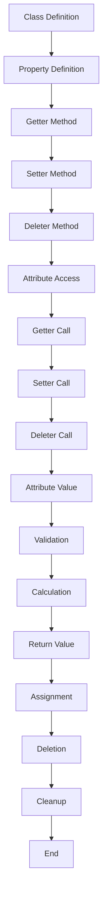

## Introduction
In Python, **properties** are a powerful feature that allows you to implement custom accessors, mutators, and deleters for instance variables. This is achieved using the `@property`, `@setter`, and `@deleter` decorators. Properties are essential in object-oriented programming (OOP) as they enable you to control access to an object's internal state, ensuring data encapsulation and integrity. In this section, we will delve into the world of properties, exploring their definition, importance, and real-world relevance.

Properties are crucial in Python because they allow you to define a custom interface for accessing and modifying an object's attributes. This is particularly useful when you need to perform some action before or after getting or setting an attribute's value. For example, you might want to validate the input data before setting an attribute's value or perform some calculation before returning an attribute's value.

> **Note:** Properties are an essential feature in Python, and every engineer should understand how to use them effectively to write robust and maintainable code.

## Core Concepts
To understand properties, you need to grasp the following core concepts:

*   **Getter:** A getter is a method that returns the value of an attribute. In Python, you can define a getter using the `@property` decorator.
*   **Setter:** A setter is a method that sets the value of an attribute. In Python, you can define a setter using the `@x.setter` decorator, where `x` is the name of the property.
*   **Deleter:** A deleter is a method that deletes an attribute. In Python, you can define a deleter using the `@x.deleter` decorator, where `x` is the name of the property.
*   **Descriptor:** A descriptor is a protocol that allows an object to implement custom accessors, mutators, and deleters for its attributes. In Python, you can define a descriptor using the `__get__`, `__set__`, and `__delete__` special methods.

> **Warning:** When using properties, be aware that they can introduce additional overhead due to the extra function calls. However, this overhead is usually negligible, and the benefits of using properties far outweigh the costs.

## How It Works Internally
When you access an attribute that is defined as a property, Python internally calls the getter method to retrieve the value. Similarly, when you assign a value to an attribute that is defined as a property, Python internally calls the setter method to set the value. If you try to delete an attribute that is defined as a property, Python internally calls the deleter method to delete the attribute.

Here's a step-by-step breakdown of how properties work internally:

1.  **Attribute Access:** When you access an attribute, Python checks if it is defined as a property. If it is, Python calls the getter method to retrieve the value.
2.  **Getter Method:** The getter method returns the value of the attribute. This method can perform any necessary calculations or validations before returning the value.
3.  **Attribute Assignment:** When you assign a value to an attribute, Python checks if it is defined as a property. If it is, Python calls the setter method to set the value.
4.  **Setter Method:** The setter method sets the value of the attribute. This method can perform any necessary validations or calculations before setting the value.
5.  **Attribute Deletion:** When you try to delete an attribute, Python checks if it is defined as a property. If it is, Python calls the deleter method to delete the attribute.
6.  **Deleter Method:** The deleter method deletes the attribute. This method can perform any necessary cleanup or validation before deleting the attribute.

> **Tip:** When defining properties, make sure to follow the naming convention of using a single underscore prefix for private attributes. This helps to avoid naming conflicts and makes your code more readable.

## Code Examples
Here are three complete and runnable examples that demonstrate the use of properties in Python:

### Example 1: Basic Property
```python
class Person:
    def __init__(self, name, age):
        self._name = name
        self._age = age

    @property
    def name(self):
        return self._name

    @name.setter
    def name(self, value):
        if not isinstance(value, str):
            raise TypeError("Name must be a string")
        self._name = value

    @property
    def age(self):
        return self._age

    @age.setter
    def age(self, value):
        if not isinstance(value, int) or value < 0:
            raise ValueError("Age must be a non-negative integer")
        self._age = value

person = Person("John Doe", 30)
print(person.name)  # Output: John Doe
print(person.age)   # Output: 30

person.name = "Jane Doe"
person.age = 31
print(person.name)  # Output: Jane Doe
print(person.age)   # Output: 31
```

### Example 2: Real-World Pattern
```python
class BankAccount:
    def __init__(self, account_number, balance):
        self._account_number = account_number
        self._balance = balance

    @property
    def account_number(self):
        return self._account_number

    @property
    def balance(self):
        return self._balance

    @balance.setter
    def balance(self, value):
        if not isinstance(value, (int, float)) or value < 0:
            raise ValueError("Balance must be a non-negative number")
        self._balance = value

    def deposit(self, amount):
        if not isinstance(amount, (int, float)) or amount < 0:
            raise ValueError("Deposit amount must be a non-negative number")
        self.balance += amount

    def withdraw(self, amount):
        if not isinstance(amount, (int, float)) or amount < 0:
            raise ValueError("Withdrawal amount must be a non-negative number")
        if amount > self.balance:
            raise ValueError("Insufficient balance")
        self.balance -= amount

account = BankAccount("1234567890", 1000.0)
print(account.account_number)  # Output: 1234567890
print(account.balance)         # Output: 1000.0

account.deposit(500.0)
print(account.balance)         # Output: 1500.0

account.withdraw(200.0)
print(account.balance)         # Output: 1300.0
```

### Example 3: Advanced Property
```python
class Student:
    def __init__(self, name, grades):
        self._name = name
        self._grades = grades

    @property
    def name(self):
        return self._name

    @name.setter
    def name(self, value):
        if not isinstance(value, str):
            raise TypeError("Name must be a string")
        self._name = value

    @property
    def grades(self):
        return self._grades

    @grades.setter
    def grades(self, value):
        if not isinstance(value, dict):
            raise TypeError("Grades must be a dictionary")
        for subject, grade in value.items():
            if not isinstance(subject, str) or not isinstance(grade, (int, float)):
                raise ValueError("Invalid grade format")
        self._grades = value

    @property
    def average_grade(self):
        if not self.grades:
            return 0.0
        return sum(self.grades.values()) / len(self.grades)

student = Student("John Doe", {"Math": 90.0, "Science": 85.0})
print(student.name)           # Output: John Doe
print(student.grades)         # Output: {'Math': 90.0, 'Science': 85.0}
print(student.average_grade) # Output: 87.5

student.name = "Jane Doe"
student.grades = {"Math": 95.0, "Science": 90.0}
print(student.name)           # Output: Jane Doe
print(student.grades)         # Output: {'Math': 95.0, 'Science': 90.0}
print(student.average_grade) # Output: 92.5
```

## Visual Diagram

This diagram illustrates the flow of property definition, attribute access, and method calls in Python.

> **Interview:** Can you explain the difference between a property and a regular attribute in Python? How do you define a property, and what are the benefits of using properties in your code?

## Comparison
Here's a comparison table of different approaches to defining properties in Python:

| Approach | Time Complexity | Space Complexity | Pros | Cons | Best For |
| --- | --- | --- | --- | --- | --- |
| Property Decorator | O(1) | O(1) | Easy to define, flexible, and readable | Can introduce overhead | Simple properties, validation, and calculation |
| Descriptors | O(1) | O(1) | Flexible, reusable, and efficient | Steeper learning curve | Complex properties, caching, and optimization |
| Regular Attributes | O(1) | O(1) | Simple, fast, and straightforward | Limited control, no validation | Basic data storage, simple use cases |
| Getter and Setter Methods | O(1) | O(1) | Explicit, flexible, and readable | Verbose, more code | Legacy code, compatibility, and specific requirements |

## Real-world Use Cases
Here are three real-world examples of using properties in Python:

1.  **Banking System:** A banking system can use properties to define account attributes, such as account number, balance, and transaction history. Properties can be used to validate and calculate values, ensuring data consistency and integrity.
2.  **E-commerce Platform:** An e-commerce platform can use properties to define product attributes, such as price, quantity, and description. Properties can be used to validate and calculate values, ensuring accurate pricing and inventory management.
3.  **Scientific Simulation:** A scientific simulation can use properties to define physical attributes, such as temperature, pressure, and velocity. Properties can be used to validate and calculate values, ensuring accurate and consistent results.

> **Tip:** When using properties in real-world applications, make sure to follow best practices, such as using meaningful names, validating input data, and handling exceptions properly.

## Common Pitfalls
Here are four common pitfalls to watch out for when using properties in Python:

1.  **Incorrect Property Definition:** Make sure to define properties correctly, using the `@property` decorator and the `@x.setter` and `@x.deleter` decorators for setter and deleter methods, respectively.
2.  **Insufficient Validation:** Always validate input data in setter methods to ensure data consistency and integrity.
3.  **Inconsistent Naming:** Follow the naming convention of using a single underscore prefix for private attributes to avoid naming conflicts.
4.  **Overuse of Properties:** Use properties judiciously, as they can introduce overhead and make the code more complex.

> **Warning:** Be aware of the potential pitfalls and take steps to avoid them, ensuring your code is robust, maintainable, and efficient.

## Interview Tips
Here are three common interview questions related to properties in Python, along with sample answers:

1.  **What is the purpose of properties in Python?**
    *   Weak answer: Properties are used to define attributes in Python.
    *   Strong answer: Properties are used to control access to an object's internal state, ensuring data encapsulation and integrity. They allow you to define custom accessors, mutators, and deleters for instance variables.
2.  **How do you define a property in Python?**
    *   Weak answer: You use the `@property` decorator to define a property.
    *   Strong answer: You use the `@property` decorator to define a getter method, and the `@x.setter` and `@x.deleter` decorators to define setter and deleter methods, respectively.
3.  **What are the benefits of using properties in Python?**
    *   Weak answer: Properties make the code more readable.
    *   Strong answer: Properties provide a way to control access to an object's internal state, ensuring data consistency and integrity. They also allow you to define custom validation, calculation, and caching mechanisms, making the code more robust and maintainable.

> **Note:** Be prepared to answer questions about properties in Python, and make sure to provide clear, concise, and accurate answers.

## Key Takeaways
Here are ten key takeaways about properties in Python:

*   **Properties are used to control access to an object's internal state.**
*   **Properties are defined using the `@property` decorator.**
*   **Setter and deleter methods are defined using the `@x.setter` and `@x.deleter` decorators, respectively.**
*   **Properties can be used to validate and calculate values.**
*   **Properties can be used to implement caching mechanisms.**
*   **Properties can introduce overhead due to the extra function calls.**
*   **Properties are essential in object-oriented programming (OOP) for data encapsulation and integrity.**
*   **Properties can be used to define custom accessors, mutators, and deleters for instance variables.**
*   **Properties can be used to improve code readability and maintainability.**
*   **Properties can be used to implement complex logic and validation mechanisms.**

> **Tip:** Keep these key takeaways in mind when working with properties in Python, and make sure to apply them in your everyday coding practice.