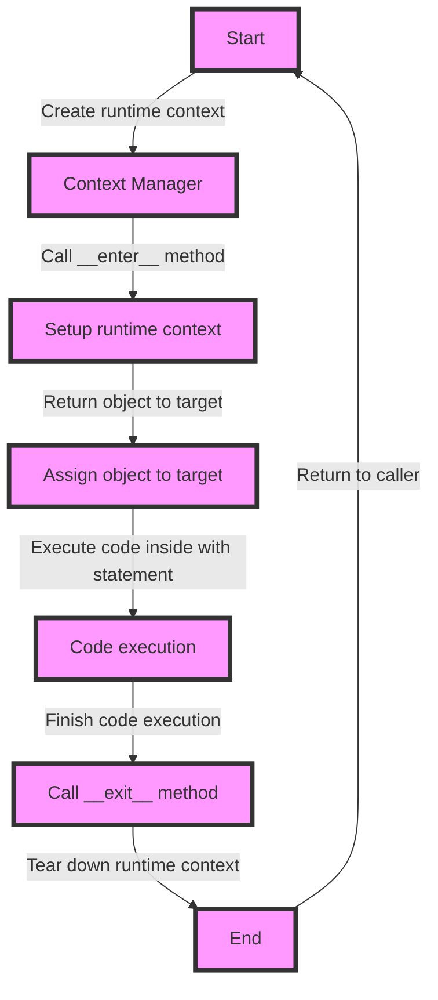

## Introduction
**Context managers** are a crucial concept in Python that allows you to manage resources, such as files, connections, or locks, in a way that ensures they are properly cleaned up after use. The `with` statement is a key part of context managers, as it provides a clear and concise way to express the setup and teardown of resources. In this section, we'll explore why context managers matter, their real-world relevance, and why every engineer needs to know this.

Context managers are essential in production environments, where resources are limited and need to be managed efficiently. For example, when working with files, you want to ensure that they are properly closed after use to avoid file descriptor leaks. Similarly, when working with database connections, you want to ensure that they are properly closed to avoid connection leaks. Context managers provide a way to do this in a concise and readable way.

> **Tip:** Use context managers to ensure that resources are properly cleaned up after use, which helps prevent resource leaks and improves the overall performance of your application.

## Core Concepts
A context manager is an object that defines the runtime context to be established when the execution enters the suite of the `with` statement. The context manager is responsible for setting up and tearing down the runtime context. The `__enter__` method is called when entering the `with` statement, and the `__exit__` method is called when exiting the `with` statement.

The `__enter__` method is used to set up the runtime context, and it should return an object that will be assigned to the target of the `with` statement. The `__exit__` method is used to tear down the runtime context, and it should return `True` if the exception is handled, and `False` otherwise.

> **Note:** The `__enter__` and `__exit__` methods are special methods in Python that are used to define the context manager protocol.

Key terminology:

* **Context manager**: An object that defines the runtime context to be established when the execution enters the suite of the `with` statement.
* **`__enter__` method**: A special method that is called when entering the `with` statement, used to set up the runtime context.
* **`__exit__` method**: A special method that is called when exiting the `with` statement, used to tear down the runtime context.

## How It Works Internally
When you use the `with` statement, Python creates a runtime context that is managed by the context manager. The context manager is responsible for setting up and tearing down the runtime context.

Here's a step-by-step breakdown of how it works:

1. The `with` statement is executed, and Python creates a runtime context.
2. The `__enter__` method is called on the context manager, which sets up the runtime context.
3. The object returned by the `__enter__` method is assigned to the target of the `with` statement.
4. The code inside the `with` statement is executed.
5. When the code inside the `with` statement is finished, the `__exit__` method is called on the context manager, which tears down the runtime context.
6. If an exception occurs inside the `with` statement, the `__exit__` method is called with the exception as an argument.

> **Warning:** If an exception occurs inside the `with` statement, and the `__exit__` method returns `False`, the exception will be propagated to the caller.

## Code Examples
### Example 1: Basic Usage
```python
class FileManager:
    def __enter__(self):
        self.file = open("example.txt", "w")
        return self.file

    def __exit__(self, exc_type, exc_val, exc_tb):
        self.file.close()

with FileManager() as file:
    file.write("Hello, World!")
```
This example demonstrates the basic usage of a context manager. The `FileManager` class defines the `__enter__` and `__exit__` methods, which are used to set up and tear down the file resource.

### Example 2: Real-World Pattern
```python
import logging

class LoggingContextManager:
    def __enter__(self):
        logging.basicConfig(level=logging.INFO)
        return logging

    def __exit__(self, exc_type, exc_val, exc_tb):
        logging.shutdown()

with LoggingContextManager() as logging:
    logging.info("This is an info message")
    logging.warning("This is a warning message")
    logging.error("This is an error message")
```
This example demonstrates a real-world pattern for using a context manager. The `LoggingContextManager` class defines the `__enter__` and `__exit__` methods, which are used to set up and tear down the logging configuration.

### Example 3: Advanced Usage
```python
import threading

class LockContextManager:
    def __init__(self, lock):
        self.lock = lock

    def __enter__(self):
        self.lock.acquire()
        return self.lock

    def __exit__(self, exc_type, exc_val, exc_tb):
        self.lock.release()

lock = threading.Lock()
with LockContextManager(lock):
    # Critical section of code
    print("This is a critical section of code")
```
This example demonstrates an advanced usage of a context manager. The `LockContextManager` class defines the `__enter__` and `__exit__` methods, which are used to acquire and release a lock.

## Visual Diagram

This diagram illustrates the flow of execution when using a context manager. The `__enter__` method is called when entering the `with` statement, and the `__exit__` method is called when exiting the `with` statement.

## Comparison
| Approach | Time Complexity | Space Complexity | Pros | Cons | Best For |
| --- | --- | --- | --- | --- | --- |
| Context Manager | O(1) | O(1) | Ensures proper cleanup, improves readability | Requires implementing `__enter__` and `__exit__` methods | Resource management, error handling |
| Try-Except Block | O(1) | O(1) | Simple to implement, flexible | Does not ensure proper cleanup, can be error-prone | Simple error handling, resource management |
| Manual Cleanup | O(1) | O(1) | Simple to implement, flexible | Does not ensure proper cleanup, can be error-prone | Simple resource management, error handling |

> **Interview:** Can you explain the difference between a context manager and a try-except block? How would you choose between the two?

## Real-world Use Cases
1. **File Management**: Context managers are used to manage file resources, ensuring that files are properly closed after use.
2. **Database Connections**: Context managers are used to manage database connections, ensuring that connections are properly closed after use.
3. **Locking Mechanisms**: Context managers are used to manage locking mechanisms, ensuring that locks are properly acquired and released.

## Common Pitfalls
1. **Not Implementing `__exit__` Method**: Failing to implement the `__exit__` method can lead to resource leaks.
```python
class FileManager:
    def __enter__(self):
        self.file = open("example.txt", "w")
        return self.file

# Wrong way
with FileManager() as file:
    file.write("Hello, World!")

# Right way
class FileManager:
    def __enter__(self):
        self.file = open("example.txt", "w")
        return self.file

    def __exit__(self, exc_type, exc_val, exc_tb):
        self.file.close()
```
2. **Not Handling Exceptions**: Failing to handle exceptions can lead to unexpected behavior.
```python
class FileManager:
    def __enter__(self):
        self.file = open("example.txt", "w")
        return self.file

    def __exit__(self, exc_type, exc_val, exc_tb):
        self.file.close()

# Wrong way
with FileManager() as file:
    file.write("Hello, World!")
    raise Exception("Something went wrong")

# Right way
class FileManager:
    def __enter__(self):
        self.file = open("example.txt", "w")
        return self.file

    def __exit__(self, exc_type, exc_val, exc_tb):
        if exc_type:
            self.file.close()
            return False
        self.file.close()
        return True
```
3. **Not Releasing Resources**: Failing to release resources can lead to resource leaks.
```python
class LockContextManager:
    def __init__(self, lock):
        self.lock = lock

    def __enter__(self):
        self.lock.acquire()
        return self.lock

# Wrong way
with LockContextManager(lock):
    # Critical section of code
    print("This is a critical section of code")

# Right way
class LockContextManager:
    def __init__(self, lock):
        self.lock = lock

    def __enter__(self):
        self.lock.acquire()
        return self.lock

    def __exit__(self, exc_type, exc_val, exc_tb):
        self.lock.release()
```
4. **Not Implementing `__enter__` Method**: Failing to implement the `__enter__` method can lead to unexpected behavior.
```python
class FileManager:
    def __exit__(self, exc_type, exc_val, exc_tb):
        self.file.close()

# Wrong way
with FileManager() as file:
    file.write("Hello, World!")

# Right way
class FileManager:
    def __enter__(self):
        self.file = open("example.txt", "w")
        return self.file

    def __exit__(self, exc_type, exc_val, exc_tb):
        self.file.close()
```
> **Warning:** Failing to implement the `__enter__` and `__exit__` methods can lead to unexpected behavior and resource leaks.

## Interview Tips
1. **Context Manager vs Try-Except Block**: Can you explain the difference between a context manager and a try-except block? How would you choose between the two?
2. **Implementing `__enter__` and `__exit__` Methods**: Can you explain how to implement the `__enter__` and `__exit__` methods? What are the best practices for implementing these methods?
3. **Handling Exceptions**: Can you explain how to handle exceptions in a context manager? What are the best practices for handling exceptions?

> **Tip:** When implementing a context manager, make sure to handle exceptions properly and release resources to avoid resource leaks.

## Key Takeaways
* Context managers ensure proper cleanup and improve readability.
* The `__enter__` method is called when entering the `with` statement.
* The `__exit__` method is called when exiting the `with` statement.
* Context managers can be used for resource management, error handling, and locking mechanisms.
* Implementing the `__enter__` and `__exit__` methods is crucial for proper context manager behavior.
* Handling exceptions properly is essential for avoiding unexpected behavior and resource leaks.
* Releasing resources is essential for avoiding resource leaks.
* Context managers are a powerful tool for managing resources and handling exceptions in Python.