## Introduction
**Decorators** are a powerful feature in Python that allow programmers to modify the behavior of function or class. They provide a way to wrap another function in order to extend the behavior of the wrapped function, without permanently modifying it. Decorators are often used to add additional functionality to existing code, such as logging, authentication, or caching. In this section, we will explore the basics of decorators and their real-world relevance.

Decorators are useful when we want to add some functionality to a function without changing its source code. They are also useful when we want to reuse the same functionality in multiple functions. For example, we can use decorators to measure the execution time of a function, or to check if a user is authenticated before allowing them to access a certain function.

## Core Concepts
A decorator is a small function that takes another function as an argument and returns a new function that "wraps" the original function. The new function produced by the decorator is then called instead of the original function when it's invoked.

Here are some key concepts related to decorators:
- **Function Decorators**: These are decorators that are used to modify the behavior of a function.
- **Class Decorators**: These are decorators that are used to modify the behavior of a class.
- **Decorator Factories**: These are functions that return decorators.
- **`functools.wraps`**: This is a decorator that is used to preserve the metadata of the original function.

> **Tip:** Use the `@` symbol to apply a decorator to a function.

## How It Works Internally
When a decorator is applied to a function, Python replaces the original function with the new function returned by the decorator. The new function then calls the original function, but it can also do other things, such as logging or authentication.

Here's a step-by-step breakdown of how decorators work:
1. The decorator function is defined.
2. The decorator function is applied to a function using the `@` symbol.
3. When the decorated function is called, Python actually calls the new function returned by the decorator.
4. The new function calls the original function, but it can also do other things.

> **Warning:** Be careful when using decorators, as they can modify the behavior of a function in unexpected ways.

## Code Examples
### Example 1: Basic Decorator
```python
def my_decorator(func):
    def wrapper():
        print("Something is happening before the function is called.")
        func()
        print("Something is happening after the function is called.")
    return wrapper

@my_decorator
def say_hello():
    print("Hello!")

say_hello()
```
This will output:
```
Something is happening before the function is called.
Hello!
Something is happening after the function is called.
```
### Example 2: Real-World Decorator
```python
import time
from functools import wraps

def timer_decorator(func):
    @wraps(func)
    def wrapper(*args, **kwargs):
        start_time = time.time()
        result = func(*args, **kwargs)
        end_time = time.time()
        print(f"Function {func.__name__} took {end_time - start_time} seconds to execute.")
        return result
    return wrapper

@timer_decorator
def add_numbers(a, b):
    time.sleep(1)  # Simulate some time-consuming operation
    return a + b

result = add_numbers(2, 3)
print(f"Result: {result}")
```
This will output:
```
Function add_numbers took 1.002315 seconds to execute.
Result: 5
```
### Example 3: Decorator Factory
```python
def repeat_decorator(n):
    def decorator(func):
        def wrapper(*args, **kwargs):
            for _ in range(n):
                func(*args, **kwargs)
        return wrapper
    return decorator

@repeat_decorator(3)
def say_hello(name):
    print(f"Hello, {name}!")

say_hello("John")
```
This will output:
```
Hello, John!
Hello, John!
Hello, John!
```
## Visual Diagram

```mermaid
flowchart TD
    A[Define Decorator] --> B[Apply Decorator]
    B --> C[Call Decorated Function]
    C --> D[Call Original Function]
    D --> E[Do Something Before]
    E --> F[Do Something After]
    F --> G[Return Result]
    G --> H[Preserve Metadata]
    H --> I[Return New Function]
    I --> J[Replace Original Function]
    J --> K[Call New Function]
    K --> L[Call Original Function]
    L --> M[Do Something Before]
    M --> N[Do Something After]
    N --> O[Return Result]
    O --> P[Repeat]
    P --> Q[Repeat N Times]
    Q --> R[Return Result]
    style A fill:#f9f,stroke:#333,stroke-width:4px
    style B fill:#f9f,stroke:#333,stroke-width:4px
    style C fill:#f9f,stroke:#333,stroke-width:4px
    style D fill:#f9f,stroke:#333,stroke-width:4px
    style E fill:#f9f,stroke:#333,stroke-width:4px
    style F fill:#f9f,stroke:#333,stroke-width:4px
    style G fill:#f9f,stroke:#333,stroke-width:4px
    style H fill:#f9f,stroke:#333,stroke-width:4px
    style I fill:#f9f,stroke:#333,stroke-width:4px
    style J fill:#f9f,stroke:#333,stroke-width:4px
    style K fill:#f9f,stroke:#333,stroke-width:4px
    style L fill:#f9f,stroke:#333,stroke-width:4px
    style M fill:#f9f,stroke:#333,stroke-width:4px
    style N fill:#f9f,stroke:#333,stroke-width:4px
    style O fill:#f9f,stroke:#333,stroke-width:4px
    style P fill:#f9f,stroke:#333,stroke-width:4px
    style Q fill:#f9f,stroke:#333,stroke-width:4px
    style R fill:#f9f,stroke:#333,stroke-width:4px
```

This diagram shows the step-by-step process of how decorators work.

## Comparison
| Approach | Time Complexity | Space Complexity | Pros | Cons | Best For |
| --- | --- | --- | --- | --- | --- |
| Function Decorators | O(1) | O(1) | Easy to use, flexible | Can be slow, hard to debug | Small functions, logging, authentication |
| Class Decorators | O(1) | O(1) | Flexible, easy to use | Can be slow, hard to debug | Classes, inheritance, polymorphism |
| Decorator Factories | O(1) | O(1) | Flexible, easy to use | Can be slow, hard to debug | Repeating tasks, caching |
| `functools.wraps` | O(1) | O(1) | Preserves metadata, easy to use | Can be slow, hard to debug | Preserving metadata, debugging |

> **Note:** The time and space complexity of decorators depends on the specific use case.

## Real-world Use Cases
1. **Logging**: Decorators can be used to log information about function calls, such as the input arguments and the return value.
2. **Authentication**: Decorators can be used to check if a user is authenticated before allowing them to access a certain function.
3. **Caching**: Decorators can be used to cache the result of a function, so that it doesn't need to be recalculated every time it's called.
4. **Error Handling**: Decorators can be used to catch and handle exceptions raised by a function.
5. **Rate Limiting**: Decorators can be used to limit the number of times a function can be called within a certain time period.

> **Interview:** Can you explain how decorators work in Python? How would you use a decorator to log information about function calls?

## Common Pitfalls
1. **Not Preserving Metadata**: When using decorators, it's easy to forget to preserve the metadata of the original function. This can lead to problems when debugging or using tools that rely on metadata.
2. **Not Handling Exceptions**: Decorators can catch and handle exceptions raised by the original function, but they can also mask the original exception. This can make it harder to debug problems.
3. **Not Testing Decorators**: Decorators can be complex and hard to test. It's easy to forget to test them, which can lead to problems in production.
4. **Overusing Decorators**: Decorators can be a powerful tool, but they can also be overused. This can lead to code that's hard to read and maintain.

> **Warning:** Be careful when using decorators, as they can modify the behavior of a function in unexpected ways.

## Interview Tips
1. **Be Prepared to Explain Decorators**: Make sure you can explain how decorators work and how to use them.
2. **Practice Using Decorators**: Practice using decorators to solve problems, such as logging or authentication.
3. **Be Prepared to Answer Questions About Decorator Pitfalls**: Be prepared to answer questions about common pitfalls when using decorators, such as not preserving metadata or not handling exceptions.
4. **Be Prepared to Answer Questions About Decorator Use Cases**: Be prepared to answer questions about real-world use cases for decorators, such as logging or caching.

> **Tip:** Use decorators to solve problems in a clean and elegant way.

## Key Takeaways
* Decorators are a powerful feature in Python that allow programmers to modify the behavior of function or class.
* Decorators are useful when we want to add some functionality to a function without changing its source code.
* Decorators can be used to log information about function calls, check if a user is authenticated, cache the result of a function, catch and handle exceptions, and limit the number of times a function can be called within a certain time period.
* Decorators can be complex and hard to test, so it's easy to forget to test them.
* Decorators can modify the behavior of a function in unexpected ways, so be careful when using them.
* `functools.wraps` is a decorator that preserves the metadata of the original function.
* Decorator factories are functions that return decorators.
* Decorators have a time complexity of O(1) and a space complexity of O(1).
* Decorators are best used for small functions, logging, authentication, and caching.