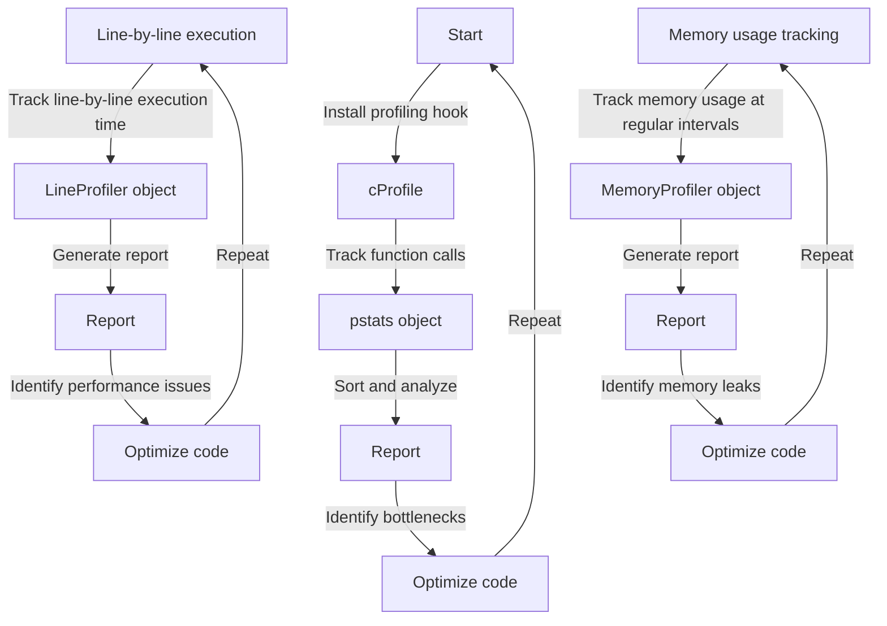

## Introduction
Profiling is a crucial step in optimizing the performance of Python applications. It involves analyzing the execution time and memory usage of different parts of the code to identify bottlenecks and areas for improvement. Python provides several profiling tools, including **cProfile**, **line_profiler**, and **memory_profiler**, each with its own strengths and use cases. In this section, we will explore the importance of profiling, its real-world relevance, and why every engineer needs to know about it.
> **Note:** Profiling is not just about finding the slowest part of the code, but also about understanding how different components interact and affect overall performance.

## Core Concepts
To understand profiling, it's essential to grasp some key concepts:
* **Call stack**: a data structure that stores information about the active subroutines (functions, methods, etc.) in a program.
* **Frame**: a single entry in the call stack, representing a function call.
* **Profile**: a collection of data about the execution time and memory usage of different frames.
* **Sampling**: a technique used by some profilers to collect data at regular intervals, rather than tracking every single function call.
> **Warning:** Sampling can lead to inaccurate results if the sampling rate is too low or if the code has a high degree of variability in execution time.

## How It Works Internally
Let's dive into the under-the-hood mechanics of each profiling tool:
* **cProfile**: uses the **sys.setprofile** function to install a profiling hook that tracks every function call. It stores the data in a **pstats** object, which can be sorted and analyzed.
* **line_profiler**: uses a combination of **sys.setprofile** and **sys.settrace** to track line-by-line execution time. It stores the data in a **LineProfiler** object, which can be used to generate reports.
* **memory_profiler**: uses the **psutil** library to track memory usage at regular intervals. It stores the data in a **MemoryProfiler** object, which can be used to generate reports.
> **Tip:** When using **cProfile**, it's essential to sort the data by **cumulative time** to identify the most critical parts of the code.

## Code Examples
Here are three complete and runnable examples:
### Example 1: Basic cProfile usage
```python
import cProfile

def my_function():
    result = 0
    for i in range(1000000):
        result += i
    return result

profiler = cProfile.Profile()
profiler.enable()
my_function()
profiler.disable()
profiler.print_stats(sort='cumulative')
```
### Example 2: Real-world line_profiler usage
```python
from line_profiler import LineProfiler

def my_function():
    result = 0
    for i in range(1000000):
        result += i
    return result

profiler = LineProfiler()
profiler.add_function(my_function)
profiler.run('my_function()')
profiler.print_stats()
```
### Example 3: Advanced memory_profiler usage
```python
from memory_profiler import profile

@profile
def my_function():
    result = []
    for i in range(1000000):
        result.append(i)
    return result

my_function()
```
> **Interview:** Can you explain the difference between **cProfile** and **line_profiler**? How would you choose which one to use in a given situation?

## Visual Diagram

This diagram illustrates the basic workflow of each profiling tool.

## Comparison
| Profiler | Time Complexity | Space Complexity | Pros | Cons | Best For |
| --- | --- | --- | --- | --- | --- |
| cProfile | O(n) | O(n) | Comprehensive, easy to use | Can be slow, may not provide line-by-line data | Identifying bottlenecks in large codebases |
| line_profiler | O(n) | O(n) | Provides line-by-line data, easy to use | May not provide comprehensive data, can be slow | Optimizing performance-critical code |
| memory_profiler | O(n) | O(n) | Provides memory usage data, easy to use | May not provide comprehensive data, can be slow | Identifying memory leaks and optimizing memory usage |

## Real-world Use Cases
* **Google**: uses **cProfile** to optimize the performance of their Python-based infrastructure.
* **Facebook**: uses **line_profiler** to optimize the performance of their Python-based web application.
* **Netflix**: uses **memory_profiler** to identify memory leaks and optimize memory usage in their Python-based microservices.

## Common Pitfalls
* **Incorrectly installing the profiling hook**: can lead to inaccurate results or crashes.
* **Not sorting the data by cumulative time**: can make it difficult to identify the most critical parts of the code.
* **Not using the correct profiling tool**: can lead to incomplete or inaccurate data.
* **Not repeating the profiling process**: can lead to incomplete optimization.

## Interview Tips
* **What is the difference between cProfile and line_profiler?**: The correct answer should explain the difference in their approach to profiling and their use cases.
* **How would you optimize the performance of a Python application?**: The correct answer should include a discussion of profiling tools, such as **cProfile** and **line_profiler**, and their use in identifying bottlenecks.
* **What is the most important thing to consider when using a profiling tool?**: The correct answer should include a discussion of the importance of sorting the data by cumulative time and using the correct profiling tool for the task at hand.

## Key Takeaways
* **Profiling is essential for optimizing Python application performance**.
* **cProfile, line_profiler, and memory_profiler are three commonly used profiling tools**.
* **Each profiling tool has its own strengths and use cases**.
* **Sorting the data by cumulative time is crucial for identifying bottlenecks**.
* **Repeating the profiling process is essential for complete optimization**.
* **Using the correct profiling tool for the task at hand is essential for accurate results**.
* **Profiling can be used to identify memory leaks and optimize memory usage**.
* **Profiling can be used to optimize the performance of large codebases**.
* **Profiling can be used to optimize the performance of performance-critical code**.