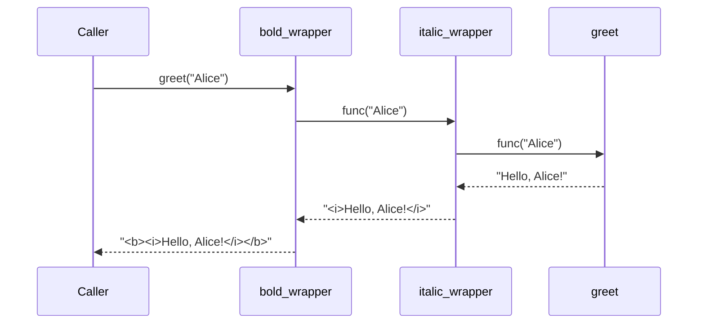

## Introduction

Decorators are one of Python's most elegant features — they let you wrap a function or class with additional behaviour without modifying its source code. Under the hood, a decorator is just a callable that takes a callable and returns a callable. They are the foundation of frameworks like Flask, FastAPI, Django, and Celery.

> **Note:** The `@decorator` syntax is pure syntactic sugar. `@my_decorator` above a function is exactly equivalent to `func = my_decorator(func)` after the definition.

## Core Concepts

### How Decorators Work

```python
# A decorator is a function that wraps another function
def my_decorator(func):
    def wrapper(*args, **kwargs):
        print("Before the function runs")
        result = func(*args, **kwargs)  # call the original
        print("After the function runs")
        return result
    return wrapper

# Using @ syntax
@my_decorator
def greet(name: str) -> str:
    return f"Hello, {name}!"

# Equivalent to:
# greet = my_decorator(greet)

greet("Alice")
# Before the function runs
# After the function runs
```

### Preserving Metadata with `functools.wraps`

```python
import functools

def my_decorator(func):
    @functools.wraps(func)  # preserves __name__, __doc__, __annotations__
    def wrapper(*args, **kwargs):
        return func(*args, **kwargs)
    return wrapper

@my_decorator
def add(a: int, b: int) -> int:
    """Add two numbers."""
    return a + b

print(add.__name__)  # "add" (not "wrapper")
print(add.__doc__)   # "Add two numbers."
```

> **Warning:** Always use `@functools.wraps(func)` inside your decorator. Without it, `func.__name__`, `func.__doc__`, and type hints are lost — this breaks introspection, logging, and documentation tools.

## Code Examples

### Example 1: Timing Decorator

```python
import functools
import time

def timer(func):
    @functools.wraps(func)
    def wrapper(*args, **kwargs):
        start = time.perf_counter()
        result = func(*args, **kwargs)
        elapsed = time.perf_counter() - start
        print(f"{func.__name__!r} took {elapsed:.4f}s")
        return result
    return wrapper

@timer
def slow_operation(n: int) -> int:
    time.sleep(0.1)
    return sum(range(n))

slow_operation(1_000_000)
# 'slow_operation' took 0.1123s
```

### Example 2: Decorator with Arguments (Decorator Factory)

```python
import functools

def retry(max_attempts: int = 3, delay: float = 1.0):
    """Retry a function up to max_attempts times on exception."""
    def decorator(func):
        @functools.wraps(func)
        def wrapper(*args, **kwargs):
            last_error = None
            for attempt in range(1, max_attempts + 1):
                try:
                    return func(*args, **kwargs)
                except Exception as e:
                    last_error = e
                    print(f"Attempt {attempt}/{max_attempts} failed: {e}")
                    if attempt < max_attempts:
                        time.sleep(delay)
            raise last_error
        return wrapper
    return decorator

@retry(max_attempts=3, delay=0.5)
def fetch_data(url: str) -> dict:
    response = requests.get(url, timeout=5)
    response.raise_for_status()
    return response.json()
```

### Example 3: Class-based Decorator

```python
import functools

class cache:
    """Simple in-memory cache decorator."""

    def __init__(self, func):
        functools.update_wrapper(self, func)
        self.func = func
        self._cache: dict = {}

    def __call__(self, *args):
        if args not in self._cache:
            self._cache[args] = self.func(*args)
        return self._cache[args]

    def clear(self):
        self._cache.clear()

@cache
def fibonacci(n: int) -> int:
    if n < 2:
        return n
    return fibonacci(n - 1) + fibonacci(n - 2)

print(fibonacci(50))  # instant after first call
fibonacci.clear()     # clear the cache
```

### Example 4: Stacking Decorators

```python
import functools

def bold(func):
    @functools.wraps(func)
    def wrapper(*args, **kwargs):
        return f"<b>{func(*args, **kwargs)}</b>"
    return wrapper

def italic(func):
    @functools.wraps(func)
    def wrapper(*args, **kwargs):
        return f"<i>{func(*args, **kwargs)}</i>"
    return wrapper

# Applied bottom-up: italic first, then bold wraps the result
@bold
@italic
def greet(name: str) -> str:
    return f"Hello, {name}!"

print(greet("Alice"))  # <b><i>Hello, Alice!</i></b>
```

## Decorator Execution Flow



## Common Decorator Patterns

| Pattern | Use Case | Example |
|---------|----------|---------|
| Logging | Audit trail | `@log_calls` |
| Timing | Performance profiling | `@timer` |
| Caching | Memoization | `@functools.lru_cache` |
| Retry | Resilience | `@retry(max=3)` |
| Auth | Access control | `@login_required` |
| Rate limiting | API protection | `@rate_limit(100)` |
| Validation | Input checking | `@validate_schema` |

## Real-world Use Cases

```python
# FastAPI route decorator
@app.get("/users/{user_id}")
async def get_user(user_id: int):
    return {"id": user_id}

# Django view decorator
@login_required
@permission_required("app.view_report")
def report_view(request):
    return render(request, "report.html")

# Celery task decorator
@celery.task(bind=True, max_retries=3)
def send_email(self, recipient: str, subject: str):
    try:
        mailer.send(recipient, subject)
    except Exception as exc:
        raise self.retry(exc=exc, countdown=60)

# Python stdlib
@functools.lru_cache(maxsize=128)
def expensive_computation(n: int) -> int:
    return sum(i ** 2 for i in range(n))

@property
def full_name(self) -> str:
    return f"{self.first} {self.last}"

@staticmethod
def validate_email(email: str) -> bool:
    return "@" in email
```

## Common Pitfalls & How to Avoid Them

- **Forgetting `functools.wraps`** — always add it; it preserves metadata and makes debugging much easier
- **Mutable default arguments in factories** — use `None` as default and assign inside the function
- **Decorating methods** — class methods need `self` passed through; use `*args, **kwargs` to handle this transparently
- **Order matters when stacking** — decorators apply bottom-up; `@a @b def f` means `a(b(f))`

## Summary / Key Takeaways

- A decorator is a callable that takes a callable and returns a callable — pure Python, no magic
- Always use `@functools.wraps(func)` to preserve the wrapped function's metadata
- Decorator factories (decorators with arguments) add an extra layer: `decorator_factory(args)(func)`
- Class-based decorators are useful when you need to maintain state between calls
- The Python stdlib ships powerful built-in decorators: `@property`, `@staticmethod`, `@classmethod`, `@functools.lru_cache`, `@functools.cached_property`

> **Tip:** `@functools.lru_cache(maxsize=None)` (or `@functools.cache` in Python 3.9+) is the fastest way to memoize a pure function. It's implemented in C and significantly faster than a hand-rolled cache decorator.
