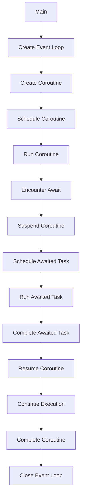

## Introduction
**Asynchronous programming** is a paradigm that allows your program to execute multiple tasks concurrently, improving overall performance and responsiveness. In Python, this is achieved through the use of **async def**, **await**, **async for**, and **async with**. These keywords enable you to write asynchronous code that is easier to read and maintain than traditional threading or multiprocessing approaches. Asynchronous programming is particularly relevant in real-world applications, such as web development, where handling multiple requests concurrently is crucial for a responsive user experience.

> **Note:** Asynchronous programming is not the same as parallel processing. While parallel processing executes multiple tasks simultaneously on multiple CPUs, asynchronous programming executes multiple tasks concurrently on a single CPU, switching between them quickly.

## Core Concepts
- **Coroutine**: A special type of function that can suspend its execution before reaching the return statement, allowing other coroutines to run in the meantime.
- **Event Loop**: The core of an asynchronous program, responsible for scheduling and running coroutines.
- **Async/Await**: Keywords used to define and interact with coroutines.
- **Async For/With**: Keywords used to handle asynchronous iteration and context management.

> **Warning:** Asynchronous code can be more complex and harder to debug than synchronous code. It's essential to understand the basics of asynchronous programming before diving into production code.

## How It Works Internally
When you define an **async def** function, Python creates a coroutine object. The **await** keyword is used to suspend the execution of the coroutine until the awaited task is complete. The event loop is responsible for scheduling and running the coroutines. Here's a step-by-step breakdown of how it works:
1. The event loop creates a coroutine object from the **async def** function.
2. The coroutine is scheduled to run by the event loop.
3. The coroutine executes until it reaches an **await** statement.
4. The coroutine is suspended, and the event loop schedules the awaited task to run.
5. The event loop runs the awaited task and waits for it to complete.
6. Once the awaited task is complete, the coroutine is resumed from the **await** statement.

> **Tip:** Use the **asyncio** library to create and manage event loops in Python.

## Code Examples
### Example 1: Basic Async/Await
```python
import asyncio

async def hello_world():
    """A simple async function that prints 'Hello, World!'"""
    print("Hello, ")
    await asyncio.sleep(1)  # Simulate an I/O-bound task
    print("World!")

async def main():
    """The main entry point of the program"""
    await hello_world()

asyncio.run(main())
```
This example demonstrates the basic usage of **async def** and **await**.

### Example 2: Async For
```python
import asyncio

async def fetch_data(url):
    """Simulate an I/O-bound task to fetch data from a URL"""
    await asyncio.sleep(1)
    return f"Data from {url}"

async def main():
    """The main entry point of the program"""
    urls = ["https://example.com", "https://www.python.org"]
    for url in urls:
        data = await fetch_data(url)
        print(data)

asyncio.run(main())
```
This example demonstrates the use of **async for** to handle asynchronous iteration.

### Example 3: Async With
```python
import asyncio
import async_timeout

async def fetch_data(url):
    """Simulate an I/O-bound task to fetch data from a URL"""
    async with async_timeout.timeout(1):
        await asyncio.sleep(2)  # Simulate a timeout
        return f"Data from {url}"

async def main():
    """The main entry point of the program"""
    url = "https://example.com"
    try:
        data = await fetch_data(url)
        print(data)
    except asyncio.TimeoutError:
        print("Timeout occurred")

asyncio.run(main())
```
This example demonstrates the use of **async with** to handle asynchronous context management.

## Visual Diagram

This diagram illustrates the internal mechanics of asynchronous programming in Python.

## Comparison
| Approach | Time Complexity | Space Complexity | Pros | Cons | Best For |
| --- | --- | --- | --- | --- | --- |
| Async/Await | O(1) | O(1) | Simple, readable, and maintainable | Limited control over underlying threads | I/O-bound tasks, web development |
| Threading | O(n) | O(n) | Can handle CPU-bound tasks, fine-grained control | Complex, error-prone, and resource-intensive | CPU-bound tasks, scientific computing |
| Multiprocessing | O(n) | O(n) | Can handle CPU-bound tasks, true parallelism | Complex, resource-intensive, and limited communication | CPU-bound tasks, data processing |
| asyncio | O(1) | O(1) | High-level abstraction, easy to use | Limited control over underlying threads, I/O-bound only | I/O-bound tasks, web development |

## Real-world Use Cases
1. **Web Development**: The **asyncio** library is widely used in web development frameworks like **FastAPI** and **Sanic** to handle multiple requests concurrently.
2. **Data Processing**: Companies like **Apache** and **Netflix** use asynchronous programming to process large amounts of data in parallel.
3. **Scientific Computing**: Research institutions like **CERN** and **NASA** use asynchronous programming to simulate complex systems and process large datasets.

> **Interview:** Be prepared to explain the differences between asynchronous programming, threading, and multiprocessing, as well as the trade-offs between them.

## Common Pitfalls
1. **Forgetting to await**: Failing to await an asynchronous task can lead to unexpected behavior and errors.
```python
# Wrong
async def main():
    fetch_data("https://example.com")
    print("Data fetched")

# Right
async def main():
    data = await fetch_data("https://example.com")
    print(data)
```
2. **Not handling exceptions**: Failing to handle exceptions in asynchronous code can lead to crashes and unexpected behavior.
```python
# Wrong
async def main():
    try:
        await fetch_data("https://example.com")
    except Exception as e:
        pass

# Right
async def main():
    try:
        await fetch_data("https://example.com")
    except Exception as e:
        print(f"Error: {e}")
```
3. **Using blocking calls**: Using blocking calls in asynchronous code can lead to performance issues and deadlocks.
```python
# Wrong
async def main():
    await asyncio.sleep(1)
    time.sleep(1)  # Blocking call

# Right
async def main():
    await asyncio.sleep(1)
    await asyncio.sleep(1)  # Non-blocking call
```
4. **Not using async/await consistently**: Failing to use async/await consistently can lead to confusing and hard-to-debug code.
```python
# Wrong
async def main():
    data = fetch_data("https://example.com")  # Not awaited
    print(data)

# Right
async def main():
    data = await fetch_data("https://example.com")  # Awaited
    print(data)
```

## Interview Tips
1. **Explain the basics**: Be prepared to explain the basics of asynchronous programming, including coroutines, event loops, and async/await.
2. **Discuss trade-offs**: Be prepared to discuss the trade-offs between asynchronous programming, threading, and multiprocessing.
3. **Provide examples**: Be prepared to provide examples of real-world use cases and how asynchronous programming is used in production.

> **Tip:** Practice answering behavioral questions, such as "Tell me about a time when you used asynchronous programming to solve a problem."

## Key Takeaways
* Asynchronous programming is a paradigm that allows your program to execute multiple tasks concurrently.
* **Async def**, **await**, **async for**, and **async with** are keywords used to define and interact with coroutines.
* The event loop is responsible for scheduling and running coroutines.
* Asynchronous programming is particularly relevant in real-world applications, such as web development and data processing.
* **Asyncio** is a high-level library that provides a simple and easy-to-use API for asynchronous programming.
* Asynchronous programming has a time complexity of O(1) and a space complexity of O(1).
* Common pitfalls include forgetting to await, not handling exceptions, using blocking calls, and not using async/await consistently.
* Real-world use cases include web development, data processing, and scientific computing.
* Asynchronous programming is a key skill for any software engineer, and practicing with real-world examples and exercises is essential for mastering it.