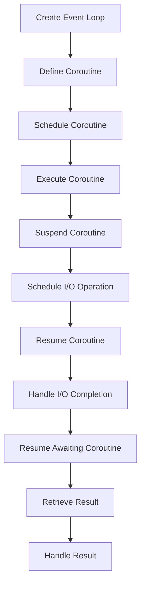

## Introduction
**asyncio** is a built-in Python library that allows you to write single-threaded concurrent code using coroutines, multiplexing I/O access over sockets and other resources, and implementing network clients and servers. It's essential for building high-performance, scalable, and concurrent systems. Every engineer needs to know **asyncio** because it's a crucial tool for handling multiple tasks simultaneously, improving system responsiveness, and increasing overall throughput. You'll encounter **asyncio** in production when working with web servers, databases, APIs, and other I/O-bound applications.

> **Note:** **asyncio** is not a replacement for traditional threading or multiprocessing, but rather a complementary approach that excels in I/O-bound scenarios.

## Core Concepts
- **Event Loop:** The core of **asyncio**, responsible for managing the execution of coroutines and handling I/O operations. It's the main entry point for any **asyncio** application.
- **Coroutines:** Special functions that can suspend and resume execution, allowing other coroutines to run in the meantime. They're the building blocks of **asyncio** applications.
- **Tasks:** Used to schedule coroutines for execution, providing a way to handle coroutine results and exceptions.
- **Futures:** Represent the result of a task, allowing you to wait for its completion and retrieve the result.

> **Warning:** Confusing coroutines with threads or processes can lead to incorrect assumptions about their behavior and performance.

## How It Works Internally
When you create an **asyncio** application, you start by creating an event loop. The event loop is responsible for managing the execution of coroutines and handling I/O operations. Here's a step-by-step breakdown of how it works:
1. Create an event loop using `asyncio.get_event_loop()`.
2. Define a coroutine using the `async def` syntax.
3. Schedule the coroutine for execution using `asyncio.create_task()` or `loop.create_task()`.
4. The event loop executes the coroutine, suspending and resuming it as needed.
5. When a coroutine awaits an I/O operation, the event loop schedules the operation and continues executing other coroutines.
6. Once the I/O operation completes, the event loop resumes the awaiting coroutine.

> **Tip:** Use `asyncio.run()` to create and manage the event loop for you, simplifying the process of running **asyncio** applications.

## Code Examples
### Example 1: Basic Coroutine
```python
import asyncio

async def hello_world():
    print("Hello")
    await asyncio.sleep(1)  # Simulate I/O operation
    print("World")

async def main():
    await hello_world()

asyncio.run(main())
```
This example demonstrates a basic coroutine that prints "Hello" and "World" with a 1-second delay.

### Example 2: Concurrent Tasks
```python
import asyncio

async def task(name):
    print(f"Task {name} started")
    await asyncio.sleep(1)  # Simulate I/O operation
    print(f"Task {name} finished")

async def main():
    tasks = [task(f"Task {i}") for i in range(5)]
    await asyncio.gather(*tasks)

asyncio.run(main())
```
This example shows how to run multiple tasks concurrently using `asyncio.gather()`.

### Example 3: Advanced Error Handling
```python
import asyncio

async def task(name):
    try:
        print(f"Task {name} started")
        await asyncio.sleep(1)  # Simulate I/O operation
        raise Exception(f"Error in Task {name}")
    except Exception as e:
        print(f"Task {name} failed: {e}")

async def main():
    tasks = [task(f"Task {i}") for i in range(5)]
    await asyncio.gather(*tasks, return_exceptions=True)

asyncio.run(main())
```
This example demonstrates advanced error handling using `try`-`except` blocks and `return_exceptions=True` with `asyncio.gather()`.

## Visual Diagram

This diagram illustrates the internal workflow of **asyncio**, from creating the event loop to handling I/O completion and retrieving results.

## Comparison
| Approach | Time Complexity | Space Complexity | Pros | Cons | Best For |
| --- | --- | --- | --- | --- | --- |
| **asyncio** | O(1) | O(n) | High-performance, concurrent I/O | Limited CPU-bound tasks | I/O-bound applications |
| **threading** | O(n) | O(n) | Easy to use, CPU-bound tasks | Limited concurrency, GIL | CPU-bound applications |
| **multiprocessing** | O(n) | O(n) | High-performance, CPU-bound tasks | Complex communication | CPU-bound applications |
| **trio** | O(1) | O(n) | High-performance, concurrent I/O | Steeper learning curve | I/O-bound applications |

> **Interview:** When asked about the trade-offs between **asyncio**, **threading**, and **multiprocessing**, be prepared to discuss the time and space complexity of each approach, as well as their pros and cons.

## Real-world Use Cases
1. **Web Servers:** **asyncio** is used in web servers like **aiohttp** and **Sanic** to handle multiple requests concurrently, improving responsiveness and throughput.
2. **Databases:** **asyncio** is used in database drivers like **aiomysql** and **asyncpg** to handle multiple queries concurrently, reducing latency and improving performance.
3. **APIs:** **asyncio** is used in APIs like **FastAPI** and **Starlette** to handle multiple requests concurrently, improving responsiveness and throughput.

## Common Pitfalls
1. **Incorrect Coroutine Usage:** Failing to use `await` with coroutines can lead to unexpected behavior and errors.
```python
# WRONG
async def task():
    print("Task started")
    asyncio.sleep(1)  # Missing await

# RIGHT
async def task():
    print("Task started")
    await asyncio.sleep(1)
```
2. **Insufficient Error Handling:** Failing to handle errors properly can lead to crashes and unexpected behavior.
```python
# WRONG
async def task():
    try:
        # Code that may raise an exception
    except:  # Missing exception type
        pass

# RIGHT
async def task():
    try:
        # Code that may raise an exception
    except Exception as e:  # Handle specific exception type
        print(f"Error: {e}")
```
3. **Inadequate Resource Management:** Failing to manage resources properly can lead to memory leaks and performance issues.
```python
# WRONG
async def task():
    # Create resource
    resource = open("file.txt", "r")
    # Use resource
    # Missing close()

# RIGHT
async def task():
    # Create resource
    resource = open("file.txt", "r")
    try:
        # Use resource
    finally:
        resource.close()
```
4. **IncorrectConcurrency:** Failing to use concurrency correctly can lead to performance issues and unexpected behavior.
```python
# WRONG
async def task():
    # Perform I/O operation
    asyncio.sleep(1)
    # Perform another I/O operation
    asyncio.sleep(1)

# RIGHT
async def task():
    # Perform I/O operation
    await asyncio.sleep(1)
    # Perform another I/O operation
    await asyncio.sleep(1)
```

## Interview Tips
1. **What is **asyncio****:** Be prepared to explain the basics of **asyncio**, including coroutines, tasks, and futures.
2. **How does **asyncio** work:** Be prepared to explain the internal mechanics of **asyncio**, including the event loop and I/O operation scheduling.
3. **When to use **asyncio****:** Be prepared to discuss the trade-offs between **asyncio**, **threading**, and **multiprocessing**, and explain when to use each approach.

## Key Takeaways
* **asyncio** is a built-in Python library for writing single-threaded concurrent code.
* **asyncio** uses coroutines, tasks, and futures to manage concurrency.
* The event loop is the core of **asyncio**, responsible for managing the execution of coroutines and handling I/O operations.
* **asyncio** is well-suited for I/O-bound applications, but limited for CPU-bound tasks.
* **asyncio** has a time complexity of O(1) and a space complexity of O(n).
* **asyncio** is used in real-world applications like web servers, databases, and APIs.
* Common pitfalls include incorrect coroutine usage, insufficient error handling, inadequate resource management, and incorrect concurrency.
* When interviewing, be prepared to explain the basics of **asyncio**, its internal mechanics, and when to use it.