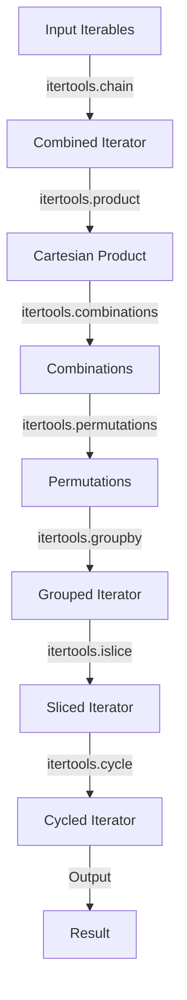

## Introduction
The **itertools** module in Python provides a collection of tools intended to be fast and use memory efficiently when handling iterators (like lists, tuples, dictionaries, etc). It is a part of Python's standard library, making it easily accessible for use in any Python program. This module is particularly useful when working with large datasets or when memory efficiency is crucial. The functions provided by **itertools** can be used to create iterators that perform various tasks, such as combining, filtering, and transforming data.

> **Note:** The **itertools** module is designed to work with iterators, which are objects that enable iteration over a sequence of values. By using iterators instead of lists, **itertools** functions can operate on large datasets without loading the entire dataset into memory at once.

## Core Concepts
The **itertools** module includes several key functions that perform different operations on iterators. Some of the most commonly used functions include:

*   **chain**: This function is used to combine multiple iterators into a single iterator. It takes in a variable number of arguments, each of which is an iterator.
*   **product**: This function is used to generate the Cartesian product of input iterables. It returns an iterator that produces tuples, containing the Cartesian product of input iterables.
*   **combinations**: This function is used to generate all possible combinations of a certain size from a given iterable. It returns an iterator that produces tuples, containing the combinations of the input iterable.
*   **permutations**: This function is used to generate all possible permutations of a given iterable. It returns an iterator that produces tuples, containing the permutations of the input iterable.
*   **groupby**: This function is used to group consecutive items from an iterable based on a key function. It returns an iterator that produces tuples, containing the key and a group of consecutive items from the input iterable.
*   **islice**: This function is used to extract a slice from an iterator. It returns an iterator that produces a slice of the input iterator.
*   **cycle**: This function is used to create an iterator that returns the elements from the iterable and saves a copy of the iterable. When the iterable is exhausted, the function returns elements from the saved copy.

> **Warning:** The **itertools** functions return iterators, which can only be iterated over once. If you need to use the results of an **itertools** function multiple times, you will need to convert the iterator to a list or other data structure.

## How It Works Internally
The **itertools** functions work internally by creating iterators that perform the desired operations. For example, the **chain** function creates an iterator that yields elements from the first iterable until it is exhausted, then proceeds to the next iterable, until all of the iterables are exhausted.

The **product** function works by using a recursive approach to generate the Cartesian product of the input iterables. The **combinations** and **permutations** functions also use recursive approaches to generate the combinations and permutations of the input iterable.

The **groupby** function works by using a key function to group consecutive items from the input iterable. The **islice** function works by using a start, stop, and step to extract a slice from the input iterator. The **cycle** function works by saving a copy of the input iterable and returning elements from the saved copy when the input iterable is exhausted.

> **Tip:** The **itertools** functions are designed to be efficient and use minimal memory. They can be used to process large datasets without loading the entire dataset into memory at once.

## Code Examples

### Example 1: Basic Usage of itertools.chain
```python
import itertools

# Define two lists
list1 = [1, 2, 3]
list2 = ['a', 'b', 'c']

# Use itertools.chain to combine the lists
combined_list = list(itertools.chain(list1, list2))

print(combined_list)  # Output: [1, 2, 3, 'a', 'b', 'c']
```

### Example 2: Using itertools.product to Generate the Cartesian Product
```python
import itertools

# Define two lists
list1 = [1, 2]
list2 = ['a', 'b']

# Use itertools.product to generate the Cartesian product
cartesian_product = list(itertools.product(list1, list2))

print(cartesian_product)  # Output: [(1, 'a'), (1, 'b'), (2, 'a'), (2, 'b')]
```

### Example 3: Using itertools.groupby to Group Consecutive Items
```python
import itertools
import operator

# Define a list of students with their grades
students = [
    {'name': 'John', 'grade': 'A'},
    {'name': 'Jane', 'grade': 'A'},
    {'name': 'Bob', 'grade': 'B'},
    {'name': 'Alice', 'grade': 'B'},
    {'name': 'Charlie', 'grade': 'C'}
]

# Sort the students by grade
students.sort(key=lambda x: x['grade'])

# Use itertools.groupby to group the students by grade
for grade, group in itertools.groupby(students, key=lambda x: x['grade']):
    print(f"Grade: {grade}")
    for student in group:
        print(f"  {student['name']}")
```

## Visual Diagram

The diagram above illustrates the flow of data through the various **itertools** functions. The input iterables are first combined using **itertools.chain**, then the Cartesian product is generated using **itertools.product**. The combinations and permutations are then generated using **itertools.combinations** and **itertools.permutations**, respectively. The resulting iterator is then grouped using **itertools.groupby**, sliced using **itertools.islice**, and cycled using **itertools.cycle**.

> **Interview:** Can you explain the difference between **itertools.combinations** and **itertools.permutations**? How would you use these functions in a real-world scenario?

## Comparison
| Function | Time Complexity | Space Complexity | Pros | Cons | Best For |
| --- | --- | --- | --- | --- | --- |
| **itertools.chain** | O(n) | O(1) | Combines multiple iterables into a single iterator | Only works with iterables | Combining multiple lists or tuples into a single iterator |
| **itertools.product** | O(n^k) | O(1) | Generates the Cartesian product of input iterables | Can be slow for large inputs | Generating all possible combinations of multiple lists or tuples |
| **itertools.combinations** | O(n choose k) | O(1) | Generates all possible combinations of a certain size from a given iterable | Can be slow for large inputs | Generating all possible combinations of a certain size from a list or tuple |
| **itertools.permutations** | O(n!) | O(1) | Generates all possible permutations of a given iterable | Can be slow for large inputs | Generating all possible permutations of a list or tuple |
| **itertools.groupby** | O(n) | O(1) | Groups consecutive items from an iterable based on a key function | Only works with sorted iterables | Grouping consecutive items from a list or tuple based on a key function |
| **itertools.islice** | O(k) | O(1) | Extracts a slice from an iterator | Only works with iterators | Extracting a slice from a large iterator |
| **itertools.cycle** | O(1) | O(n) | Creates an iterator that returns the elements from the iterable and saves a copy of the iterable | Can use a lot of memory for large inputs | Creating an iterator that returns the elements from a list or tuple repeatedly |

## Real-world Use Cases

1.  **Data Analysis**: The **itertools** module can be used to analyze large datasets by combining, filtering, and transforming the data.
2.  **Machine Learning**: The **itertools** module can be used to generate all possible combinations of features for a machine learning model.
3.  **Web Development**: The **itertools** module can be used to generate all possible permutations of a list of items for a web application.

> **Tip:** The **itertools** module can be used in a variety of real-world scenarios, from data analysis to machine learning to web development.

## Common Pitfalls

1.  **Using **itertools** functions with large inputs**: The **itertools** functions can be slow for large inputs, so it's best to use them with smaller datasets.
2.  **Not converting the result to a list or other data structure**: The **itertools** functions return iterators, which can only be iterated over once. If you need to use the results multiple times, you will need to convert the iterator to a list or other data structure.
3.  **Not sorting the input iterable before using **itertools.groupby****: The **itertools.groupby** function only works with sorted iterables, so you will need to sort the input iterable before using this function.
4.  **Using **itertools.cycle** with large inputs**: The **itertools.cycle** function can use a lot of memory for large inputs, so it's best to use it with smaller datasets.

> **Warning:** The **itertools** functions can be slow or use a lot of memory for large inputs, so be careful when using them.

## Interview Tips

1.  **Be prepared to explain the difference between **itertools.combinations** and **itertools.permutations****: The interviewer may ask you to explain the difference between these two functions, so be prepared to provide a clear and concise explanation.
2.  **Be prepared to provide examples of how to use the **itertools** functions**: The interviewer may ask you to provide examples of how to use the **itertools** functions, so be prepared to provide clear and concise examples.
3.  **Be prepared to explain the time and space complexity of the **itertools** functions**: The interviewer may ask you to explain the time and space complexity of the **itertools** functions, so be prepared to provide a clear and concise explanation.

> **Interview:** Can you explain the time and space complexity of the **itertools.combinations** function? How would you use this function in a real-world scenario?

## Key Takeaways

*   The **itertools** module provides a collection of tools for working with iterators.
*   The **itertools** functions include **chain**, **product**, **combinations**, **permutations**, **groupby**, **islice**, and **cycle**.
*   The **itertools** functions can be used to combine, filter, and transform data.
*   The **itertools** functions can be slow or use a lot of memory for large inputs.
*   The **itertools** functions return iterators, which can only be iterated over once.
*   The **itertools.groupby** function only works with sorted iterables.
*   The **itertools.cycle** function can use a lot of memory for large inputs.
*   The time complexity of the **itertools.combinations** function is O(n choose k).
*   The space complexity of the **itertools.combinations** function is O(1).
*   The time complexity of the **itertools.permutations** function is O(n!).
*   The space complexity of the **itertools.permutations** function is O(1).