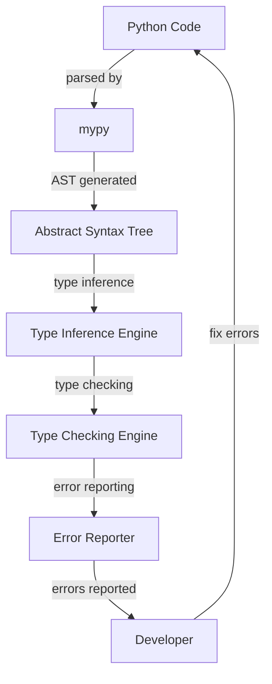

## Introduction
**mypy** is a popular static type checking tool for **Python**. It helps catch type-related errors before runtime, making it an essential tool for large-scale Python projects. With mypy, developers can ensure that their code is type-safe and maintainable, leading to fewer bugs and easier code refactoring. In this section, we will explore the importance of mypy, its real-world relevance, and why every engineer should know about it.

> **Tip:** Using mypy is especially crucial for large-scale projects where type errors can be difficult to track down. By integrating mypy into your development workflow, you can catch type-related errors early and avoid costly debugging sessions.

## Core Concepts
To understand mypy, we need to grasp some core concepts:

*   **Static type checking**: mypy checks the types of variables, function parameters, and return types at compile-time, rather than at runtime.
*   **Type inference**: mypy can automatically infer the types of variables and function parameters based on their usage.
*   **Type hinting**: developers can use type hints to specify the expected types of variables, function parameters, and return types.

> **Note:** mypy is not a replacement for Python's dynamic typing, but rather a complementary tool to help ensure type safety.

## How It Works Internally
mypy works by parsing the abstract syntax tree (AST) of the Python code and checking the types of variables, function parameters, and return types. Here's a step-by-step breakdown of how mypy works internally:

1.  **AST parsing**: mypy parses the Python code into an AST, which represents the syntactic structure of the code.
2.  **Type inference**: mypy infers the types of variables, function parameters, and return types based on their usage.
3.  **Type checking**: mypy checks the types of variables, function parameters, and return types against the inferred types.
4.  **Error reporting**: mypy reports any type-related errors found during the type checking process.

> **Warning:** mypy can only check types that are explicitly annotated or inferred. If a variable or function parameter is not annotated and cannot be inferred, mypy will not be able to check its type.

## Code Examples
Here are three complete and runnable examples of using mypy:

### Example 1: Basic Usage
```python
# mypy_example1.py

def greet(name: str) -> None:
    print(f"Hello, {name}!")

greet("John")  # Okay
greet(123)     # Error: Argument 1 to "greet" has incompatible type "int"; expected "str"
```
In this example, we define a `greet` function that takes a `name` parameter of type `str`. mypy checks the type of the `name` parameter and reports an error if a non-`str` value is passed to the function.

### Example 2: Real-World Pattern
```python
# mypy_example2.py

from typing import List, Dict

def process_data(data: List[Dict[str, int]]) -> None:
    for item in data:
        print(f"Name: {item['name']}, Age: {item['age']}")

data = [
    {"name": "John", "age": 30},
    {"name": "Jane", "age": 25},
]

process_data(data)  # Okay
process_data([{"name": "John"}])  # Error: Missing key "age" in TypedDict "item"
```
In this example, we define a `process_data` function that takes a list of dictionaries, where each dictionary has `name` and `age` keys. mypy checks the types of the `data` parameter and reports an error if a dictionary is missing the `age` key.

### Example 3: Advanced Usage
```python
# mypy_example3.py

from typing import TypeVar, Generic

T = TypeVar('T')

class Stack(Generic[T]):
    def __init__(self) -> None:
        self.items: list[T] = []

    def push(self, item: T) -> None:
        self.items.append(item)

    def pop(self) -> T:
        return self.items.pop()

stack = Stack[int]()
stack.push(1)  # Okay
stack.push("hello")  # Error: Argument 1 to "push" has incompatible type "str"; expected "int"
```
In this example, we define a `Stack` class that is generic over the type `T`. mypy checks the types of the `push` and `pop` methods and reports an error if a non-`int` value is pushed onto the stack.

## Visual Diagram

This diagram illustrates the internal workflow of mypy, from parsing the Python code to reporting type-related errors.

## Comparison
Here's a comparison of mypy with other static type checking tools for Python:

| Tool | Time Complexity | Space Complexity | Pros | Cons | Best For |
| --- | --- | --- | --- | --- | --- |
| mypy | O(n) | O(n) | Fast, accurate, and widely adopted | Limited support for dynamic typing | Large-scale Python projects |
| Pytype | O(n) | O(n) | Fast and accurate, supports dynamic typing | Steeper learning curve | Complex Python projects with dynamic typing |
| Pyright | O(n) | O(n) | Fast and accurate, supports dynamic typing | Limited support for Python 2.x | Complex Python projects with dynamic typing |
| Pyre | O(n) | O(n) | Fast and accurate, supports dynamic typing | Limited support for Python 2.x | Complex Python projects with dynamic typing |

> **Note:** The time and space complexities listed are approximate and may vary depending on the specific use case.

## Real-world Use Cases
Here are three real-world examples of using mypy in production:

1.  **Dropbox**: Dropbox uses mypy to ensure type safety in their Python codebase.
2.  **Instagram**: Instagram uses mypy to catch type-related errors in their Python codebase.
3.  **Pinterest**: Pinterest uses mypy to ensure type safety in their Python codebase.

> **Interview:** Can you tell me about your experience with mypy in a previous project? How did you integrate it into your development workflow?

## Common Pitfalls
Here are four common mistakes to avoid when using mypy:

1.  **Not annotating function parameters**: Failing to annotate function parameters can lead to type-related errors that mypy cannot catch.
    ```python
# wrong
def greet(name):
    print(f"Hello, {name}!")

# right
def greet(name: str) -> None:
    print(f"Hello, {name}!")
```
2.  **Not using type hints for variables**: Failing to use type hints for variables can lead to type-related errors that mypy cannot catch.
    ```python
# wrong
name = "John"

# right
name: str = "John"
```
3.  **Not handling None values**: Failing to handle None values can lead to type-related errors that mypy cannot catch.
    ```python
# wrong
def greet(name: str) -> None:
    print(f"Hello, {name}!")

greet(None)  # Error: Argument 1 to "greet" has incompatible type "None"; expected "str"

# right
def greet(name: str | None) -> None:
    if name is not None:
        print(f"Hello, {name}!")
```
4.  **Not using mypy with other tools**: Failing to use mypy with other tools, such as linters and formatters, can lead to inconsistent code quality.
    ```bash
# wrong
mypy mypy_example.py

# right
mypy mypy_example.py && pylint mypy_example.py && black mypy_example.py
```

## Interview Tips
Here are three common interview questions related to mypy, along with weak and strong answers:

1.  **What is mypy, and how does it work?**
    *   Weak answer: mypy is a tool that checks the types of variables and function parameters.
    *   Strong answer: mypy is a static type checking tool that checks the types of variables, function parameters, and return types at compile-time. It works by parsing the abstract syntax tree (AST) of the Python code and checking the types against the inferred types.
2.  **How do you integrate mypy into your development workflow?**
    *   Weak answer: I run mypy manually whenever I make changes to the code.
    *   Strong answer: I integrate mypy into my development workflow by running it automatically whenever I make changes to the code. I also use other tools, such as linters and formatters, to ensure consistent code quality.
3.  **What are some common pitfalls to avoid when using mypy?**
    *   Weak answer: I'm not sure.
    *   Strong answer: Some common pitfalls to avoid when using mypy include not annotating function parameters, not using type hints for variables, not handling None values, and not using mypy with other tools.

> **Tip:** When answering interview questions, be sure to provide specific examples and details to demonstrate your knowledge and experience.

## Key Takeaways
Here are ten key takeaways to remember when using mypy:

*   **Use mypy to catch type-related errors**: mypy can help catch type-related errors that can be difficult to track down.
*   **Annotate function parameters**: annotating function parameters can help mypy catch type-related errors.
*   **Use type hints for variables**: using type hints for variables can help mypy catch type-related errors.
*   **Handle None values**: handling None values can help mypy catch type-related errors.
*   **Integrate mypy into your development workflow**: integrating mypy into your development workflow can help ensure consistent code quality.
*   **Use mypy with other tools**: using mypy with other tools, such as linters and formatters, can help ensure consistent code quality.
*   **Be aware of common pitfalls**: being aware of common pitfalls, such as not annotating function parameters and not using type hints for variables, can help you avoid type-related errors.
*   **Use mypy to improve code maintainability**: mypy can help improve code maintainability by catching type-related errors and ensuring consistent code quality.
*   **Use mypy to improve code readability**: mypy can help improve code readability by providing clear and concise type annotations.
*   **Stay up-to-date with the latest mypy features**: staying up-to-date with the latest mypy features can help you take advantage of new features and improvements.

> **Warning:** mypy is not a replacement for Python's dynamic typing, but rather a complementary tool to help ensure type safety. Be sure to use mypy in conjunction with other tools and best practices to ensure consistent code quality.