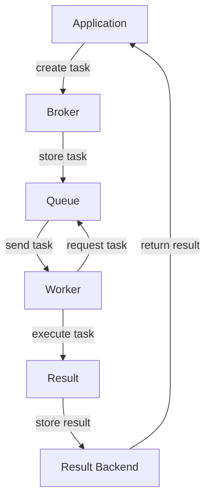

## Introduction
Celery is a **distributed task queue** that allows you to run time-consuming tasks asynchronously in the background. It is a popular tool for building scalable and fault-tolerant systems, and is widely used in production environments. Celery provides a simple and efficient way to distribute tasks across multiple workers, allowing you to process large volumes of data in parallel. In this section, we will explore the basics of Celery, its key features, and why it is an essential tool for any Python developer.

> **Note:** Celery is often used in conjunction with web frameworks such as Django and Flask, but it can be used with any Python application.

Celery is particularly useful for tasks that are time-consuming or resource-intensive, such as data processing, image processing, or sending emails. By running these tasks in the background, you can improve the performance and responsiveness of your application, and provide a better user experience.

## Core Concepts
Celery has several key concepts that are essential to understanding how it works. These include:

* **Tasks**: Tasks are the basic unit of work in Celery. They are functions that are executed by workers in the background.
* **Workers**: Workers are the processes that execute tasks. They can be run on multiple machines, allowing you to scale your task processing capacity.
* **Brokers**: Brokers are the messaging systems that handle task messages between workers and the application. Celery supports several brokers, including RabbitMQ, Redis, and Amazon SQS.
* **Queues**: Queues are the data structures that store task messages. They can be used to prioritize tasks, or to route tasks to specific workers.

> **Warning:** Celery requires a broker to function, so you will need to set up a broker before you can use Celery.

## How It Works Internally
Here is a high-level overview of how Celery works:

1. The application creates a task and sends it to the broker.
2. The broker stores the task message in a queue.
3. A worker connects to the broker and requests a task from the queue.
4. The broker sends the task message to the worker.
5. The worker executes the task and sends the result back to the broker.
6. The broker stores the result in a result backend, such as a database or a cache.

Celery uses a variety of algorithms to manage task execution, including:

* **First-in, first-out (FIFO)**: Tasks are executed in the order they are received.
* **Least recently used (LRU)**: Tasks are executed based on how recently they were last executed.
* **Priority queue**: Tasks are executed based on their priority.

> **Tip:** Celery provides a number of built-in algorithms for managing task execution, but you can also write your own custom algorithms.

## Code Examples
Here are three complete and runnable examples of using Celery:

### Example 1: Basic Task
```python
from celery import Celery

app = Celery('tasks', broker='amqp://guest@localhost//')

@app.task
def add(x, y):
    return x + y

result = add.delay(4, 4)
print(result.get())  # prints 8
```
This example defines a simple task that adds two numbers together.

### Example 2: Real-World Task
```python
from celery import Celery
import requests

app = Celery('tasks', broker='amqp://guest@localhost//')

@app.task
def fetch_data(url):
    response = requests.get(url)
    return response.json()

result = fetch_data.delay('https://api.github.com/users/octocat')
print(result.get())  # prints the JSON response
```
This example defines a task that fetches data from a URL using the `requests` library.

### Example 3: Advanced Task
```python
from celery import Celery, chain
from celery.utils import uuid

app = Celery('tasks', broker='amqp://guest@localhost//')

@app.task
def add(x, y):
    return x + y

@app.task
def multiply(x, y):
    return x * y

@app.task
def divide(x, y):
    return x / y

# Create a chain of tasks
chain = chain(add.s(4, 4), multiply.s(8), divide.s(2))

# Execute the chain
result = chain.delay()
print(result.get())  # prints the final result
```
This example defines a chain of tasks that executes a series of mathematical operations.

## Visual Diagram

This diagram shows the flow of tasks through the Celery system, from creation to execution and result storage.

## Comparison
Here is a comparison of Celery with other task queue systems:

| Approach | Time Complexity | Space Complexity | Pros | Cons | Best For |
|----------|----------------|-----------------|------|------|----------|
| Celery | O(1) | O(n) | Distributed, scalable, flexible | Complex setup, requires broker | Large-scale task processing |
| Zato | O(1) | O(n) | Simple setup, easy to use | Limited scalability, no support for chains | Small-scale task processing |
| RQ | O(1) | O(n) | Simple setup, easy to use | Limited scalability, no support for chains | Small-scale task processing |
| Dramatiq | O(1) | O(n) | Simple setup, easy to use | Limited scalability, no support for chains | Small-scale task processing |

> **Interview:** What are the advantages and disadvantages of using Celery compared to other task queue systems?

## Real-world Use Cases
Here are three real-world examples of using Celery:

* **Instagram**: Instagram uses Celery to process image uploads and video encoding.
* **Pinterest**: Pinterest uses Celery to process image uploads and analytics tasks.
* **Dropbox**: Dropbox uses Celery to process file uploads and synchronization tasks.

## Common Pitfalls
Here are four common mistakes to avoid when using Celery:

* **Not configuring the broker correctly**: Make sure to configure the broker correctly, including setting the correct host, port, and username/password.
* **Not handling task failures**: Make sure to handle task failures correctly, including retrying failed tasks and logging errors.
* **Not using chains and groups correctly**: Make sure to use chains and groups correctly, including creating and executing chains and groups.
* **Not monitoring Celery**: Make sure to monitor Celery correctly, including monitoring task execution and result storage.

> **Warning:** Not handling task failures correctly can lead to lost data and incorrect results.

## Interview Tips
Here are three common interview questions related to Celery:

* **What is Celery and how does it work?**: A good answer should include a brief overview of Celery, including its key features and how it works.
* **How do you handle task failures in Celery?**: A good answer should include a discussion of how to handle task failures, including retrying failed tasks and logging errors.
* **How do you use chains and groups in Celery?**: A good answer should include a discussion of how to use chains and groups, including creating and executing chains and groups.

> **Tip:** Make sure to practice answering these questions before an interview, including providing specific examples and code snippets.

## Key Takeaways
Here are ten key takeaways from this section:

* **Celery is a distributed task queue**: Celery allows you to run time-consuming tasks asynchronously in the background.
* **Celery requires a broker**: Celery requires a broker to function, including RabbitMQ, Redis, or Amazon SQS.
* **Tasks are the basic unit of work**: Tasks are functions that are executed by workers in the background.
* **Workers execute tasks**: Workers are the processes that execute tasks, and can be run on multiple machines.
* **Chains and groups are used to manage task execution**: Chains and groups are used to manage task execution, including creating and executing chains and groups.
* **Celery provides a number of built-in algorithms**: Celery provides a number of built-in algorithms for managing task execution, including FIFO, LRU, and priority queue.
* **Celery can be used with any Python application**: Celery can be used with any Python application, including web frameworks such as Django and Flask.
* **Celery is widely used in production environments**: Celery is widely used in production environments, including Instagram, Pinterest, and Dropbox.
* **Celery requires careful configuration and monitoring**: Celery requires careful configuration and monitoring, including configuring the broker and monitoring task execution and result storage.
* **Celery provides a number of tools and libraries**: Celery provides a number of tools and libraries, including the `celery` command-line tool and the `celery` Python library.