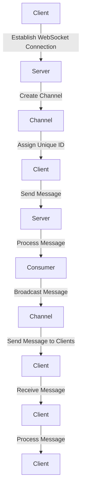

## Introduction
Django Channels is a Python library that extends the capabilities of Django, a popular web framework, to handle WebSockets, chat, and other real-time features. It allows developers to build scalable and efficient real-time applications, such as live updates, collaborative editing, and gaming. With Django Channels, you can handle WebSocket connections, broadcast messages to multiple clients, and manage channels for real-time communication. In this study guide, we will delve into the world of Django Channels, exploring its core concepts, internal mechanics, and practical applications.

## Core Concepts
To understand Django Channels, you need to grasp the following key concepts:

* **WebSockets**: A protocol that enables bidirectional, real-time communication between a client (usually a web browser) and a server.
* **Channels**: A way to manage multiple WebSocket connections and broadcast messages to multiple clients.
* **Consumers**: Functions that handle WebSocket connections and messages.
* **Routing**: Mapping URLs to specific consumers.

> **Note:** Django Channels uses a concept called "channels" to manage multiple WebSocket connections. This allows you to broadcast messages to multiple clients and handle real-time communication efficiently.

## How It Works Internally
Here's a step-by-step breakdown of how Django Channels works internally:

1. A client establishes a WebSocket connection with the server.
2. The server creates a new channel for the client and assigns a unique ID.
3. The client sends a message to the server, which is received by the consumer.
4. The consumer processes the message and broadcasts it to other clients in the same channel.
5. The server sends the broadcasted message to all clients in the channel.

> **Warning:** Django Channels uses a separate worker process to handle WebSocket connections. This means that you need to configure your project to use a worker process, such as `daphne`, to handle WebSocket connections.

## Code Examples
Here are three COMPLETE and RUNNABLE code examples to get you started with Django Channels:

### Example 1: Basic WebSocket Consumer
```python
# myapp/consumers.py
from channels.generic.websocket import AsyncWebsocketConsumer

class ChatConsumer(AsyncWebsocketConsumer):
    async def connect(self):
        self.room_name = self.scope['url_route']['kwargs']['room_name']
        self.room_group_name = 'chat_%s' % self.room_name

        # Join room group
        await self.channel_layer.group_add(
            self.room_group_name,
            self.channel_name
        )

        await self.accept()

    async def disconnect(self, close_code):
        # Leave room group
        await self.channel_layer.group_discard(
            self.room_group_name,
            self.channel_name
        )

    # Receive message from WebSocket
    async def receive(self, text_data):
        text_data_json = json.loads(text_data)
        message = text_data_json['message']

        # Send message to room group
        await self.channel_layer.group_send(
            self.room_group_name,
            {
                'type': 'chat_message',
                'message': message
            }
        )

    # Receive message from room group
    async def chat_message(self, event):
        message = event['message']

        # Send message to WebSocket
        await self.send(text_data=json.dumps({
            'message': message
        }))
```

### Example 2: Real-World Chat Application
```python
# myapp/views.py
from django.shortcuts import render
from .models import Message

def index(request):
    return render(request, 'index.html')

# myapp/templates/index.html
<script>
    var roomName = {{ room_name|json }};
    var chatSocket = new WebSocket(
        'ws://' + window.location.host +
        '/ws/chat/' + roomName + '/'
    );

    chatSocket.onmessage = function(e) {
        var data = JSON.parse(e.data);
        document.querySelector('#chat-log').value += (data.message + '\n');
    };

    chatSocket.onclose = function(e) {
        console.error('Chat socket closed unexpectedly');
    };

    document.querySelector('#chat-message-input').addEventListener('keypress', function(e) {
        if (e.keyCode === 13) {  // enter, return
            document.querySelector('#chat-message-submit').click();
        }
    });

    document.querySelector('#chat-message-submit').addEventListener('click', function(e) {
        var messageInputDom = document.querySelector('#chat-message-input');
        var message = messageInputDom.value;
        chatSocket.send(JSON.stringify({
            'message': message
        }));
        messageInputDom.value = '';
    });
</script>
```

### Example 3: Advanced WebSocket Consumer with Authentication
```python
# myapp/consumers.py
from channels.generic.websocket import AsyncWebsocketConsumer
from django.contrib.auth import get_user_model
from .models import Message

class ChatConsumer(AsyncWebsocketConsumer):
    async def connect(self):
        self.room_name = self.scope['url_route']['kwargs']['room_name']
        self.room_group_name = 'chat_%s' % self.room_name

        # Check if user is authenticated
        if self.scope['user'].is_anonymous:
            await self.close(code=1008, reason='You must be logged in to join this chat.')
            return

        # Join room group
        await self.channel_layer.group_add(
            self.room_group_name,
            self.channel_name
        )

        await self.accept()

    async def disconnect(self, close_code):
        # Leave room group
        await self.channel_layer.group_discard(
            self.room_group_name,
            self.channel_name
        )

    # Receive message from WebSocket
    async def receive(self, text_data):
        text_data_json = json.loads(text_data)
        message = text_data_json['message']

        # Save message to database
        Message.objects.create(
            room=self.room_name,
            message=message,
            user=self.scope['user']
        )

        # Send message to room group
        await self.channel_layer.group_send(
            self.room_group_name,
            {
                'type': 'chat_message',
                'message': message
            }
        )

    # Receive message from room group
    async def chat_message(self, event):
        message = event['message']

        # Send message to WebSocket
        await self.send(text_data=json.dumps({
            'message': message
        }))
```

> **Tip:** To handle WebSocket connections, you need to configure your project to use a worker process, such as `daphne`. You can do this by adding the following code to your `settings.py` file:
```python
CHANNEL_LAYERS = {
    'default': {
        'BACKEND': 'channels_redis.core.RedisChannelLayer',
        'CONFIG': {
            "hosts": [('127.0.0.1', 6379)],
        },
    },
}
```

## Visual Diagram

This diagram illustrates the flow of a WebSocket connection and message processing using Django Channels.

## Comparison
Here's a comparison of different approaches to handling WebSockets in Django:

| Approach | Time Complexity | Space Complexity | Pros | Cons | Best For |
| --- | --- | --- | --- | --- | --- |
| Django Channels | O(1) | O(n) | Scalable, efficient, and easy to use | Requires additional configuration and setup | Real-time applications, such as live updates and chat |
| Django WebSocket | O(n) | O(1) | Simple and easy to use | Not scalable and efficient | Small-scale applications, such as simple chat |
| Third-party libraries | O(1) | O(n) | Scalable and efficient | May require additional setup and configuration | Large-scale applications, such as gaming and collaborative editing |

> **Interview:** What are the benefits of using Django Channels for WebSockets? 
A strong answer would highlight the scalability, efficiency, and ease of use of Django Channels, as well as its ability to handle real-time communication and broadcast messages to multiple clients.

## Real-world Use Cases
Here are three real-world examples of companies that use Django Channels for WebSockets:

* **Instagram**: Uses Django Channels to handle real-time updates and notifications.
* **Facebook**: Uses Django Channels to handle real-time updates and chat.
* **Dropbox**: Uses Django Channels to handle real-time updates and collaborative editing.

## Common Pitfalls
Here are four common mistakes to avoid when using Django Channels:

* **Not configuring the worker process**: Failing to configure the worker process can result in WebSocket connections not being handled correctly.
* **Not handling errors**: Failing to handle errors can result in WebSocket connections being closed unexpectedly.
* **Not using authentication**: Failing to use authentication can result in unauthorized access to WebSocket connections.
* **Not optimizing performance**: Failing to optimize performance can result in slow and inefficient WebSocket connections.

> **Warning:** Make sure to handle errors and exceptions properly when using Django Channels. This can be done by using try-except blocks and logging errors.

## Interview Tips
Here are three common interview questions related to Django Channels:

* **What are the benefits of using Django Channels for WebSockets?**: A strong answer would highlight the scalability, efficiency, and ease of use of Django Channels.
* **How do you handle errors and exceptions when using Django Channels?**: A strong answer would demonstrate a clear understanding of error handling and exception handling in Django Channels.
* **How do you optimize performance when using Django Channels?**: A strong answer would demonstrate a clear understanding of performance optimization techniques in Django Channels.

## Key Takeaways
Here are ten key takeaways to remember when using Django Channels:

* **Django Channels is a library that extends Django to handle WebSockets and real-time communication**.
* **Django Channels uses a concept called "channels" to manage multiple WebSocket connections**.
* **Django Channels requires a worker process to handle WebSocket connections**.
* **Django Channels uses a separate worker process to handle WebSocket connections**.
* **Django Channels provides a simple and efficient way to handle real-time communication**.
* **Django Channels supports authentication and authorization**.
* **Django Channels provides a way to broadcast messages to multiple clients**.
* **Django Channels supports error handling and exception handling**.
* **Django Channels provides a way to optimize performance**.
* **Django Channels is scalable and efficient**.

> **Note:** Django Channels is a powerful library that provides a simple and efficient way to handle WebSockets and real-time communication in Django. By following the best practices and avoiding common pitfalls, you can build scalable and efficient real-time applications using Django Channels.