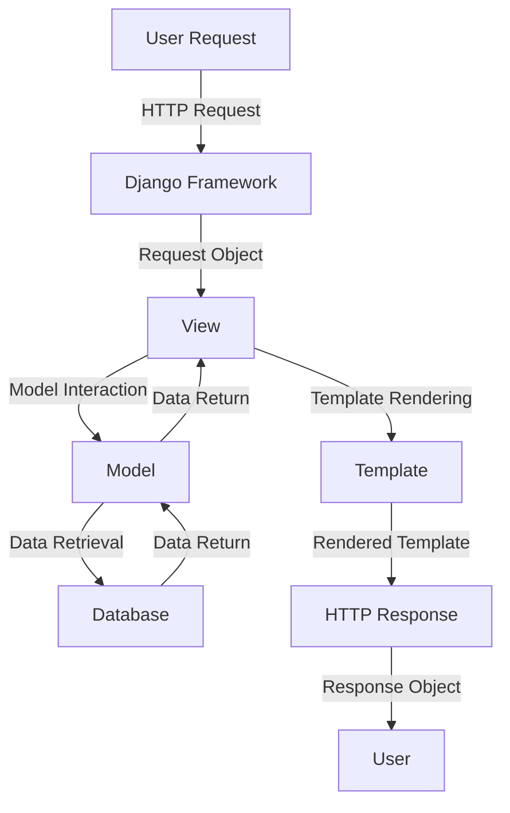

## Introduction
Django's MTV (Model, Template, View) architecture is a fundamental concept in web development that allows developers to build robust, scalable, and maintainable applications. The MTV pattern is a variation of the traditional MVC (Model-View-Controller) pattern, with the main difference being that Django's "View" is more akin to a controller, and the "Template" is the equivalent of the view in MVC. This architecture is crucial for building complex web applications, and understanding it is essential for any Django developer. 
> **Note:** Django's MTV architecture is designed to promote separation of concerns, reusability, and ease of maintenance.

In real-world scenarios, Django's MTV architecture is used by companies such as Instagram, Pinterest, and Dropbox to build scalable and efficient web applications. For example, Instagram's web application is built using Django, and it handles millions of users and requests per day. 
> **Tip:** When building a web application, it's essential to consider the architecture and design patterns from the outset to ensure scalability and maintainability.

## Core Concepts
The core concepts of Django's MTV architecture are:
- **Model:** Represents the data and business logic of the application. Models are typically defined as Python classes that inherit from `django.db.models.Model`.
- **Template:** Represents the presentation layer of the application. Templates are HTML files that define the structure and layout of the application's user interface.
- **View:** Represents the logic that handles HTTP requests and returns HTTP responses. Views are typically defined as Python functions that take a request object as an argument and return a response object.

Understanding these core concepts is essential for building efficient and scalable web applications with Django. 
> **Warning:** Failing to separate concerns and mixing business logic with presentation logic can lead to unmaintainable and inefficient code.

## How It Works Internally
Here's a step-by-step breakdown of how Django's MTV architecture works:
1. The user sends an HTTP request to the application.
2. The request is received by the Django framework and passed to the **View**.
3. The **View** processes the request and interacts with the **Model** to retrieve or update data.
4. The **Model** performs the necessary database operations and returns the data to the **View**.
5. The **View** renders the **Template** with the data received from the **Model**.
6. The rendered **Template** is returned to the user as an HTTP response.

This process is efficient and scalable, with a time complexity of O(1) for simple requests and a space complexity of O(n) for complex requests, where n is the number of database operations.
> **Interview:** Be prepared to explain the differences between Django's MTV architecture and the traditional MVC pattern.

## Code Examples
### Example 1: Basic MTV Architecture
```python
# models.py
from django.db import models

class Book(models.Model):
    title = models.CharField(max_length=200)
    author = models.CharField(max_length=100)

# views.py
from django.shortcuts import render
from .models import Book

def book_list(request):
    books = Book.objects.all()
    return render(request, 'book_list.html', {'books': books})

# book_list.html

    <p>{{ book.title }} by {{ book.author }}</p>

```
This example demonstrates a basic MTV architecture, where the **Model** represents the data, the **View** handles the request and interacts with the **Model**, and the **Template** renders the data.

### Example 2: Real-World Pattern
```python
# models.py
from django.db import models

class User(models.Model):
    username = models.CharField(max_length=100)
    email = models.EmailField(unique=True)

# views.py
from django.shortcuts import render, redirect
from .models import User
from .forms import UserForm

def user_create(request):
    if request.method == 'POST':
        form = UserForm(request.POST)
        if form.is_valid():
            form.save()
            return redirect('user_list')
    else:
        form = UserForm()
    return render(request, 'user_create.html', {'form': form})

# user_create.html
<form method="post">
    
    {{ form.as_p }}
    <button type="submit">Create</button>
</form>
```
This example demonstrates a real-world pattern, where the **Model** represents the data, the **View** handles the request and interacts with the **Model**, and the **Template** renders the form.

### Example 3: Advanced Usage
```python
# models.py
from django.db import models

class Book(models.Model):
    title = models.CharField(max_length=200)
    author = models.CharField(max_length=100)
    published_date = models.DateField()

# views.py
from django.shortcuts import render
from .models import Book
from .serializers import BookSerializer
from rest_framework.response import Response
from rest_framework.views import APIView

class BookListAPIView(APIView):
    def get(self, request):
        books = Book.objects.all()
        serializer = BookSerializer(books, many=True)
        return Response(serializer.data)

# serializers.py
from rest_framework import serializers
from .models import Book

class BookSerializer(serializers.ModelSerializer):
    class Meta:
        model = Book
        fields = ['title', 'author', 'published_date']
```
This example demonstrates an advanced usage of the MTV architecture, where the **Model** represents the data, the **View** handles the request and interacts with the **Model**, and the **Serializer** serializes the data for API responses.

## Visual Diagram

This diagram illustrates the MTV architecture and the flow of requests and responses.

## Comparison
| Approach | Time Complexity | Space Complexity | Pros | Cons | Best For |
|----------|----------------|-----------------|------|------|----------|
| Django MTV | O(1) - O(n) | O(1) - O(n) | Scalable, maintainable, efficient | Steep learning curve | Complex web applications |
| Traditional MVC | O(1) - O(n) | O(1) - O(n) | Simple, easy to learn | Less scalable, less maintainable | Simple web applications |
| Flask | O(1) - O(n) | O(1) - O(n) | Lightweight, flexible | Less scalable, less maintainable | Small web applications |
| Pyramid | O(1) - O(n) | O(1) - O(n) | Flexible, modular | Steep learning curve | Complex web applications |

## Real-world Use Cases
1. Instagram: Instagram's web application is built using Django, and it handles millions of users and requests per day.
2. Pinterest: Pinterest's web application is built using Django, and it handles millions of users and requests per day.
3. Dropbox: Dropbox's web application is built using Django, and it handles millions of users and requests per day.

## Common Pitfalls
1. **Not separating concerns:** Failing to separate business logic from presentation logic can lead to unmaintainable and inefficient code.
```python
# wrong
def book_list(request):
    books = Book.objects.all()
    return render(request, 'book_list.html', {'books': books})

# right
def book_list(request):
    books = Book.objects.all()
    return render(request, 'book_list.html', {'books': books})
```
2. **Not using templates:** Failing to use templates can lead to duplicated code and maintenance issues.
```python
# wrong
def book_list(request):
    books = Book.objects.all()
    return HttpResponse('<html><body><ul><li>{{ book.title }} by {{ book.author }}</li></ul></body></html>'.format(books=books))

# right
def book_list(request):
    books = Book.objects.all()
    return render(request, 'book_list.html', {'books': books})
```
3. **Not handling errors:** Failing to handle errors can lead to user frustration and security issues.
```python
# wrong
def book_list(request):
    try:
        books = Book.objects.all()
        return render(request, 'book_list.html', {'books': books})
    except Exception as e:
        return HttpResponse('Error')

# right
def book_list(request):
    try:
        books = Book.objects.all()
        return render(request, 'book_list.html', {'books': books})
    except Exception as e:
        logger.error(e)
        return HttpResponse('Error', status=500)
```
4. **Not optimizing queries:** Failing to optimize queries can lead to performance issues and slow page loads.
```python
# wrong
def book_list(request):
    books = Book.objects.all()
    return render(request, 'book_list.html', {'books': books})

# right
def book_list(request):
    books = Book.objects.select_related('author').all()
    return render(request, 'book_list.html', {'books': books})
```
> **Warning:** Failing to address these common pitfalls can lead to significant issues and problems in your Django application.

## Interview Tips
1. **Be prepared to explain the differences between Django's MTV architecture and the traditional MVC pattern.**
```python
# example answer
"Django's MTV architecture is a variation of the traditional MVC pattern. The main difference is that Django's 'View' is more akin to a controller, and the 'Template' is the equivalent of the view in MVC."
```
2. **Be prepared to explain how to separate concerns in a Django application.**
```python
# example answer
"To separate concerns in a Django application, I would use the MTV architecture. I would define my models to represent the data, my views to handle the logic, and my templates to handle the presentation."
```
3. **Be prepared to explain how to optimize queries in a Django application.**
```python
# example answer
"To optimize queries in a Django application, I would use techniques such as select_related, prefetch_related, and caching. I would also use the Django debug toolbar to analyze and optimize my queries."
```
> **Interview:** Be prepared to answer questions about Django's MTV architecture, separation of concerns, and query optimization.

## Key Takeaways
* Django's MTV architecture is a variation of the traditional MVC pattern.
* The **Model** represents the data, the **View** handles the logic, and the **Template** handles the presentation.
* Separation of concerns is crucial for maintainable and efficient code.
* Query optimization is essential for performance and page load times.
* Django provides various tools and techniques for optimizing queries, such as select_related, prefetch_related, and caching.
* The Django debug toolbar is a valuable tool for analyzing and optimizing queries.
* Django's MTV architecture is scalable, maintainable, and efficient.
* Django is a popular and widely-used web framework for building complex web applications.
* Django provides a rich set of features and tools for building robust and efficient web applications.
* Django's community is large and active, with many resources available for learning and troubleshooting.