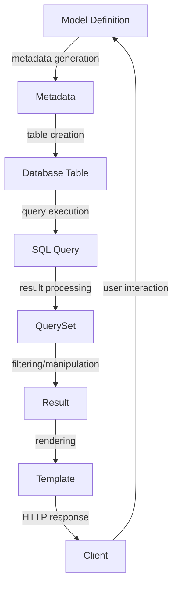

## Introduction
Django's Object-Relational Mapping (ORM) system is a powerful tool that allows developers to interact with their database using Python code, rather than writing raw SQL queries. This abstraction provides a higher level of complexity, making it easier to develop, maintain, and scale applications. The ORM system is one of the core components of the Django framework, and understanding how it works is essential for building robust and efficient web applications. 
> **Note:** The Django ORM provides a high-level interface for interacting with databases, making it easier to switch between different database backends, such as MySQL, PostgreSQL, or SQLite.

In real-world scenarios, the Django ORM is used by companies like Instagram, Pinterest, and Dropbox to manage their large-scale databases. For instance, Instagram uses Django's ORM to handle millions of user interactions, likes, and comments on their platform. 
> **Tip:** The Django ORM is not only useful for database operations but also provides a robust framework for building scalable and maintainable applications.

## Core Concepts
The Django ORM consists of several key components:
- **Models:** These are Python classes that represent database tables. They define the structure and relationships between data entities.
- **QuerySets:** These are collections of objects from the database, returned by model queries. They can be filtered, ordered, and sliced like Python lists.
- **Managers:** These are interfaces that provide methods for creating, reading, updating, and deleting objects in the database.
- **Migrations:** These are a way to modify the database schema over time, allowing developers to evolve their application's data structure as needed.

Understanding these concepts is crucial for working with the Django ORM. 
> **Warning:** Failing to understand the differences between QuerySets and models can lead to inefficient database queries and performance issues.

## How It Works Internally
When you create a model in Django, it is translated into a database table. The ORM system uses a combination of metadata and introspection to determine the structure of the table. 
> **Interview:** How does Django's ORM system determine the structure of a database table from a model? 
The answer should involve metadata and introspection.

Here's a step-by-step breakdown of how the ORM works:
1. **Model Definition:** You define a model as a Python class, inheriting from `django.db.models.Model`.
2. **Metadata Generation:** Django generates metadata for the model, including the table name, field names, and relationships.
3. **Table Creation:** When you run migrations, Django creates the corresponding database table based on the metadata.
4. **Query Execution:** When you query the model, Django translates the Python code into SQL queries, which are then executed on the database.
5. **Result Processing:** The results of the query are processed and returned as a QuerySet, which can be further filtered or manipulated.

## Code Examples
### Example 1: Basic Model Definition
```python
# models.py
from django.db import models

class Book(models.Model):
    title = models.CharField(max_length=200)
    author = models.CharField(max_length=100)
    publication_date = models.DateField()
```
This example defines a simple `Book` model with three fields: `title`, `author`, and `publication_date`.

### Example 2: Querying the Model
```python
# views.py
from django.shortcuts import render
from .models import Book

def book_list(request):
    books = Book.objects.all()  # Query all books
    return render(request, 'book_list.html', {'books': books})
```
This example queries all `Book` objects using the `objects.all()` method and passes the result to a template for rendering.

### Example 3: Advanced Query Filtering
```python
# views.py
from django.db.models import Q
from .models import Book

def book_search(request):
    query = request.GET.get('q')
    books = Book.objects.filter(Q(title__icontains=query) | Q(author__icontains=query))
    return render(request, 'book_search.html', {'books': books})
```
This example uses the `Q` object to build a complex query that filters books by title or author, using the `icontains` lookup.

## Visual Diagram

This diagram illustrates the flow of data from model definition to user interaction, highlighting the key components and processes involved in the Django ORM system.

## Comparison
| Approach | Time Complexity | Space Complexity | Pros | Cons | Best For |
| --- | --- | --- | --- | --- | --- |
| Raw SQL | O(1) | O(n) | Fine-grained control, performance | Error-prone, database-dependent | Legacy systems, performance-critical code |
| Django ORM | O(n) | O(n) | High-level abstraction, database-agnostic | Overhead, limited control | New projects, rapid development, scalability |
| SQLAlchemy | O(n) | O(n) | Flexible, Pythonic API | Steeper learning curve, dependencies | Data-intensive applications, complex queries |
| Peewee | O(n) | O(n) | Lightweight, easy to use | Limited features, not as scalable | Small projects, prototyping, education |

## Real-world Use Cases
1. **Instagram:** Uses Django's ORM to manage user interactions, likes, and comments on their platform.
2. **Pinterest:** Employs Django's ORM to handle large-scale data storage and retrieval for their image-sharing platform.
3. **Dropbox:** Utilizes Django's ORM to manage file metadata and user permissions for their cloud storage service.

## Common Pitfalls
1. **Inefficient Querying:** Failing to use `select_related()` or `prefetch_related()` can lead to N+1 query problems.
```python
# wrong
books = Book.objects.all()
for book in books:
    print(book.author.name)  # queries the database for each book

# right
books = Book.objects.select_related('author').all()
for book in books:
    print(book.author.name)  # queries the database only once
```
2. **Incorrect Model Definitions:** Forgetting to define a `__str__()` method can lead to unreadable model representations.
```python
# wrong
class Book(models.Model):
    title = models.CharField(max_length=200)

# right
class Book(models.Model):
    title = models.CharField(max_length=200)

    def __str__(self):
        return self.title
```
3. **Insufficient Error Handling:** Failing to catch and handle database errors can lead to unexpected crashes and data corruption.
```python
# wrong
try:
    book = Book.objects.get(id=1)
except:
    pass  # ignores the error

# right
try:
    book = Book.objects.get(id=1)
except Book.DoesNotExist:
    print("Book not found")
except Exception as e:
    print("An error occurred:", e)
```
4. **Inadequate Indexing:** Failing to define indexes on frequently queried fields can lead to slow query performance.
```python
# wrong
class Book(models.Model):
    title = models.CharField(max_length=200)

# right
class Book(models.Model):
    title = models.CharField(max_length=200, db_index=True)
```

## Interview Tips
1. **What is the difference between a model and a QuerySet?**
A weak answer might confuse the two concepts, while a strong answer should clearly explain the distinction.
2. **How do you optimize database queries in Django?**
A weak answer might suggest using raw SQL, while a strong answer should discuss the use of `select_related()`, `prefetch_related()`, and indexing.
3. **What is the purpose of migrations in Django?**
A weak answer might be unclear, while a strong answer should explain how migrations allow for the evolution of the database schema over time.

## Key Takeaways
* The Django ORM provides a high-level abstraction for interacting with databases.
* Models define the structure and relationships between data entities.
* QuerySets are collections of objects from the database, returned by model queries.
* Managers provide methods for creating, reading, updating, and deleting objects in the database.
* Migrations allow for the evolution of the database schema over time.
* The Django ORM uses metadata and introspection to determine the structure of the database table.
* Efficient querying techniques, such as `select_related()` and `prefetch_related()`, can improve performance.
* Correct model definitions, including `__str__()` methods and indexing, are essential for maintainable and efficient code.
* Error handling, including try-except blocks and logging, is crucial for robust and reliable applications. 
> **Tip:** Remember to use `select_related()` and `prefetch_related()` to optimize your database queries.