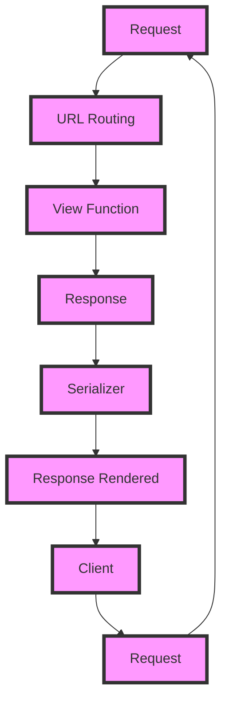

## Introduction
Django REST Framework (DRF) is a high-level Python Web framework that encourages rapid development and clean, pragmatic design. It's built on top of Django, one of the most popular Python web frameworks, and provides a simple, consistent, and extensible way to build RESTful APIs. **Django REST Framework** is widely used in the industry due to its simplicity, flexibility, and scalability. In this study guide, we'll dive deep into the core concepts, internal mechanics, and practical applications of DRF, focusing on **Serializers**, **ViewSets**, and **Routers**.

> **Note:** DRF is not just a framework, it's an ecosystem that provides a wide range of tools and libraries to build robust and maintainable APIs.

## Core Concepts
To master DRF, you need to understand the following core concepts:
* **Serializers**: These are responsible for converting complex data types, such as Django model instances, into native Python datatypes that can then be easily rendered into JSON, XML, or other content types.
* **ViewSets**: These are classes that provide a set of views that can be used to handle different types of requests, such as GET, POST, PUT, and DELETE. ViewSets are a way to organize your API views in a logical and consistent way.
* **Routers**: These are used to automatically generate URLs for your API views. Routers are a convenient way to map URLs to views without having to write a lot of boilerplate code.

> **Warning:** Don't confuse ViewSets with Views. While both are used to handle requests, ViewSets are a higher-level abstraction that provides a set of views for a particular resource.

## How It Works Internally
Here's a step-by-step breakdown of how DRF works internally:
1. **Request**: The client sends a request to the server, which is received by the Django WSGI application.
2. **URL Routing**: The request is then passed to the URL router, which maps the URL to a view function.
3. **View Function**: The view function is called, which returns a response object.
4. **Response**: The response object is then rendered into a specific format, such as JSON or XML, using a serializer.
5. **Serializer**: The serializer is responsible for converting the response data into a native Python datatype that can be easily rendered into the desired format.

> **Tip:** Use the `@api_view` decorator to define a view function that handles a specific type of request.

## Code Examples
### Example 1: Basic Serializer
```python
# models.py
from django.db import models

class Book(models.Model):
    title = models.CharField(max_length=200)
    author = models.CharField(max_length=100)

# serializers.py
from rest_framework import serializers
from .models import Book

class BookSerializer(serializers.ModelSerializer):
    class Meta:
        model = Book
        fields = ['id', 'title', 'author']

# views.py
from rest_framework.response import Response
from rest_framework.views import APIView
from .serializers import BookSerializer
from .models import Book

class BookView(APIView):
    def get(self, request):
        books = Book.objects.all()
        serializer = BookSerializer(books, many=True)
        return Response(serializer.data)
```
### Example 2: ViewSet with Router
```python
# views.py
from rest_framework import viewsets
from .models import Book
from .serializers import BookSerializer

class BookViewSet(viewsets.ModelViewSet):
    queryset = Book.objects.all()
    serializer_class = BookSerializer

# urls.py
from django.urls import path, include
from rest_framework.routers import DefaultRouter
from .views import BookViewSet

router = DefaultRouter()
router.register(r'books', BookViewSet, basename='books')

urlpatterns = [
    path('', include(router.urls)),
]
```
### Example 3: Advanced Serializer with Validation
```python
# serializers.py
from rest_framework import serializers
from .models import Book

class BookSerializer(serializers.ModelSerializer):
    class Meta:
        model = Book
        fields = ['id', 'title', 'author']

    def validate_title(self, value):
        if len(value) < 3:
            raise serializers.ValidationError('Title must be at least 3 characters long')
        return value
```
> **Interview:** Can you explain the difference between a Serializer and a ViewSet? How do you use a Router to map URLs to views?

## Visual Diagram

The diagram illustrates the request-response cycle in DRF, including URL routing, view functions, responses, serializers, and rendering.

## Comparison
| Approach | Time Complexity | Space Complexity | Pros | Cons | Best For |
| --- | --- | --- | --- | --- | --- |
| DRF | O(n) | O(n) | High-level abstraction, flexible, scalable | Steep learning curve, complex setup | Large-scale APIs, complex data models |
| Django | O(n) | O(n) | Low-level control, flexible, scalable | Complex setup, lower-level abstraction | Small-scale APIs, simple data models |
| Flask | O(n) | O(n) | Lightweight, flexible, easy to learn | Limited scalability, lower-level abstraction | Small-scale APIs, simple data models |
| FastAPI | O(n) | O(n) | High-performance, flexible, easy to learn | Limited scalability, new framework | Small-scale APIs, simple data models |

## Real-world Use Cases
1. **Instagram**: Instagram uses DRF to build its API, which handles millions of requests per day.
2. **Pinterest**: Pinterest uses DRF to build its API, which provides a wide range of features, including image processing and caching.
3. **Dropbox**: Dropbox uses DRF to build its API, which provides a scalable and secure way to store and share files.

> **Tip:** Use DRF to build large-scale APIs with complex data models.

## Common Pitfalls
1. **Incorrect Serializer Usage**: Using the wrong serializer can lead to incorrect data rendering or validation.
```python
# incorrect
serializer = BookSerializer(Book.objects.all(), many=False)
# correct
serializer = BookSerializer(Book.objects.all(), many=True)
```
2. **Insufficient Validation**: Failing to validate user input can lead to security vulnerabilities or data corruption.
```python
# incorrect
class BookSerializer(serializers.ModelSerializer):
    class Meta:
        model = Book
        fields = ['id', 'title', 'author']
# correct
class BookSerializer(serializers.ModelSerializer):
    class Meta:
        model = Book
        fields = ['id', 'title', 'author']

    def validate_title(self, value):
        if len(value) < 3:
            raise serializers.ValidationError('Title must be at least 3 characters long')
        return value
```
3. **Incorrect Router Configuration**: Incorrectly configuring the router can lead to incorrect URL mapping or 404 errors.
```python
# incorrect
router = DefaultRouter()
router.register(r'books', BookView, basename='books')
# correct
router = DefaultRouter()
router.register(r'books', BookViewSet, basename='books')
```
4. **Inconsistent API Design**: Failing to follow API design best practices can lead to confusing or difficult-to-use APIs.
```python
# incorrect
class BookViewSet(viewsets.ModelViewSet):
    queryset = Book.objects.all()
    serializer_class = BookSerializer

    def get(self, request):
        # handle GET request
    def post(self, request):
        # handle POST request
# correct
class BookViewSet(viewsets.ModelViewSet):
    queryset = Book.objects.all()
    serializer_class = BookSerializer
```
> **Warning:** Always validate user input and follow API design best practices to ensure secure and maintainable APIs.

## Interview Tips
1. **DRF vs Django**: Can you explain the difference between DRF and Django? How do you choose between the two?
	* Weak answer: "DRF is a framework for building APIs, while Django is a framework for building web applications."
	* Strong answer: "DRF is a high-level framework for building RESTful APIs, while Django is a low-level framework for building web applications. I would choose DRF for building large-scale APIs with complex data models, while I would choose Django for building small-scale APIs with simple data models."
2. **Serializer vs ViewSet**: Can you explain the difference between a Serializer and a ViewSet? How do you use a Router to map URLs to views?
	* Weak answer: "A Serializer is used to serialize data, while a ViewSet is used to handle requests."
	* Strong answer: "A Serializer is used to convert complex data types into native Python datatypes, while a ViewSet is a class that provides a set of views for a particular resource. I would use a Router to map URLs to views, which provides a convenient way to organize API views in a logical and consistent way."
3. **API Design**: Can you explain the importance of API design? How do you design a maintainable and scalable API?
	* Weak answer: "API design is important because it makes the API easy to use."
	* Strong answer: "API design is crucial because it ensures that the API is maintainable, scalable, and easy to use. I would design a maintainable and scalable API by following API design best practices, such as using consistent naming conventions, providing clear documentation, and implementing robust error handling."

## Key Takeaways
* **DRF is a high-level framework for building RESTful APIs**: DRF provides a simple, consistent, and extensible way to build RESTful APIs.
* **Serializers are used to convert complex data types into native Python datatypes**: Serializers are responsible for converting complex data types, such as Django model instances, into native Python datatypes that can then be easily rendered into JSON, XML, or other content types.
* **ViewSets are classes that provide a set of views for a particular resource**: ViewSets are a way to organize API views in a logical and consistent way.
* **Routers are used to map URLs to views**: Routers provide a convenient way to map URLs to views without having to write a lot of boilerplate code.
* **API design is crucial for maintainability and scalability**: API design is important because it ensures that the API is maintainable, scalable, and easy to use.
* **Validation is essential for security and data integrity**: Validation is crucial for ensuring the security and integrity of the API and its data.
* **Consistent naming conventions and clear documentation are essential for API design**: Consistent naming conventions and clear documentation are essential for ensuring that the API is easy to use and understand.
* **Robust error handling is essential for API reliability**: Robust error handling is crucial for ensuring that the API is reliable and can handle unexpected errors or exceptions.
* **DRF provides a wide range of tools and libraries for building RESTful APIs**: DRF provides a wide range of tools and libraries, including Serializers, ViewSets, and Routers, for building RESTful APIs.
* **DRF is widely used in the industry due to its simplicity, flexibility, and scalability**: DRF is widely used in the industry due to its simplicity, flexibility, and scalability, making it a popular choice for building RESTful APIs.