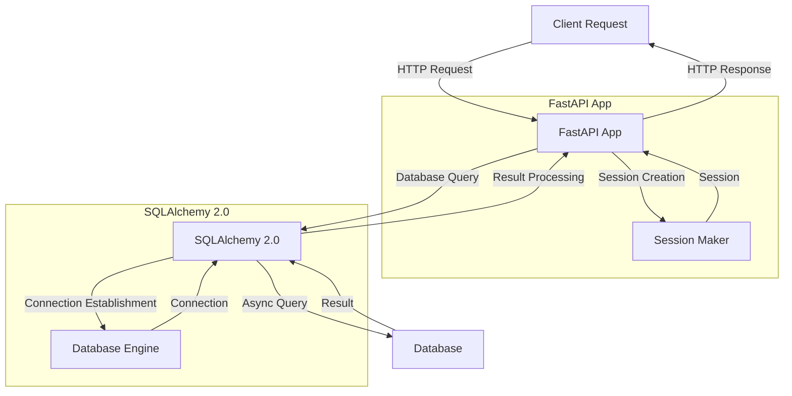

## Introduction
**FastAPI** is a modern, fast (high-performance), web framework for building APIs with Python 3.7+ based on standard Python type hints. It is designed to be fast, scalable, and easy to use, with a strong focus on automatic API documentation and robust validation. **SQLAlchemy 2.0** is a SQL toolkit and Object-Relational Mapping (ORM) library for Python, which provides a high-level SQL abstraction for a wide range of databases. Combining FastAPI with SQLAlchemy 2.0 enables developers to build high-performance, scalable, and robust APIs with a strong focus on database interactions.

> **Note:** The combination of FastAPI and SQLAlchemy 2.0 provides a powerful toolset for building modern web applications with Python.

In real-world scenarios, FastAPI with SQLAlchemy 2.0 is used in various applications, such as building RESTful APIs, microservices, and data-driven web applications. For example, **Uber** uses FastAPI to build their API gateway, while **Airbnb** uses SQLAlchemy to manage their database interactions.

## Core Concepts
**Async Database** refers to the ability to interact with a database asynchronously, allowing for non-blocking I/O operations and improving overall application performance. **SQLAlchemy 2.0** provides an async interface for interacting with databases, which can be used with FastAPI to build high-performance APIs.

> **Warning:** Using async databases can introduce complexity, and developers must ensure proper error handling and connection management to avoid performance issues.

Key terminology includes:

* **Async**: Asynchronous programming, which allows for non-blocking I/O operations.
* **SQLAlchemy 2.0**: A SQL toolkit and Object-Relational Mapping (ORM) library for Python.
* **FastAPI**: A modern, fast (high-performance), web framework for building APIs with Python 3.7+.
* **ORM**: Object-Relational Mapping, which provides a high-level abstraction for interacting with databases.

## How It Works Internally
When using FastAPI with SQLAlchemy 2.0, the application interacts with the database through an async interface. The following steps outline the internal mechanics:

1. **Connection Establishment**: The application establishes a connection to the database using SQLAlchemy 2.0's async interface.
2. **Query Execution**: The application executes a query using SQLAlchemy 2.0's async interface, which returns a future representing the result.
3. **Result Processing**: The application processes the result of the query, which can involve mapping the result to a Python object using SQLAlchemy 2.0's ORM features.
4. **Connection Closure**: The application closes the connection to the database when it is no longer needed.

> **Tip:** Using an async interface can improve application performance by allowing for non-blocking I/O operations. However, developers must ensure proper error handling and connection management to avoid performance issues.

## Code Examples
### Example 1: Basic Usage
```python
from fastapi import FastAPI
from sqlalchemy import create_engine
from sqlalchemy.ext.asyncio import AsyncSession
from sqlalchemy.orm import sessionmaker

app = FastAPI()

# Create a database engine
engine = create_engine("sqlite:///example.db")

# Create a session maker
Session = sessionmaker(bind=engine, class_=AsyncSession)

# Define a route
@app.get("/")
async def read_root():
    # Create a session
    async with Session() as session:
        # Execute a query
        result = await session.execute("SELECT * FROM example")
        # Process the result
        return [{"id": row[0], "name": row[1]} for row in result]

```
### Example 2: Real-World Pattern
```python
from fastapi import FastAPI, Depends
from sqlalchemy import create_engine
from sqlalchemy.ext.asyncio import AsyncSession
from sqlalchemy.orm import sessionmaker
from pydantic import BaseModel

app = FastAPI()

# Create a database engine
engine = create_engine("sqlite:///example.db")

# Create a session maker
Session = sessionmaker(bind=engine, class_=AsyncSession)

# Define a model
class User(BaseModel):
    id: int
    name: str

# Define a route
@app.get("/users/")
async def read_users(session: AsyncSession = Depends()):
    # Execute a query
    result = await session.execute("SELECT * FROM users")
    # Process the result
    return [{"id": row[0], "name": row[1]} for row in result]

# Define a dependency
def get_session():
    async with Session() as session:
        yield session

```
### Example 3: Advanced Usage
```python
from fastapi import FastAPI, Depends
from sqlalchemy import create_engine
from sqlalchemy.ext.asyncio import AsyncSession
from sqlalchemy.orm import sessionmaker
from pydantic import BaseModel
from typing import List

app = FastAPI()

# Create a database engine
engine = create_engine("sqlite:///example.db")

# Create a session maker
Session = sessionmaker(bind=engine, class_=AsyncSession)

# Define a model
class User(BaseModel):
    id: int
    name: str

# Define a route
@app.get("/users/")
async def read_users(session: AsyncSession = Depends()):
    # Execute a query
    result = await session.execute("SELECT * FROM users")
    # Process the result
    users = [{"id": row[0], "name": row[1]} for row in result]
    # Return the result
    return users

# Define a dependency
def get_session():
    async with Session() as session:
        yield session

# Define a route with pagination
@app.get("/users/{page}")
async def read_users_page(page: int, session: AsyncSession = Depends()):
    # Execute a query with pagination
    result = await session.execute("SELECT * FROM users LIMIT 10 OFFSET :offset", {"offset": (page - 1) * 10})
    # Process the result
    users = [{"id": row[0], "name": row[1]} for row in result]
    # Return the result
    return users

```
## Visual Diagram

The diagram illustrates the interaction between the client, FastAPI app, SQLAlchemy 2.0, and the database. The FastAPI app creates a session using the session maker, which establishes a connection to the database using SQLAlchemy 2.0's async interface. The app then executes a query using the session, which returns a result. The result is processed by the app, and an HTTP response is returned to the client.

## Comparison
| Framework | Async Support | ORM Support | Performance |
| --- | --- | --- | --- |
| FastAPI | Yes | Yes (with SQLAlchemy 2.0) | High |
| Django | No | Yes (with Django ORM) | Medium |
| Flask | No | Yes (with Flask-SQLAlchemy) | Medium |
| Pyramid | No | Yes (with Pyramid-SQLAlchemy) | Medium |

The table compares the features of different Python web frameworks. FastAPI stands out for its async support and high performance, making it an ideal choice for building high-performance APIs.

## Real-world Use Cases
1. **Uber**: Uses FastAPI to build their API gateway, which handles a large volume of requests and requires high performance.
2. **Airbnb**: Uses SQLAlchemy to manage their database interactions, which provides a high-level abstraction for interacting with their database.
3. **Dropbox**: Uses Python and SQLAlchemy to build their file storage system, which requires high performance and reliability.

## Common Pitfalls
1. **Incorrect Session Management**: Failing to properly manage sessions can lead to performance issues and errors.
```python
# Incorrect
session = Session()
# ...

# Correct
async with Session() as session:
    # ...
```
2. **Insufficient Error Handling**: Failing to handle errors properly can lead to unexpected behavior and crashes.
```python
# Incorrect
try:
    # ...
except Exception as e:
    print(e)

# Correct
try:
    # ...
except Exception as e:
    # Log the error and return a meaningful response
    logging.error(e)
    return {"error": "Internal Server Error"}
```
3. **Inefficient Database Queries**: Failing to optimize database queries can lead to performance issues.
```python
# Incorrect
result = await session.execute("SELECT * FROM users")

# Correct
result = await session.execute("SELECT * FROM users WHERE id = :id", {"id": user_id})
```
4. **Inadequate Connection Pooling**: Failing to properly configure connection pooling can lead to performance issues.
```python
# Incorrect
engine = create_engine("sqlite:///example.db")

# Correct
engine = create_engine("sqlite:///example.db", pool_size=10, max_overflow=10)
```
## Interview Tips
1. **What is FastAPI, and how does it differ from other Python web frameworks?**
	* Weak answer: "FastAPI is a Python web framework that is fast."
	* Strong answer: "FastAPI is a modern, fast (high-performance), web framework for building APIs with Python 3.7+. It differs from other Python web frameworks in its async support, automatic API documentation, and robust validation."
2. **How do you handle errors in a FastAPI application?**
	* Weak answer: "I use try-except blocks to catch errors."
	* Strong answer: "I use try-except blocks to catch errors, and I also log the errors and return meaningful responses to the client. I also use error handling middleware to handle errors globally."
3. **What is SQLAlchemy 2.0, and how does it differ from other ORMs?**
	* Weak answer: "SQLAlchemy 2.0 is an ORM that provides a high-level abstraction for interacting with databases."
	* Strong answer: "SQLAlchemy 2.0 is a SQL toolkit and Object-Relational Mapping (ORM) library for Python that provides a high-level abstraction for interacting with databases. It differs from other ORMs in its async support, robust validation, and high-performance capabilities."

## Key Takeaways
* **FastAPI is a modern, fast (high-performance), web framework for building APIs with Python 3.7+**.
* **SQLAlchemy 2.0 is a SQL toolkit and Object-Relational Mapping (ORM) library for Python that provides a high-level abstraction for interacting with databases**.
* **Async support is a key feature of FastAPI and SQLAlchemy 2.0, which provides high-performance capabilities**.
* **Error handling is crucial in a FastAPI application, and it should be done properly to avoid unexpected behavior and crashes**.
* **Connection pooling is important for performance, and it should be configured properly to avoid performance issues**.
* **SQLAlchemy 2.0 provides a high-level abstraction for interacting with databases, which makes it easier to build robust and scalable applications**.
* **FastAPI provides automatic API documentation and robust validation, which makes it easier to build APIs that are easy to use and maintain**.