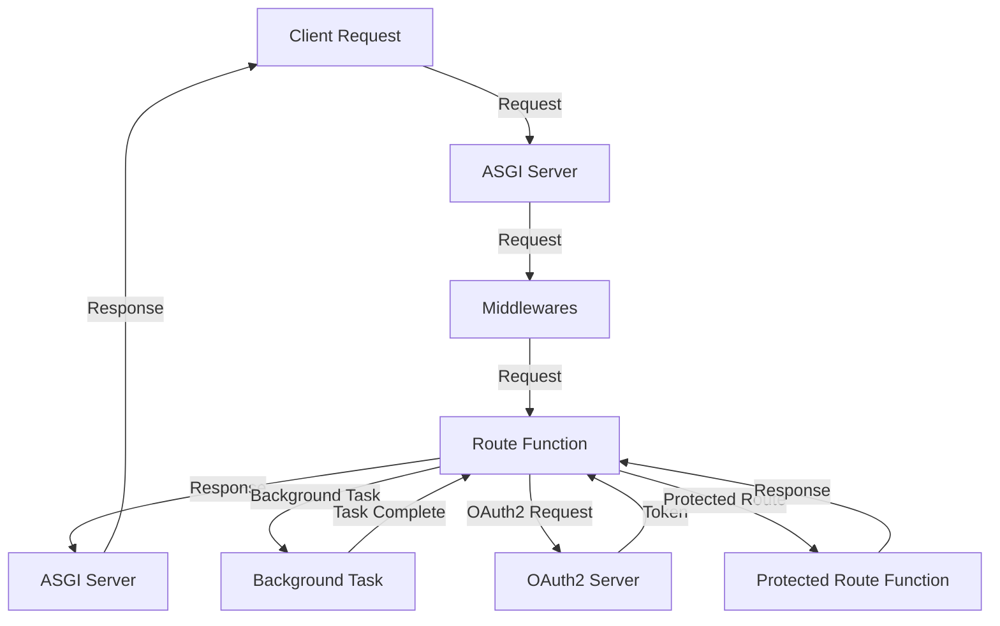

## Introduction
**FastAPI** is a modern, fast (high-performance), web framework for building APIs with Python 3.7+ based on standard Python type hints. It's designed to be fast, robust, and easy to use, with a strong focus on automatic interactive API documentation. FastAPI is a relatively new framework, but it has gained popularity quickly due to its simplicity, flexibility, and performance. In this study note, we will explore the key concepts of FastAPI, including background tasks, middleware, and OAuth2 with JWT. We will also provide code examples, visual diagrams, and comparison tables to help you understand the concepts better.

> **Note:** FastAPI is built on top of standard Python type hints, which makes it easy to use and understand for Python developers.

## Core Concepts
Let's start with the core concepts of FastAPI. 

* **Background Tasks**: In FastAPI, you can run tasks in the background using the `background_tasks` parameter. This allows you to perform tasks that don't block the main thread, such as sending emails or making API calls.
* **Middleware**: Middleware is a function that can modify or extend the behavior of a FastAPI application. It's a powerful tool that allows you to add custom functionality to your application, such as authentication or caching.
* **OAuth2 with JWT**: OAuth2 is a popular authorization framework that allows users to grant access to their resources without sharing their credentials. JWT (JSON Web Tokens) is a compact, URL-safe means of representing claims to be transferred between two parties. FastAPI provides built-in support for OAuth2 with JWT, making it easy to secure your API.

> **Warning:** When using OAuth2 with JWT, make sure to handle the tokens securely and never expose them to unauthorized parties.

## How It Works Internally
Let's take a look at how FastAPI works internally.

1. **Request**: When a request is made to a FastAPI application, it's handled by the ASGI (Asynchronous Server Gateway Interface) server.
2. **Middleware**: The request is then passed through the middleware stack, where each middleware function can modify or extend the behavior of the application.
3. **Route**: The request is then routed to the corresponding route function, where the logic of the application is executed.
4. **Background Tasks**: If a background task is scheduled, it's executed in a separate thread, allowing the main thread to continue processing other requests.

> **Tip:** Use the `background_tasks` parameter to run tasks in the background and improve the performance of your application.

## Code Examples
Here are three complete and runnable code examples that demonstrate the concepts of FastAPI, background tasks, middleware, and OAuth2 with JWT.

### Example 1: Basic FastAPI Application
```python
from fastapi import FastAPI

app = FastAPI()

@app.get("/")
def read_root():
    return {"Hello": "World"}
```
This example creates a basic FastAPI application with a single route that returns a JSON response.

### Example 2: Background Tasks
```python
from fastapi import FastAPI, BackgroundTasks
import time

app = FastAPI()

def write_notification(email: str, message=""):
    time.sleep(5)  # Simulate a long-running task
    print(f"Sent notification to {email}: {message}")

@app.post("/send-notification/{email}")
def send_notification(email: str, background_tasks: BackgroundTasks):
    message = f"Hello, {email}!"
    background_tasks.add_task(write_notification, email, message)
    return {"message": "Notification sent in the background"}
```
This example demonstrates how to use background tasks to run a long-running task in the background.

### Example 3: OAuth2 with JWT
```python
from fastapi import FastAPI, Depends, HTTPException
from fastapi.security import OAuth2PasswordBearer, OAuth2PasswordRequestForm
from pydantic import BaseModel

app = FastAPI()

class User(BaseModel):
    username: str
    email: str

class Token(BaseModel):
    access_token: str
    token_type: str

oauth2_scheme = OAuth2PasswordBearer(tokenUrl="token")

@app.post("/token")
def login(form_data: OAuth2PasswordRequestForm = Depends()):
    # Simulate a database query to retrieve the user
    user = User(username="john", email="john@example.com")
    if user.username != form_data.username or user.email != form_data.password:
        raise HTTPException(
            status_code=401,
            detail="Incorrect username or password",
            headers={"WWW-Authenticate": "Bearer"},
        )
    access_token = "example_token"
    return {"access_token": access_token, "token_type": "bearer"}

@app.get("/users/me")
def read_users_me(token: str = Depends(oauth2_scheme)):
    # Simulate a database query to retrieve the user
    user = User(username="john", email="john@example.com")
    return user
```
This example demonstrates how to use OAuth2 with JWT to secure a FastAPI application.

## Visual Diagram

This diagram illustrates the flow of a request through a FastAPI application, including the middleware stack, route function, background tasks, and OAuth2 server.

> **Note:** This diagram is a simplified representation of the flow and may not include all the details.

## Comparison
Here is a comparison table of different approaches to building a web application with Python.

| Approach | Time Complexity | Space Complexity | Pros | Cons | Best For |
| --- | --- | --- | --- | --- | --- |
| FastAPI | O(1) | O(1) | Fast, robust, easy to use | Limited support for older Python versions | Building high-performance web applications |
| Flask | O(1) | O(1) | Lightweight, flexible, easy to use | Limited support for asynchronous programming | Building small to medium-sized web applications |
| Django | O(n) | O(n) | High-level framework, built-in support for databases and authentication | Steep learning curve, monolithic architecture | Building complex, data-driven web applications |
| Pyramid | O(1) | O(1) | Flexible, modular, easy to use | Limited support for asynchronous programming | Building small to medium-sized web applications |

> **Warning:** The time and space complexity of an approach can vary depending on the specific use case and implementation.

## Real-world Use Cases
Here are three real-world use cases of FastAPI in production.

1. **Building a RESTful API**: FastAPI can be used to build a RESTful API that exposes data and functionality to clients. For example, a company like **Netflix** might use FastAPI to build an API that provides access to its movie and TV show catalog.
2. **Real-time Data Processing**: FastAPI can be used to build real-time data processing applications that handle high volumes of data. For example, a company like **Twitter** might use FastAPI to build an application that processes and analyzes tweets in real-time.
3. **Machine Learning Model Serving**: FastAPI can be used to build applications that serve machine learning models. For example, a company like **Google** might use FastAPI to build an application that serves a machine learning model that predicts user behavior.

> **Tip:** Use FastAPI to build high-performance web applications that require real-time data processing or machine learning model serving.

## Common Pitfalls
Here are four common pitfalls to avoid when using FastAPI.

1. **Not Handling Errors Properly**: Make sure to handle errors properly in your FastAPI application. This includes catching and logging exceptions, as well as returning error responses to clients.
2. **Not Using Async/Await Correctly**: Make sure to use async/await correctly in your FastAPI application. This includes using async/await to handle asynchronous programming, as well as avoiding blocking calls.
3. **Not Validating User Input**: Make sure to validate user input in your FastAPI application. This includes using validation libraries like **Pydantic** to validate user input, as well as handling invalid input correctly.
4. **Not Securing Your Application**: Make sure to secure your FastAPI application. This includes using OAuth2 and JWT to authenticate and authorize users, as well as handling sensitive data correctly.

> **Warning:** Not handling errors properly, not using async/await correctly, not validating user input, and not securing your application can lead to security vulnerabilities and performance issues.

## Interview Tips
Here are three common interview questions related to FastAPI, along with tips for answering them.

1. **What is FastAPI and how does it work?**: This question is designed to test your knowledge of FastAPI and its underlying architecture. Make sure to explain the basics of FastAPI, including its use of ASGI and async/await.
2. **How do you handle errors in FastAPI?**: This question is designed to test your knowledge of error handling in FastAPI. Make sure to explain how to catch and log exceptions, as well as how to return error responses to clients.
3. **How do you secure a FastAPI application?**: This question is designed to test your knowledge of security in FastAPI. Make sure to explain how to use OAuth2 and JWT to authenticate and authorize users, as well as how to handle sensitive data correctly.

> **Interview:** Be prepared to answer questions about FastAPI, error handling, and security. Make sure to explain the concepts clearly and provide examples where possible.

## Key Takeaways
Here are ten key takeaways from this study note.

* **FastAPI is a modern, fast (high-performance), web framework for building APIs with Python 3.7+**.
* **FastAPI uses ASGI and async/await to handle asynchronous programming**.
* **FastAPI provides built-in support for OAuth2 and JWT**.
* **FastAPI is designed to be fast, robust, and easy to use**.
* **FastAPI is well-suited for building high-performance web applications**.
* **FastAPI provides a flexible and modular architecture**.
* **FastAPI is designed to be secure and handle sensitive data correctly**.
* **FastAPI provides built-in support for error handling and logging**.
* **FastAPI is designed to be easy to learn and use, even for developers without prior experience with Python or web development**.
* **FastAPI is a popular and widely-used framework, with a large and active community of developers and users**.

> **Note:** These key takeaways summarize the main points of this study note and provide a quick reference for future review.