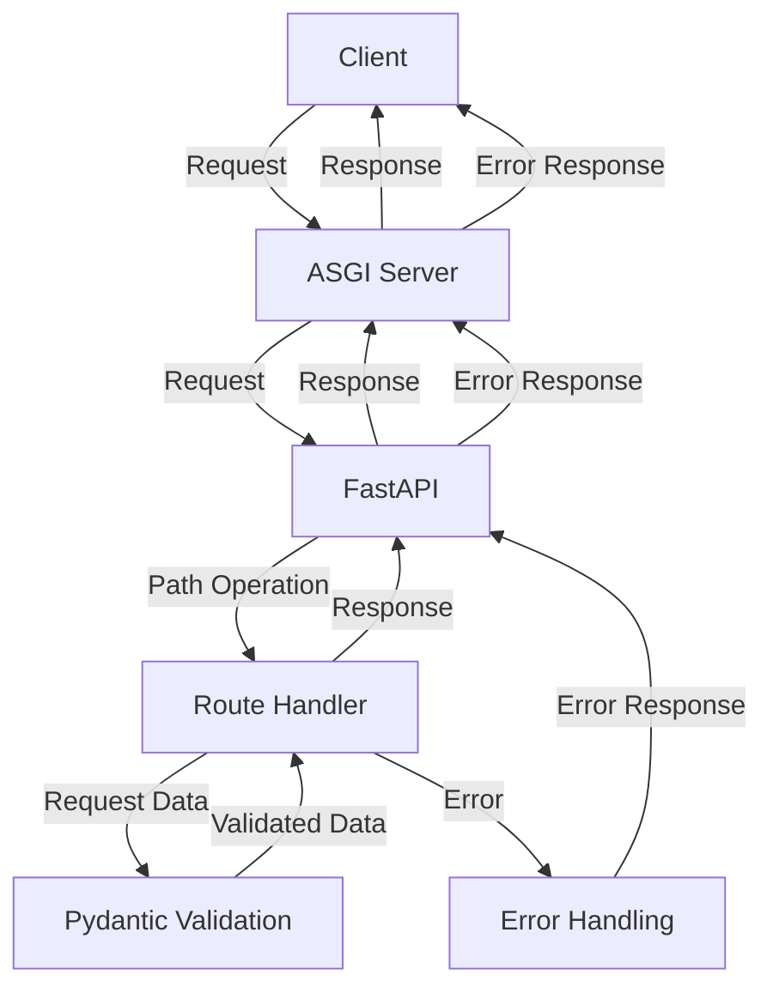

## Introduction
FastAPI is a modern, fast (high-performance), web framework for building APIs with Python 3.7+ based on standard Python type hints. It's designed to be fast, robust, and easy to use, with a strong focus on automatic API documentation and validation. FastAPI is ideal for building high-performance APIs, microservices, and data-driven applications. **Real-world relevance:** FastAPI is used by companies like Netflix, Uber, and Microsoft to build scalable and efficient APIs.

> **Note:** FastAPI is built on top of standard Python type hints using Python 3.7+ and is designed to be highly performant, with automatic API documentation and validation.

## Core Concepts
- **Path Operations:** These are the core of building APIs with FastAPI. They define the routes and methods that your API will respond to.
- **Request/Response Models:** These are used to define the structure of the data that your API will accept and return. This is done using Pydantic models, which provide automatic validation and documentation.
- **Pydantic Validation:** This is used to validate the data that your API receives and returns. Pydantic models provide automatic validation and error handling, making it easy to ensure that your API is robust and reliable.

> **Tip:** When building APIs with FastAPI, it's essential to use Pydantic models to define the structure of your data. This provides automatic validation and documentation, making it easy to ensure that your API is robust and reliable.

## How It Works Internally
- **Under-the-Hood Mechanics:** FastAPI uses the ASGI (Asynchronous Server Gateway Interface) framework to handle requests and responses. This allows for high-performance and asynchronous processing of requests.
- **Step-by-Step Breakdown:**
  1. The client sends a request to the API.
  2. The request is received by the ASGI server, which then passes it to FastAPI.
  3. FastAPI uses the path operation to determine which route to handle the request.
  4. The request data is validated using Pydantic models.
  5. The validated data is then passed to the route handler function.
  6. The route handler function processes the request and returns a response.
  7. The response is then sent back to the client.

> **Warning:** When building APIs with FastAPI, it's essential to handle errors and exceptions properly. This can be done using try-except blocks and returning error responses to the client.

## Code Examples
### Example 1: Basic Usage
```python
from fastapi import FastAPI
from pydantic import BaseModel

app = FastAPI()

class Item(BaseModel):
    name: str
    description: str

@app.post("/items/")
async def create_item(item: Item):
    return item

# This code defines a simple API with one endpoint, /items/, that accepts POST requests.
# The request body is validated using the Item Pydantic model.
```

### Example 2: Real-World Pattern
```python
from fastapi import FastAPI, HTTPException
from pydantic import BaseModel
from typing import List

app = FastAPI()

class Item(BaseModel):
    id: int
    name: str
    description: str

class ItemList(BaseModel):
    items: List[Item]

# This code defines a more complex API with multiple endpoints and models.
# The ItemList model is used to define a list of items.

@app.get("/items/")
async def read_items():
    items = [{"id": 1, "name": "Item 1", "description": "This is item 1"}]
    return ItemList(items=items)

@app.get("/items/{item_id}")
async def read_item(item_id: int):
    item = {"id": item_id, "name": "Item 1", "description": "This is item 1"}
    if item_id != 1:
        raise HTTPException(status_code=404, detail="Item not found")
    return Item(**item)
```

### Example 3: Advanced Usage
```python
from fastapi import FastAPI, Depends
from pydantic import BaseModel
from typing import List
from sqlalchemy import create_engine
from sqlalchemy.orm import sessionmaker
from sqlalchemy.ext.declarative import declarative_base
from sqlalchemy import Column, Integer, String

SQLALCHEMY_DATABASE_URL = "sqlite:///example.db"

engine = create_engine(SQLALCHEMY_DATABASE_URL)
SessionLocal = sessionmaker(autocommit=False, autoflush=False, bind=engine)

Base = declarative_base()

class Item(Base):
    __tablename__ = "items"
    id = Column(Integer, primary_key=True)
    name = Column(String)
    description = Column(String)

Base.metadata.create_all(bind=engine)

app = FastAPI()

class ItemModel(BaseModel):
    name: str
    description: str

def get_db():
    db = SessionLocal()
    try:
        yield db
    finally:
        db.close()

@app.post("/items/")
async def create_item(item: ItemModel, db: SessionLocal = Depends(get_db)):
    db_item = Item(name=item.name, description=item.description)
    db.add(db_item)
    db.commit()
    db.refresh(db_item)
    return db_item
```

## Visual Diagram

This diagram illustrates the flow of a request through FastAPI, from the client to the ASGI server, to FastAPI, and then to the route handler. It also shows the validation of request data using Pydantic models and the handling of errors.

> **Interview:** When asked about the flow of a request through FastAPI, be sure to mention the ASGI server, path operations, route handlers, and Pydantic validation.

## Comparison
| Framework | Time Complexity | Space Complexity | Pros | Cons | Best For |
| --- | --- | --- | --- | --- | --- |
| FastAPI | O(1) | O(1) | High-performance, automatic API documentation, and validation | Steep learning curve | Building high-performance APIs and microservices |
| Flask | O(n) | O(n) | Lightweight, flexible, and easy to use | Not suitable for large-scale applications | Building small to medium-sized applications |
| Django | O(n^2) | O(n^2) | High-level framework with built-in ORM and authentication | Complex and difficult to learn | Building complex, data-driven applications |
| Pyramid | O(n) | O(n) | Flexible and modular framework with a strong focus on security | Not as well-known as other frameworks | Building secure and scalable applications |

## Real-world Use Cases
- **Netflix:** Uses FastAPI to build high-performance APIs for its streaming service.
- **Uber:** Uses FastAPI to build scalable and efficient APIs for its ride-hailing service.
- **Microsoft:** Uses FastAPI to build high-performance APIs for its Azure cloud platform.

## Common Pitfalls
- **Not using Pydantic models:** Failing to use Pydantic models can lead to invalid data and errors in your API.
- **Not handling errors:** Failing to handle errors properly can lead to unexpected behavior and errors in your API.
- **Not using dependencies:** Failing to use dependencies can lead to tight coupling and difficulty in testing your API.
- **Not using async/await:** Failing to use async/await can lead to blocking and performance issues in your API.

> **Warning:** When building APIs with FastAPI, it's essential to use Pydantic models, handle errors properly, use dependencies, and use async/await to ensure high-performance and reliability.

## Interview Tips
- **What is FastAPI?:** Be prepared to explain what FastAPI is, its features, and its benefits.
- **How does FastAPI work?:** Be prepared to explain the flow of a request through FastAPI, from the client to the ASGI server, to FastAPI, and then to the route handler.
- **What is Pydantic?:** Be prepared to explain what Pydantic is, its features, and its benefits.

> **Tip:** When answering interview questions about FastAPI, be sure to mention its high-performance capabilities, automatic API documentation, and validation using Pydantic models.

## Key Takeaways
- **FastAPI is a high-performance web framework:** FastAPI is designed to be fast and efficient, making it ideal for building high-performance APIs and microservices.
- **Pydantic models provide automatic validation and documentation:** Pydantic models provide automatic validation and documentation, making it easy to ensure that your API is robust and reliable.
- **Use dependencies to manage complexity:** Dependencies can help manage complexity and make your API more maintainable and testable.
- **Use async/await to ensure performance:** Async/await can help ensure high-performance and reliability in your API.
- **Handle errors properly:** Handling errors properly can help prevent unexpected behavior and errors in your API.
- **Use automatic API documentation:** Automatic API documentation can help make your API more discoverable and easier to use.
- **FastAPI is ideal for building scalable and efficient APIs:** FastAPI is designed to be scalable and efficient, making it ideal for building large-scale applications.
- **FastAPI has a strong focus on security:** FastAPI has a strong focus on security, making it ideal for building secure and scalable applications.
- **FastAPI is well-suited for real-time applications:** FastAPI is well-suited for real-time applications, making it ideal for building applications that require low latency and high throughput.