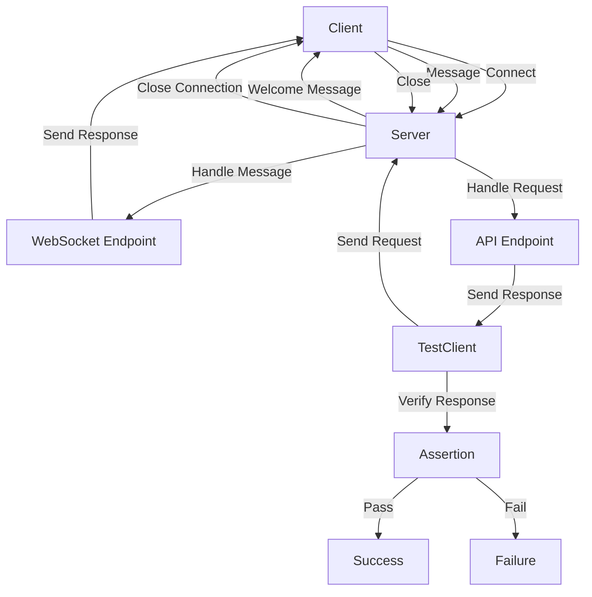

## Introduction
**FastAPI** is a modern, fast (high-performance), web framework for building APIs with Python 3.7+ based on standard Python type hints. It is designed to be fast, robust, and easy to use, with a strong focus on automatic interactive API documentation. In this section, we will explore the world of **FastAPI**, its importance, and real-world relevance.

**FastAPI** matters because it provides a robust framework for building high-performance APIs, which is essential in today's fast-paced digital world. With the rise of microservices architecture, APIs have become the backbone of modern software development. **FastAPI** helps developers build APIs quickly and efficiently, with a strong focus on performance, security, and maintainability.

In real-world scenarios, **FastAPI** is used by companies like **Microsoft**, **Netflix**, and **Uber** to build high-performance APIs. For example, **Microsoft** uses **FastAPI** to build APIs for their Azure services, while **Netflix** uses it to build APIs for their content delivery network.

> **Note:** **FastAPI** is not just limited to building APIs; it can also be used to build web applications, microservices, and even machine learning models.

## Core Concepts
In this section, we will explore the core concepts of **FastAPI**, including **WebSockets**, **Testing with TestClient**, and other key terminology.

* **WebSockets**: **WebSockets** is a protocol that allows bidirectional, real-time communication between a client and a server over the web. It is commonly used in applications that require real-time updates, such as live updates, gaming, and chat applications.
* **Testing with TestClient**: **TestClient** is a testing tool provided by **FastAPI** that allows developers to test their APIs easily and efficiently. It provides a simple and intuitive API for testing, making it easy to write unit tests and integration tests for your API.

> **Warning:** When using **WebSockets**, it is essential to handle disconnections and errors properly to avoid losing data or causing unexpected behavior.

## How It Works Internally
In this section, we will explore the internal mechanics of **FastAPI**, including how it handles **WebSockets** and **Testing with TestClient**.

When a client connects to a **FastAPI** server using **WebSockets**, the server establishes a connection and sends a welcome message to the client. The client can then send messages to the server, which are handled by the server's **WebSocket** endpoint.

When using **TestClient**, the testing tool sends HTTP requests to the API and verifies the responses. **TestClient** provides a simple and intuitive API for testing, making it easy to write unit tests and integration tests for your API.

Here is a high-level overview of how **FastAPI** handles **WebSockets** and **Testing with TestClient**:
1. Client connects to server using **WebSockets**
2. Server establishes connection and sends welcome message
3. Client sends message to server
4. Server handles message using **WebSocket** endpoint
5. **TestClient** sends HTTP request to API
6. API handles request and sends response
7. **TestClient** verifies response

> **Tip:** When using **WebSockets**, it is essential to use a message queue or a database to handle messages and avoid losing data.

## Code Examples
In this section, we will explore three complete and runnable code examples that demonstrate the use of **FastAPI** with **WebSockets** and **Testing with TestClient**.

### Example 1: Basic WebSocket Example
```python
from fastapi import FastAPI
from fastapi.websockets import WebSocket

app = FastAPI()

@app.websocket("/ws")
async def websocket_endpoint(websocket: WebSocket):
    await websocket.accept()
    while True:
        data = await websocket.receive_text()
        await websocket.send_text(f"Message text was: {data}")
```
This example demonstrates a basic **WebSocket** endpoint that sends a welcome message to the client and then echoes back any messages received from the client.

### Example 2: Testing with TestClient
```python
from fastapi import FastAPI
from fastapi.testclient import TestClient

app = FastAPI()

@app.get("/items/")
async def read_items():
    return [{"name": "Item Foo"}]

client = TestClient(app)

def test_read_items():
    response = client.get("/items/")
    assert response.status_code == 200
    assert response.json() == [{"name": "Item Foo"}]
```
This example demonstrates how to use **TestClient** to test a simple API endpoint.

### Example 3: Advanced WebSocket Example
```python
from fastapi import FastAPI
from fastapi.websockets import WebSocket
import asyncio

app = FastAPI()

@app.websocket("/ws")
async def websocket_endpoint(websocket: WebSocket):
    await websocket.accept()
    while True:
        data = await websocket.receive_text()
        if data == "ping":
            await websocket.send_text("pong")
        elif data == "close":
            await websocket.close()
        else:
            await websocket.send_text(f"Message text was: {data}")

async def send_message(websocket: WebSocket, message: str):
    await websocket.send_text(message)

async def main():
    async with websockets.connect("ws://localhost:8000/ws") as websocket:
        await send_message(websocket, "ping")
        response = await websocket.recv()
        assert response == "pong"

asyncio.run(main())
```
This example demonstrates a more advanced **WebSocket** endpoint that handles multiple messages and uses asynchronous programming to send and receive messages.

## Visual Diagram

This diagram illustrates the flow of messages between a client and a server using **WebSockets**, as well as the testing process using **TestClient**.

> **Note:** This diagram is a simplified representation of the process and is not exhaustive.

## Comparison
| Approach | Time Complexity | Space Complexity | Pros | Cons | Best For |
| --- | --- | --- | --- | --- | --- |
| **WebSockets** | O(1) | O(1) | Real-time updates, bidirectional communication | Complexity, disconnections | Real-time applications, gaming, chat |
| **REST** | O(1) | O(1) | Simple, widely adopted, easy to implement | Not suitable for real-time updates | Simple APIs, data retrieval |
| **GraphQL** | O(n) | O(n) | Flexible, powerful, reduces overhead | Complex, steep learning curve | Complex APIs, data querying |
| **gRPC** | O(1) | O(1) | High-performance, efficient, scalable | Complexity, requires additional setup | High-performance APIs, microservices |

> **Warning:** When choosing an approach, consider the trade-offs between time complexity, space complexity, and the specific requirements of your application.

## Real-world Use Cases
1. **Microsoft**: Uses **FastAPI** to build APIs for their Azure services, including **WebSockets** for real-time updates.
2. **Netflix**: Uses **FastAPI** to build APIs for their content delivery network, including **WebSockets** for live updates.
3. **Uber**: Uses **FastAPI** to build APIs for their ride-hailing platform, including **WebSockets** for real-time updates.

> **Tip:** When building real-world applications, consider using **FastAPI** with **WebSockets** for real-time updates and **TestClient** for testing.

## Common Pitfalls
1. **Not handling disconnections**: Failing to handle disconnections can cause unexpected behavior and data loss.
2. **Not using message queues**: Failing to use message queues can cause data loss and unexpected behavior.
3. **Not testing thoroughly**: Failing to test thoroughly can cause bugs and unexpected behavior.
4. **Not using asynchronous programming**: Failing to use asynchronous programming can cause performance issues and unexpected behavior.

> **Warning:** When using **WebSockets**, it is essential to handle disconnections and errors properly to avoid losing data or causing unexpected behavior.

## Interview Tips
1. **What is FastAPI?**: **FastAPI** is a modern, fast (high-performance), web framework for building APIs with Python 3.7+ based on standard Python type hints.
2. **What is WebSockets?**: **WebSockets** is a protocol that allows bidirectional, real-time communication between a client and a server over the web.
3. **How do you test FastAPI applications?**: **FastAPI** provides a testing tool called **TestClient** that allows developers to test their APIs easily and efficiently.

> **Interview:** When answering questions about **FastAPI**, be sure to highlight its key features, such as high-performance, real-time updates, and ease of use.

## Key Takeaways
* **FastAPI** is a modern, fast (high-performance), web framework for building APIs with Python 3.7+ based on standard Python type hints.
* **WebSockets** is a protocol that allows bidirectional, real-time communication between a client and a server over the web.
* **TestClient** is a testing tool provided by **FastAPI** that allows developers to test their APIs easily and efficiently.
* When using **WebSockets**, it is essential to handle disconnections and errors properly to avoid losing data or causing unexpected behavior.
* **FastAPI** is suitable for building high-performance APIs, real-time applications, and microservices.
* **FastAPI** provides a simple and intuitive API for testing, making it easy to write unit tests and integration tests for your API.
* When choosing an approach, consider the trade-offs between time complexity, space complexity, and the specific requirements of your application.