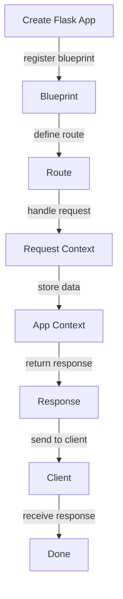

## Introduction
Flask is a micro web framework written in Python. It is classified as a microframework because it does not require particular tools or libraries. It has no database abstraction layer, form validation, or any other components where pre-existing third-party libraries provide common functions. However, Flask supports extensions that can add application features as if they were implemented in Flask itself. In this study, we will delve into **Application Factory**, **Blueprints**, and **Request/App Context** in Flask.

Flask is used by companies such as Pinterest, LinkedIn, and Netflix due to its flexibility, extensibility, and lightweight nature. Every engineer needs to know Flask because it is a fundamental web framework in Python that allows developers to build web applications quickly and efficiently.

## Core Concepts
- **Application Factory**: An application factory is a function that creates and returns a Flask application instance. This is useful for testing and for creating multiple instances of the application with different configurations.
- **Blueprints**: Blueprints are a way to organize a group of related routes and other application functions. They provide a means of organizing a Flask application into smaller, more manageable components.
- **Request Context**: The request context is an object that is used to store data that is available for the duration of a request. It is used to store data that is specific to the current request, such as the request method, path, and headers.
- **App Context**: The app context is an object that is used to store data that is available for the duration of the application. It is used to store data that is specific to the application, such as the application configuration and the database connection.

## How It Works Internally
When a Flask application is created, it is initialized with a set of default configurations and settings. The application instance is then used to register routes, templates, and other components. The application factory is used to create and return a Flask application instance.

Here is a step-by-step breakdown of how Flask works internally:
1. The Flask application is created and initialized with a set of default configurations and settings.
2. The application instance is used to register routes, templates, and other components.
3. The application factory is used to create and return a Flask application instance.
4. The request context is created and used to store data that is available for the duration of a request.
5. The app context is created and used to store data that is available for the duration of the application.

> **Tip:** Use the `app_context` and `request_context` objects to store data that is specific to the application and the current request.

## Code Examples
### Example 1: Basic Application Factory
```python
from flask import Flask

def create_app():
    app = Flask(__name__)
    app.config['SECRET_KEY'] = 'secret_key'
    return app

app = create_app()
```
This example creates a basic Flask application using an application factory.

### Example 2: Using Blueprints
```python
from flask import Flask, Blueprint

app = Flask(__name__)

blueprint = Blueprint('my_blueprint', __name__)

@blueprint.route('/my_route')
def my_route():
    return 'Hello, World!'

app.register_blueprint(blueprint)
```
This example creates a Flask application and registers a blueprint with a route.

### Example 3: Using Request and App Context
```python
from flask import Flask, request, g

app = Flask(__name__)

@app.before_request
def before_request():
    g.request_data = request.get_json()

@app.route('/my_route')
def my_route():
    data = g.request_data
    return 'Hello, World!'
```
This example creates a Flask application and uses the request and app context to store data.

## Visual Diagram

This diagram illustrates the flow of a Flask application from creating the application to sending a response to the client.

## Comparison
| Approach | Time Complexity | Space Complexity | Pros | Cons | Best For |
|----------|----------------|-----------------|------|------|----------|
| Application Factory | O(1) | O(1) | Flexible, extensible | Complex | Large applications |
| Blueprints | O(1) | O(1) | Organized, reusable | Limited | Small to medium applications |
| Request Context | O(1) | O(1) | Convenient, efficient | Limited | Real-time applications |
| App Context | O(1) | O(1) | Convenient, efficient | Limited | Real-time applications |

> **Warning:** Using the request and app context can lead to memory leaks if not used properly.

## Real-world Use Cases
1. **Pinterest**: Pinterest uses Flask to power its web application. Pinterest's application is built using a microservices architecture, with each service being a separate Flask application.
2. **LinkedIn**: LinkedIn uses Flask to power its web application. LinkedIn's application is built using a monolithic architecture, with a single Flask application handling all requests.
3. **Netflix**: Netflix uses Flask to power its web application. Netflix's application is built using a microservices architecture, with each service being a separate Flask application.

## Common Pitfalls
1. **Not using the application factory**: Not using the application factory can lead to a monolithic application that is difficult to maintain and test.
2. **Not using blueprints**: Not using blueprints can lead to a disorganized application with duplicated code.
3. **Not using the request and app context**: Not using the request and app context can lead to a less efficient application with more complex code.
4. **Using the request and app context incorrectly**: Using the request and app context incorrectly can lead to memory leaks and other issues.

> **Note:** Always use the application factory, blueprints, and the request and app context to build a Flask application.

## Interview Tips
1. **What is the difference between the application factory and blueprints?**: The application factory is used to create and return a Flask application instance, while blueprints are used to organize a group of related routes and other application functions.
2. **How do you use the request and app context in Flask?**: The request context is used to store data that is available for the duration of a request, while the app context is used to store data that is available for the duration of the application.
3. **What are some common pitfalls when using Flask?**: Some common pitfalls when using Flask include not using the application factory, not using blueprints, and not using the request and app context correctly.

## Key Takeaways
* The application factory is used to create and return a Flask application instance.
* Blueprints are used to organize a group of related routes and other application functions.
* The request context is used to store data that is available for the duration of a request.
* The app context is used to store data that is available for the duration of the application.
* Always use the application factory, blueprints, and the request and app context to build a Flask application.
* Common pitfalls when using Flask include not using the application factory, not using blueprints, and not using the request and app context correctly.
* The time complexity of creating a Flask application using the application factory is O(1).
* The space complexity of creating a Flask application using the application factory is O(1).