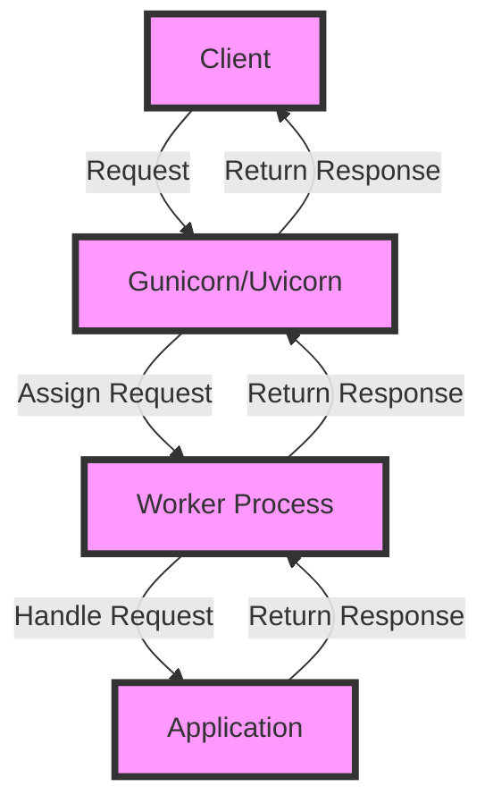

## Introduction
Gunicorn and Uvicorn are two popular WSGI and ASGI servers used for serving Python web applications in production. They provide a robust and scalable way to deploy web applications, ensuring high performance and reliability. In this section, we will introduce Gunicorn and Uvicorn, their importance, and their real-world relevance.

Gunicorn and Uvicorn are designed to work with popular Python web frameworks such as Flask and Django. They provide a bridge between the web framework and the underlying operating system, allowing the application to communicate with the outside world. Gunicorn is a WSGI server, which means it is designed to work with traditional WSGI-based frameworks, while Uvicorn is an ASGI server, which is designed to work with asynchronous frameworks.

> **Note:** Gunicorn and Uvicorn are not web frameworks themselves, but rather servers that can be used to deploy web applications built with Python web frameworks.

In real-world scenarios, Gunicorn and Uvicorn are widely used in production environments. For example, companies like Instagram and Pinterest use Gunicorn to serve their web applications. Uvicorn, on the other hand, is used by companies like GitHub and Dropbox.

## Core Concepts
In this section, we will cover the core concepts of Gunicorn and Uvicorn, including their architecture, configuration, and key terminology.

Gunicorn uses a **pre-fork** model, where the master process creates multiple worker processes that handle incoming requests. Each worker process runs in a separate memory space, which provides a high level of isolation and fault tolerance. Uvicorn, on the other hand, uses an **asyncio**-based model, where a single process handles all incoming requests using asynchronous I/O.

> **Warning:** Gunicorn's pre-fork model can lead to memory issues if not configured properly. It's essential to monitor memory usage and adjust the number of worker processes accordingly.

Key terminology includes:

* **Worker process**: a process that handles incoming requests
* **Master process**: the process that creates and manages worker processes
* **ASGI**: Asynchronous Server Gateway Interface, a standard for asynchronous web frameworks
* **WSGI**: Web Server Gateway Interface, a standard for traditional web frameworks

## How It Works Internally
In this section, we will delve into the internal workings of Gunicorn and Uvicorn.

When a request is received by Gunicorn, the master process receives the request and assigns it to a worker process. The worker process then handles the request and returns the response to the master process, which sends it back to the client. Uvicorn, on the other hand, uses an event loop to handle incoming requests. The event loop runs in a single process and uses asynchronous I/O to handle requests concurrently.

Here is a high-level overview of the Gunicorn workflow:

1. The master process receives a request
2. The master process assigns the request to a worker process
3. The worker process handles the request
4. The worker process returns the response to the master process
5. The master process sends the response back to the client

> **Tip:** Gunicorn provides a **--worker-class** option that allows you to specify the worker class to use. This can be useful for customizing the behavior of worker processes.

## Code Examples
In this section, we will provide three complete and runnable code examples that demonstrate how to use Gunicorn and Uvicorn.

### Example 1: Basic Gunicorn Usage
```python
from flask import Flask

app = Flask(__name__)

@app.route("/")
def hello():
    return "Hello, World!"

if __name__ == "__main__":
    app.run()
```
To run this example with Gunicorn, save it to a file called `app.py` and run the following command:
```bash
gunicorn -w 4 app:app
```
This will start Gunicorn with 4 worker processes.

### Example 2: Real-World Uvicorn Usage
```python
from fastapi import FastAPI

app = FastAPI()

@app.get("/")
def hello():
    return {"message": "Hello, World!"}

if __name__ == "__main__":
    import uvicorn
    uvicorn.run(app, host="0.0.0.0", port=8000)
```
To run this example with Uvicorn, save it to a file called `app.py` and run the following command:
```bash
uvicorn app:app --host 0.0.0.0 --port 8000
```
This will start Uvicorn with the FastAPI application.

### Example 3: Advanced Gunicorn Configuration
```python
from flask import Flask
from gunicorn.config import Config

app = Flask(__name__)

@app.route("/")
def hello():
    return "Hello, World!"

class GunicornConfig(Config):
    def __init__(self):
        super().__init__()
        self.bind = "0.0.0.0:5000"
        self.workers = 8
        self.worker_class = "gevent"

if __name__ == "__main__":
    app.run()
```
To run this example with Gunicorn, save it to a file called `app.py` and run the following command:
```bash
gunicorn -c gunicorn_config.py app:app
```
This will start Gunicorn with the custom configuration.

## Visual Diagram

This diagram illustrates the workflow of Gunicorn and Uvicorn, including the client, server, worker process, and application.

> **Note:** The diagram shows a simplified view of the workflow and omits some details for clarity.

## Comparison
| Server | Time Complexity | Space Complexity | Pros | Cons | Best For |
| --- | --- | --- | --- | --- | --- |
| Gunicorn | O(1) | O(n) | High performance, scalable | Memory issues if not configured properly | Traditional WSGI-based frameworks |
| Uvicorn | O(1) | O(1) | Asynchronous I/O, high performance | Limited support for traditional WSGI frameworks | Asynchronous ASGI-based frameworks |
| Waitress | O(1) | O(n) | High performance, scalable | Limited support for asynchronous I/O | Traditional WSGI-based frameworks |
| uWSGI | O(1) | O(n) | High performance, scalable | Complex configuration | Traditional WSGI-based frameworks |

> **Warning:** The time and space complexity of the servers can vary depending on the specific use case and configuration.

## Real-world Use Cases
Here are three real-world use cases for Gunicorn and Uvicorn:

* Instagram uses Gunicorn to serve its web application, which handles millions of requests per day.
* GitHub uses Uvicorn to serve its web application, which provides a high-performance and scalable solution for its users.
* Dropbox uses Gunicorn to serve its web application, which provides a reliable and fault-tolerant solution for its users.

> **Tip:** Gunicorn and Uvicorn are widely used in production environments due to their high performance, scalability, and reliability.

## Common Pitfalls
Here are four common pitfalls to watch out for when using Gunicorn and Uvicorn:

* **Insufficient worker processes**: If the number of worker processes is too low, it can lead to performance issues and slow response times.
* **Incorrect configuration**: Incorrect configuration of Gunicorn or Uvicorn can lead to performance issues, memory issues, or even crashes.
* **Inadequate monitoring**: Inadequate monitoring of the server can lead to performance issues, memory issues, or even crashes.
* **Incompatible frameworks**: Using incompatible frameworks with Gunicorn or Uvicorn can lead to performance issues, memory issues, or even crashes.

> **Warning:** It's essential to monitor the server's performance and adjust the configuration accordingly to avoid common pitfalls.

## Interview Tips
Here are three common interview questions related to Gunicorn and Uvicorn:

* **What is the difference between Gunicorn and Uvicorn?**: A strong answer would explain the difference between the two servers, including their architecture, configuration, and key terminology.
* **How do you configure Gunicorn for high performance?**: A strong answer would explain the various configuration options available in Gunicorn, including the number of worker processes, worker class, and bind address.
* **What are the benefits of using Uvicorn over Gunicorn?**: A strong answer would explain the benefits of using Uvicorn, including its asynchronous I/O, high performance, and scalability.

> **Interview:** Be prepared to answer questions related to Gunicorn and Uvicorn, including their architecture, configuration, and key terminology.

## Key Takeaways
Here are six key takeaways to remember when using Gunicorn and Uvicorn:

* **Gunicorn is a WSGI server**: Gunicorn is designed to work with traditional WSGI-based frameworks.
* **Uvicorn is an ASGI server**: Uvicorn is designed to work with asynchronous ASGI-based frameworks.
* **Configure Gunicorn and Uvicorn properly**: Proper configuration is essential for high performance, scalability, and reliability.
* **Monitor the server's performance**: Monitoring the server's performance is essential to avoid common pitfalls and ensure high performance.
* **Use the correct framework**: Using the correct framework with Gunicorn or Uvicorn is essential to avoid performance issues, memory issues, or even crashes.
* **Test and optimize**: Test and optimize the server's configuration to ensure high performance, scalability, and reliability.

> **Note:** Remember to test and optimize the server's configuration to ensure high performance, scalability, and reliability.