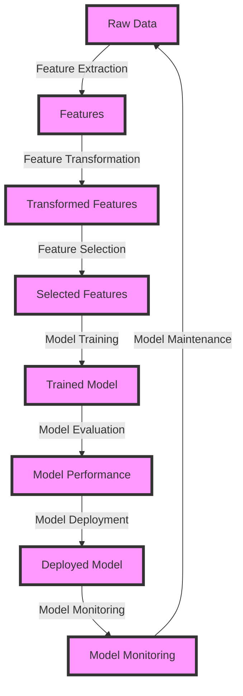

## Introduction
**Feature engineering and selection** are crucial steps in the machine learning pipeline. They involve selecting and transforming the most relevant features from the existing dataset to improve the performance of a model. In this section, we will discuss the importance of feature engineering and selection, their real-world relevance, and why every engineer needs to know about them. 
> **Note:** Feature engineering and selection can make or break a machine learning model, as the quality of the features directly affects the model's performance.

Feature engineering and selection are essential in **data science**, as they help to:
- Reduce the dimensionality of the data
- Remove irrelevant features
- Improve the model's performance
- Reduce overfitting

Real-world examples of feature engineering and selection can be seen in various applications, such as:
- **Image classification**: Extracting features from images to classify them into different categories.
- **Natural language processing**: Extracting features from text data to perform sentiment analysis or text classification.

## Core Concepts
To understand feature engineering and selection, we need to familiarize ourselves with the following core concepts:
- **Features**: The individual columns or variables in a dataset.
- **Feature engineering**: The process of creating new features from the existing ones to improve the model's performance.
- **Feature selection**: The process of selecting the most relevant features from the existing dataset.
- **Dimensionality reduction**: The process of reducing the number of features in a dataset while preserving the most important information.

Mental models and analogies can help us understand these concepts better. For example, we can think of feature engineering as a process of **transforming raw materials into a usable product**. Just like how a carpenter transforms raw wood into a beautiful piece of furniture, we transform raw features into meaningful ones.

Key terminology includes:
- **Feature extraction**: The process of extracting features from raw data.
- **Feature transformation**: The process of transforming existing features into new ones.
- **Feature selection methods**: Techniques used to select the most relevant features, such as **filter methods**, **wrapper methods**, and **embedded methods**.

## How It Works Internally
The internal mechanics of feature engineering and selection involve the following steps:
1. **Data preprocessing**: Cleaning and preprocessing the data to prepare it for feature engineering and selection.
2. **Feature extraction**: Extracting features from the raw data using techniques such as **principal component analysis (PCA)** or **t-distributed Stochastic Neighbor Embedding (t-SNE)**.
3. **Feature transformation**: Transforming existing features into new ones using techniques such as **standardization** or **normalization**.
4. **Feature selection**: Selecting the most relevant features using techniques such as **correlation analysis** or **mutual information**.

The time complexity of these steps can vary depending on the techniques used. For example, PCA has a time complexity of **O(n^3)**, where n is the number of features, while t-SNE has a time complexity of **O(n^2)**.

## Code Examples
Here are three complete and runnable code examples in Python to demonstrate feature engineering and selection:
### Example 1: Basic Feature Engineering
```python
import pandas as pd
from sklearn.preprocessing import StandardScaler

# Load the dataset
data = pd.read_csv('data.csv')

# Create a new feature by scaling the existing ones
scaler = StandardScaler()
data[['feature1', 'feature2']] = scaler.fit_transform(data[['feature1', 'feature2']])

print(data.head())
```
This example demonstrates basic feature engineering by scaling the existing features using the **StandardScaler** class from scikit-learn.

### Example 2: Feature Selection using Correlation Analysis
```python
import pandas as pd
import numpy as np

# Load the dataset
data = pd.read_csv('data.csv')

# Calculate the correlation matrix
corr_matrix = data.corr()

# Select features with a correlation coefficient greater than 0.5
selected_features = []
for i in range(len(corr_matrix.columns)):
    for j in range(i):
        if abs(corr_matrix.iloc[i, j]) > 0.5:
            selected_features.append(corr_matrix.columns[i])
            break

print(selected_features)
```
This example demonstrates feature selection using correlation analysis. It calculates the correlation matrix and selects features with a correlation coefficient greater than 0.5.

### Example 3: Advanced Feature Engineering using PCA
```python
import pandas as pd
from sklearn.decomposition import PCA

# Load the dataset
data = pd.read_csv('data.csv')

# Create a PCA object with 2 components
pca = PCA(n_components=2)

# Fit and transform the data
data_pca = pca.fit_transform(data)

print(data_pca.shape)
```
This example demonstrates advanced feature engineering using PCA. It creates a PCA object with 2 components and fits and transforms the data to reduce its dimensionality.

## Visual Diagram

This diagram illustrates the feature engineering and selection process, from raw data to deployed model.

## Comparison
The following table compares different feature selection methods:
| Method | Time Complexity | Space Complexity | Pros | Cons | Best For |
| --- | --- | --- | --- | --- | --- |
| Correlation Analysis | O(n^2) | O(n) | Easy to implement, interpretable | Sensitive to noise | Small datasets |
| Mutual Information | O(n^2) | O(n) | Robust to noise, handles non-linear relationships | Computationally expensive | Large datasets |
| PCA | O(n^3) | O(n) | Reduces dimensionality, robust to noise | Sensitive to scaling | High-dimensional datasets |
| t-SNE | O(n^2) | O(n) | Preserves local structure, robust to noise | Computationally expensive, sensitive to hyperparameters | High-dimensional datasets |

## Real-world Use Cases
Here are three real-world examples of feature engineering and selection:
1. **Image classification**: Google's self-driving cars use feature engineering and selection to classify images from cameras and sensors.
2. **Natural language processing**: Amazon's Alexa uses feature engineering and selection to extract features from text data and perform sentiment analysis.
3. **Recommendation systems**: Netflix uses feature engineering and selection to extract features from user behavior and recommend movies and TV shows.

## Common Pitfalls
Here are four common mistakes to avoid in feature engineering and selection:
1. **Overfitting**: Using too many features can lead to overfitting, which can be avoided by using regularization techniques or feature selection methods.
2. **Underfitting**: Using too few features can lead to underfitting, which can be avoided by using feature engineering techniques to create new features.
3. **Noise**: Noisy features can lead to poor model performance, which can be avoided by using noise reduction techniques or feature selection methods.
4. **Correlation**: Correlated features can lead to poor model performance, which can be avoided by using correlation analysis or feature selection methods.

> **Warning:** Using too many features can lead to the **curse of dimensionality**, which can result in poor model performance.

## Interview Tips
Here are three common interview questions on feature engineering and selection:
1. **What is the difference between feature engineering and feature selection?**
	* Weak answer: "Feature engineering is the process of creating new features, while feature selection is the process of selecting the most relevant features."
	* Strong answer: "Feature engineering is the process of transforming raw features into meaningful ones, while feature selection is the process of selecting the most relevant features to improve model performance."
2. **How do you handle high-dimensional data?**
	* Weak answer: "I use PCA to reduce the dimensionality of the data."
	* Strong answer: "I use a combination of feature engineering and selection techniques, such as PCA, t-SNE, and correlation analysis, to reduce the dimensionality of the data and improve model performance."
3. **What is the importance of feature engineering and selection in machine learning?**
	* Weak answer: "Feature engineering and selection are important because they help to improve model performance."
	* Strong answer: "Feature engineering and selection are crucial in machine learning because they help to transform raw data into meaningful features, reduce dimensionality, and improve model performance, which ultimately leads to better decision-making and business outcomes."

## Key Takeaways
Here are ten key takeaways from this section:
* Feature engineering and selection are crucial steps in the machine learning pipeline.
* Feature engineering involves transforming raw features into meaningful ones.
* Feature selection involves selecting the most relevant features to improve model performance.
* Correlation analysis and mutual information are common feature selection methods.
* PCA and t-SNE are common dimensionality reduction techniques.
* Overfitting and underfitting can be avoided by using regularization techniques or feature selection methods.
* Noisy features can lead to poor model performance.
* Correlated features can lead to poor model performance.
* Feature engineering and selection can be used to handle high-dimensional data.
* The choice of feature selection method depends on the problem and dataset.