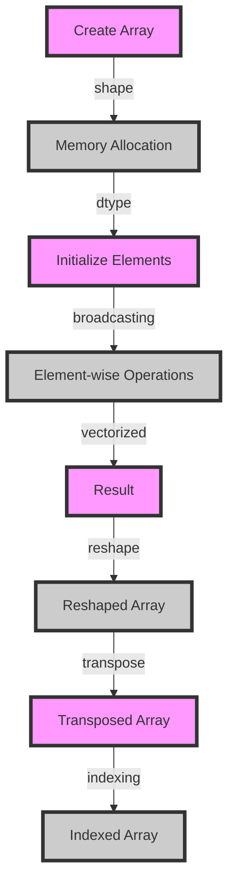

## Introduction
**NumPy** (Numerical Python) is a library for working with arrays and mathematical operations in Python. It is a fundamental package for scientific computing and data analysis in Python, providing support for large, multi-dimensional arrays and matrices, along with a wide range of high-performance mathematical functions to operate on these arrays. NumPy is the foundation of most scientific computing and data analysis libraries in Python, including **Pandas**, **SciPy**, and **Matplotlib**. Every engineer working with data in Python needs to know NumPy, as it provides the core data structure and operations for numerical computing.

> **Note:** NumPy is not just a library, it's a way of thinking about numerical computing in Python. It's essential to understand how NumPy works internally to write efficient and effective code.

## Core Concepts
- **Array**: A multi-dimensional collection of values of the same data type, stored in a contiguous block of memory.
- ** Broadcasting**: The ability of NumPy to align arrays with different shapes and sizes for element-wise operations.
- **Vectorized Operations**: Operations that act on entire arrays at once, rather than looping over individual elements.
- **Shape**: The number of dimensions and the size of each dimension in an array.
- **Dtype**: The data type of the elements in an array.

> **Tip:** When working with NumPy, it's essential to understand the shape and dtype of your arrays, as this determines the memory layout and the operations that can be performed.

## How It Works Internally
NumPy arrays are stored in a contiguous block of memory, which allows for efficient iteration and manipulation of the data. The memory layout is determined by the shape and dtype of the array. NumPy provides a range of functions for creating and manipulating arrays, including **numpy.array**, **numpy.zeros**, and **numpy.reshape**.

When performing operations on arrays, NumPy uses a combination of vectorized operations and broadcasting to align the arrays and perform the operation. This allows for efficient and flexible computation on large datasets.

> **Warning:** When working with large arrays, it's essential to be mindful of memory usage, as NumPy arrays can consume significant amounts of memory.

## Code Examples
### Example 1: Basic Array Creation
```python
import numpy as np

# Create a 1D array
arr = np.array([1, 2, 3, 4, 5])
print(arr)

# Create a 2D array
arr_2d = np.array([[1, 2], [3, 4]])
print(arr_2d)
```

### Example 2: Broadcasting and Vectorized Operations
```python
import numpy as np

# Create two arrays with different shapes
arr1 = np.array([1, 2, 3])
arr2 = np.array([4])

# Perform element-wise addition using broadcasting
result = arr1 + arr2
print(result)

# Perform element-wise multiplication using vectorized operations
result = arr1 * arr2
print(result)
```

### Example 3: Advanced Array Manipulation
```python
import numpy as np

# Create a 3D array
arr_3d = np.array([[[1, 2], [3, 4]], [[5, 6], [7, 8]]])

# Reshape the array to 2D
arr_2d = arr_3d.reshape(4, 2)
print(arr_2d)

# Transpose the array
arr_transposed = arr_2d.T
print(arr_transposed)
```

## Visual Diagram

The diagram illustrates the key steps involved in creating and manipulating NumPy arrays, including memory allocation, initialization, broadcasting, and vectorized operations.

## Comparison
| Library | Time Complexity | Space Complexity | Pros | Cons | Best For |
| --- | --- | --- | --- | --- | --- |
| NumPy | O(n) | O(n) | Efficient, flexible, and widely adopted | Steep learning curve, not suitable for small datasets | Large-scale numerical computing |
| Pandas | O(n) | O(n) | Convenient data structures and operations, easy to use | Slow for very large datasets, not optimized for numerical computing | Data analysis and manipulation |
| SciPy | O(n) | O(n) | Wide range of scientific and engineering applications, optimized for performance | Complex and difficult to use, not suitable for small datasets | Scientific and engineering applications |
| Matplotlib | O(n) | O(n) | High-quality 2D and 3D plotting, easy to use | Not suitable for large-scale numerical computing, slow for very large datasets | Data visualization |

## Real-world Use Cases
- **Google**: Uses NumPy for large-scale numerical computing and data analysis in their search engine and other applications.
- **NASA**: Uses NumPy for scientific and engineering applications, such as data analysis and visualization.
- **Airbnb**: Uses Pandas and NumPy for data analysis and manipulation, as well as data visualization using Matplotlib.

> **Tip:** When working on real-world projects, it's essential to choose the right library for the task at hand, considering factors such as performance, ease of use, and scalability.

## Common Pitfalls
- **Memory Usage**: NumPy arrays can consume significant amounts of memory, especially for large datasets.
- **Broadcasting Errors**: Incorrect broadcasting can lead to unexpected results or errors.
- **Indexing Errors**: Incorrect indexing can lead to unexpected results or errors.
- **Performance**: NumPy operations can be slow for very large datasets if not optimized correctly.

> **Warning:** When working with large datasets, it's essential to be mindful of memory usage and optimize performance to avoid slow computation times.

## Interview Tips
- **What is NumPy and why is it useful?**: A strong answer should highlight the key features and benefits of NumPy, including efficient numerical computing and flexible data structures.
- **How do you create and manipulate NumPy arrays?**: A strong answer should demonstrate a clear understanding of NumPy array creation and manipulation, including broadcasting and vectorized operations.
- **What are some common pitfalls when working with NumPy?**: A strong answer should highlight common mistakes, such as memory usage and broadcasting errors, and provide strategies for avoiding them.

> **Interview:** Be prepared to demonstrate your understanding of NumPy and its applications, as well as your ability to write efficient and effective code.

## Key Takeaways
- **NumPy is the foundation of scientific computing and data analysis in Python**.
- **NumPy arrays are stored in a contiguous block of memory**, allowing for efficient iteration and manipulation.
- **Broadcasting and vectorized operations are key features of NumPy**, enabling efficient computation on large datasets.
- **Memory usage and performance are critical considerations** when working with large datasets.
- **Choosing the right library for the task at hand** is essential for efficient and effective computation.
- **Common pitfalls include memory usage, broadcasting errors, indexing errors, and performance issues**.
- **Optimizing performance and memory usage** is crucial for large-scale numerical computing.
- **Understanding the shape and dtype of NumPy arrays** is essential for efficient and effective computation.
- **NumPy has a wide range of applications**, including scientific and engineering applications, data analysis, and data visualization.