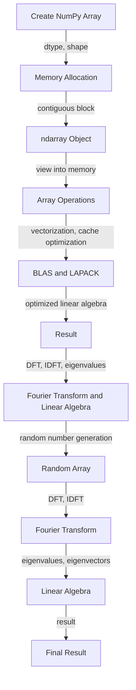

## Introduction
**NumPy** (Numerical Python) is a library for working with arrays and mathematical operations in Python. It is a fundamental package for scientific computing and data analysis in Python. NumPy provides support for large, multi-dimensional arrays and matrices, along with a large collection of high-level mathematical functions to operate on these arrays. NumPy is widely used in various fields such as data science, machine learning, scientific research, and engineering.

> **Note:** NumPy is the foundation of most scientific computing in Python, and is often used in conjunction with other libraries such as Pandas, SciPy, and Matplotlib.

NumPy is designed to provide an efficient and flexible way to work with numerical data. It provides a powerful N-dimensional array object, and tools for working with these arrays. NumPy also provides a wide range of mathematical functions, including basic arithmetic, linear algebra, random number generation, and Fourier transform.

## Core Concepts
* **Arrays**: The fundamental data structure in NumPy is the **ndarray**, which is a multi-dimensional array of values.
* **Data Types**: NumPy supports a variety of data types, including integers, floating point numbers, and complex numbers.
* **Linear Algebra**: NumPy provides a wide range of linear algebra functions, including matrix multiplication, eigenvalue decomposition, and singular value decomposition.
* **Random Number Generation**: NumPy provides a variety of random number generators, including uniform, normal, and binomial distributions.
* **Fourier Transform**: NumPy provides functions for computing the discrete Fourier transform (DFT) of a sequence.

> **Warning:** NumPy arrays are not the same as Python lists. While both can be used to store collections of data, NumPy arrays are much more efficient and provide more advanced mathematical operations.

## How It Works Internally
NumPy arrays are stored in a contiguous block of memory, which allows for efficient access and manipulation of the data. The memory layout of a NumPy array is determined by the **dtype** (data type) and **shape** of the array.

When you create a NumPy array, the memory is allocated and the data is stored in a contiguous block. The **ndarray** object then provides a view into this memory block, allowing you to access and manipulate the data.

NumPy uses a variety of techniques to optimize performance, including:

* **Vectorization**: NumPy operations are designed to operate on entire arrays at once, rather than iterating over individual elements.
* **Cache optimization**: NumPy arrays are stored in a way that minimizes cache misses, which can significantly improve performance.
* **BLAS and LAPACK**: NumPy uses optimized BLAS (Basic Linear Algebra Subprograms) and LAPACK (Linear Algebra Package) libraries to perform linear algebra operations.

## Code Examples
### Example 1: Basic Array Operations
```python
import numpy as np

# Create two arrays
a = np.array([1, 2, 3])
b = np.array([4, 5, 6])

# Perform basic arithmetic operations
print("Addition:", a + b)
print("Subtraction:", a - b)
print("Multiplication:", a * b)
print("Division:", a / b)
```

### Example 2: Linear Algebra Operations
```python
import numpy as np

# Create two matrices
A = np.array([[1, 2], [3, 4]])
B = np.array([[5, 6], [7, 8]])

# Perform matrix multiplication
C = np.matmul(A, B)
print("Matrix Multiplication:", C)

# Compute the eigenvalues and eigenvectors of A
eigenvalues, eigenvectors = np.linalg.eig(A)
print("Eigenvalues:", eigenvalues)
print("Eigenvectors:", eigenvectors)
```

### Example 3: Random Number Generation and Fourier Transform
```python
import numpy as np

# Generate a random array
random_array = np.random.rand(10)
print("Random Array:", random_array)

# Compute the discrete Fourier transform (DFT) of the array
dft = np.fft.fft(random_array)
print("DFT:", dft)

# Compute the inverse DFT
idft = np.fft.ifft(dft)
print("Inverse DFT:", idft)
```

## Visual Diagram

The diagram illustrates the flow of creating a NumPy array, performing array operations, and using linear algebra and Fourier transform functions.

## Comparison
| Library | Time Complexity | Space Complexity | Pros | Cons | Best For |
| --- | --- | --- | --- | --- | --- |
| NumPy | O(n) | O(n) | Efficient, flexible, widely used | Steep learning curve | Scientific computing, data analysis |
| Pandas | O(n) | O(n) | Easy to use, high-level data structures | Slow for large datasets | Data manipulation, analysis |
| SciPy | O(n) | O(n) | Wide range of scientific functions | Limited support for non-scientific applications | Scientific computing, signal processing |
| Matplotlib | O(n) | O(n) | High-quality visualizations | Steep learning curve | Data visualization, scientific computing |

## Real-world Use Cases
1. **Data Analysis**: NumPy is widely used in data analysis for its efficient array operations and linear algebra functions. Companies like Google, Amazon, and Facebook use NumPy for data analysis and machine learning.
2. **Scientific Research**: NumPy is used in various scientific fields such as physics, engineering, and biology for its ability to perform complex mathematical operations. Researchers use NumPy to analyze and visualize large datasets.
3. **Machine Learning**: NumPy is used in machine learning for its ability to perform linear algebra operations and random number generation. Companies like TensorFlow and PyTorch use NumPy as a foundation for their machine learning libraries.

> **Tip:** Use NumPy for efficient array operations and linear algebra functions. Use Pandas for high-level data structures and data manipulation.

## Common Pitfalls
1. **Incorrect Data Type**: Using the wrong data type can lead to incorrect results or errors. For example, using a float data type for integer data can lead to precision errors.
```python
import numpy as np

# Incorrect data type
a = np.array([1, 2, 3], dtype=np.float64)
print("Incorrect Data Type:", a)
```

2. **Inconsistent Array Shapes**: Using arrays with inconsistent shapes can lead to errors or incorrect results. For example, trying to add two arrays with different shapes can lead to a broadcast error.
```python
import numpy as np

# Inconsistent array shapes
a = np.array([1, 2, 3])
b = np.array([4, 5])
print("Inconsistent Array Shapes:", a + b)
```

3. **Incorrect Linear Algebra Operations**: Using incorrect linear algebra operations can lead to incorrect results or errors. For example, using the wrong matrix multiplication function can lead to incorrect results.
```python
import numpy as np

# Incorrect linear algebra operation
A = np.array([[1, 2], [3, 4]])
B = np.array([[5, 6], [7, 8]])
print("Incorrect Linear Algebra Operation:", A * B)
```

4. **Incorrect Random Number Generation**: Using incorrect random number generation can lead to incorrect results or errors. For example, using the wrong random number generator can lead to non-uniform distributions.
```python
import numpy as np

# Incorrect random number generation
random_array = np.random.randint(0, 10, size=10)
print("Incorrect Random Number Generation:", random_array)
```

## Interview Tips
1. **What is NumPy and why is it used?**: The interviewer wants to know if you understand the basics of NumPy and its use cases.
> **Interview:** "What is NumPy and why is it used in data science?"
> **Weak Answer:** "NumPy is a library for working with arrays."
> **Strong Answer:** "NumPy is a library for working with arrays and mathematical operations. It is widely used in data science for its efficient array operations and linear algebra functions."

2. **How do you perform linear algebra operations in NumPy?**: The interviewer wants to know if you understand how to use NumPy's linear algebra functions.
> **Interview:** "How do you perform matrix multiplication in NumPy?"
> **Weak Answer:** "I use the `*` operator."
> **Strong Answer:** "I use the `np.matmul()` function for matrix multiplication. I also use `np.linalg.eig()` for eigenvalue decomposition and `np.linalg.svd()` for singular value decomposition."

3. **How do you generate random numbers in NumPy?**: The interviewer wants to know if you understand how to use NumPy's random number generators.
> **Interview:** "How do you generate a random array in NumPy?"
> **Weak Answer:** "I use the `np.random()` function."
> **Strong Answer:** "I use the `np.random.rand()` function for generating a random array with uniform distribution. I also use `np.random.normal()` for generating a random array with normal distribution."

## Key Takeaways
* **NumPy is a library for working with arrays and mathematical operations**.
* **NumPy provides efficient array operations and linear algebra functions**.
* **NumPy is widely used in data science and scientific computing**.
* **Use `np.matmul()` for matrix multiplication**.
* **Use `np.linalg.eig()` for eigenvalue decomposition**.
* **Use `np.linalg.svd()` for singular value decomposition**.
* **Use `np.random.rand()` for generating a random array with uniform distribution**.
* **Use `np.random.normal()` for generating a random array with normal distribution**.
* **NumPy arrays are stored in a contiguous block of memory**.
* **NumPy uses vectorization and cache optimization for efficient array operations**.
* **NumPy provides a wide range of linear algebra functions, including matrix multiplication, eigenvalue decomposition, and singular value decomposition**.