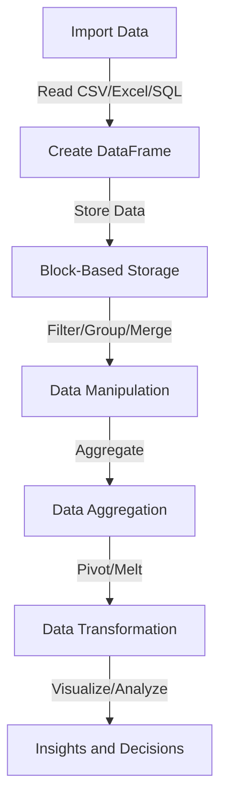

## Introduction
**Pandas** is a powerful Python library used for data manipulation and analysis. It provides data structures and functions to efficiently handle structured data, including tabular data such as spreadsheets and SQL tables. Pandas is widely used in various fields, including data science, scientific computing, and business intelligence. Its key features include data filtering, grouping, merging, pivoting, and melting, which enable users to easily manipulate and analyze large datasets. In this section, we will explore the importance of pandas in real-world applications and why every engineer should know how to use it.

> **Note:** Pandas is often used in conjunction with other popular Python libraries, such as NumPy, Matplotlib, and Scikit-learn, to provide a comprehensive data science workflow.

## Core Concepts
Pandas provides several core data structures, including **Series** (1-dimensional labeled array) and **DataFrame** (2-dimensional labeled data structure with columns of potentially different types). The library also includes various functions for data manipulation, such as **filtering**, **grouping**, **merging**, **pivoting**, and **melting**.

*   **Filtering**: The process of selecting specific rows or columns from a DataFrame based on conditions.
*   **Grouping**: The process of grouping a DataFrame by one or more columns and performing aggregation operations on the grouped data.
*   **Merging**: The process of combining two or more DataFrames based on a common column.
*   **Pivoting**: The process of rotating data from a long format to a wide format.
*   **Melting**: The process of unpivoting data from a wide format to a long format.

> **Warning:** Pandas is sensitive to missing data, and incorrect handling of missing values can lead to incorrect results or errors.

## How It Works Internally
Pandas uses a combination of NumPy arrays and Python dictionaries to store and manipulate data. The library provides an efficient and flexible way to handle large datasets by using **block-based** storage, where data is stored in contiguous blocks of memory. This approach enables pandas to perform operations quickly and efficiently.

Here is a step-by-step breakdown of how pandas works internally:

1.  **Data Import**: Pandas reads data from various sources, such as CSV, Excel, or SQL databases, and stores it in a DataFrame.
2.  **Data Storage**: Pandas stores data in a block-based structure, where each block contains a contiguous array of values.
3.  **Data Manipulation**: Pandas provides various functions for data manipulation, such as filtering, grouping, merging, pivoting, and melting.
4.  **Data Aggregation**: Pandas performs aggregation operations, such as sum, mean, and count, on the manipulated data.

> **Tip:** Pandas provides a **copy** function to create a copy of a DataFrame, which is useful when performing data manipulation operations to avoid modifying the original data.

## Code Examples
### Example 1: Basic Filtering
```python
import pandas as pd

# Create a sample DataFrame
data = {'Name': ['John', 'Anna', 'Peter', 'Linda'],
        'Age': [28, 24, 35, 32],
        'Country': ['USA', 'UK', 'Australia', 'Germany']}
df = pd.DataFrame(data)

# Filter rows where Age is greater than 30
filtered_df = df[df['Age'] > 30]

print(filtered_df)
```

### Example 2: Real-World Grouping and Aggregation
```python
import pandas as pd

# Create a sample DataFrame
data = {'OrderID': [1, 2, 3, 4, 5],
        'CustomerID': [1, 1, 2, 3, 3],
        'OrderDate': ['2022-01-01', '2022-01-15', '2022-02-01', '2022-03-01', '2022-03-15'],
        'Total': [100, 200, 50, 75, 125]}
df = pd.DataFrame(data)

# Group orders by CustomerID and calculate the total order value
grouped_df = df.groupby('CustomerID')['Total'].sum().reset_index()

print(grouped_df)
```

### Example 3: Advanced Merging and Pivoting
```python
import pandas as pd

# Create two sample DataFrames
data1 = {'OrderID': [1, 2, 3],
         'CustomerID': [1, 1, 2],
         'OrderDate': ['2022-01-01', '2022-01-15', '2022-02-01']}
df1 = pd.DataFrame(data1)

data2 = {'OrderID': [1, 2, 3],
         'ProductID': [101, 102, 103],
         'Quantity': [2, 3, 1]}
df2 = pd.DataFrame(data2)

# Merge the two DataFrames on OrderID
merged_df = pd.merge(df1, df2, on='OrderID')

# Pivot the merged DataFrame to get the quantity of each product for each customer
pivoted_df = merged_df.pivot_table(values='Quantity', index='CustomerID', columns='ProductID', aggfunc='sum')

print(pivoted_df)
```

## Visual Diagram

The diagram illustrates the pandas workflow, from importing data to creating insights and decisions.

## Comparison
| Approach | Time Complexity | Space Complexity | Pros | Cons | Best For |
| --- | --- | --- | --- | --- | --- |
| Pandas Filtering | O(n) | O(n) | Fast and efficient | Limited to simple filtering | Simple data manipulation |
| Pandas Grouping | O(n log n) | O(n) | Flexible and powerful | Can be slow for large datasets | Complex data aggregation |
| Pandas Merging | O(n log n) | O(n) | Fast and efficient | Can be slow for large datasets | Combining datasets |
| Pandas Pivoting | O(n log n) | O(n) | Fast and efficient | Can be slow for large datasets | Data transformation |
| NumPy Array Operations | O(n) | O(n) | Fast and efficient | Limited to numerical operations | Numerical computations |

## Real-world Use Cases
1.  **Data Analysis**: Pandas is widely used in data analysis to clean, transform, and visualize data. For example, a data analyst at a company like **Google** might use pandas to analyze customer behavior and preferences.
2.  **Scientific Computing**: Pandas is used in scientific computing to handle and analyze large datasets. For example, a researcher at **NASA** might use pandas to analyze climate data and predict weather patterns.
3.  **Business Intelligence**: Pandas is used in business intelligence to analyze and visualize business data. For example, a business analyst at **Amazon** might use pandas to analyze sales data and optimize marketing campaigns.

> **Interview:** Can you explain the difference between pandas and NumPy? How would you use each library in a real-world project?

## Common Pitfalls
1.  **Incorrect Handling of Missing Values**: Pandas is sensitive to missing data, and incorrect handling of missing values can lead to incorrect results or errors.
2.  **Inefficient Data Manipulation**: Pandas provides various functions for data manipulation, but using the wrong function can lead to inefficient performance.
3.  **Insufficient Data Validation**: Pandas assumes that the data is clean and valid, but insufficient data validation can lead to incorrect results or errors.
4.  **Incorrect Use of Data Structures**: Pandas provides various data structures, such as Series and DataFrame, but using the wrong data structure can lead to incorrect results or errors.

> **Warning:** Pandas is not optimized for real-time data processing and may not be suitable for applications that require low-latency data processing.

## Interview Tips
1.  **Be prepared to explain the difference between pandas and NumPy**: The interviewer will likely ask you to explain the difference between pandas and NumPy, and how you would use each library in a real-world project.
2.  **Be prepared to write code**: The interviewer will likely ask you to write code to solve a problem, such as filtering or grouping a dataset.
3.  **Be prepared to explain data manipulation concepts**: The interviewer will likely ask you to explain data manipulation concepts, such as filtering, grouping, merging, pivoting, and melting.

> **Tip:** Practice writing code and explaining data manipulation concepts to improve your chances of success in a pandas interview.

## Key Takeaways
*   Pandas is a powerful library for data manipulation and analysis.
*   Pandas provides various functions for data manipulation, such as filtering, grouping, merging, pivoting, and melting.
*   Pandas uses a block-based storage structure to store data, which enables efficient data manipulation.
*   Pandas is sensitive to missing data and requires careful handling of missing values.
*   Pandas is not optimized for real-time data processing and may not be suitable for applications that require low-latency data processing.
*   Pandas is widely used in data analysis, scientific computing, and business intelligence.
*   Pandas provides various data structures, such as Series and DataFrame, which are used to store and manipulate data.
*   Pandas has a time complexity of O(n) for filtering and O(n log n) for grouping and merging.
*   Pandas has a space complexity of O(n) for filtering and O(n log n) for grouping and merging.