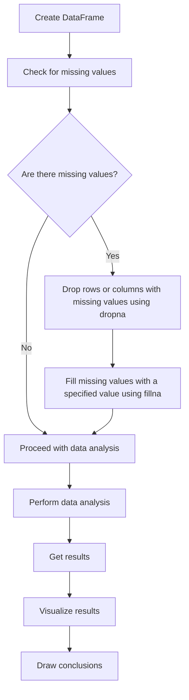

## Introduction
**Pandas** is a powerful Python library used for data manipulation and analysis. One of the most common challenges when working with data is handling missing values. Missing data can occur due to various reasons such as data entry errors, survey non-responses, or sensor malfunctions. In this section, we will discuss the importance of handling missing data and introduce the **dropna** and **fillna** functions in Pandas.

Handling missing data is crucial because it can significantly impact the accuracy of data analysis and machine learning models. For instance, if a dataset contains missing values, a model may not be able to learn the underlying patterns, leading to poor predictions. Moreover, missing data can also lead to biased results, which can have serious consequences in real-world applications.

> **Note:** In data science, it's essential to handle missing data properly to ensure the reliability and accuracy of the results.

## Core Concepts
In Pandas, missing data is represented using **NaN** (Not a Number) or **None** values. The **dropna** function is used to remove rows or columns containing missing values, while the **fillna** function is used to replace missing values with a specified value.

* **NaN**: A special floating-point value that represents an undefined or unreliable result in floating-point calculations.
* **None**: A special value that represents the absence of a value.
* **dropna**: A function that drops rows or columns containing missing values.
* **fillna**: A function that fills missing values with a specified value.

> **Tip:** When working with missing data, it's essential to understand the difference between **NaN** and **None** values.

## How It Works Internally
When you use the **dropna** function, Pandas iterates over the rows or columns of the DataFrame and checks for missing values. If a row or column contains a missing value, it is removed from the DataFrame. The **dropna** function can be used with various parameters, such as **axis**, **how**, and **thresh**, to customize the behavior.

On the other hand, the **fillna** function replaces missing values with a specified value. This value can be a scalar, a list, or even another DataFrame. The **fillna** function can also be used with various parameters, such as **inplace** and **limit**, to customize the behavior.

> **Warning:** When using the **dropna** function, be careful not to remove too many rows or columns, as this can lead to biased results.

## Code Examples
### Example 1: Basic Usage of dropna
```python
import pandas as pd
import numpy as np

# Create a DataFrame with missing values
data = {'A': [1, 2, np.nan, 4],
        'B': [5, np.nan, 7, 8]}
df = pd.DataFrame(data)

# Print the original DataFrame
print("Original DataFrame:")
print(df)

# Drop rows containing missing values
df_dropped = df.dropna()

# Print the resulting DataFrame
print("\nDataFrame after dropping rows with missing values:")
print(df_dropped)
```

### Example 2: Real-World Pattern with fillna
```python
import pandas as pd
import numpy as np

# Create a DataFrame with missing values
data = {'A': [1, 2, np.nan, 4],
        'B': [5, np.nan, 7, 8]}
df = pd.DataFrame(data)

# Print the original DataFrame
print("Original DataFrame:")
print(df)

# Fill missing values with the mean of each column
df_filled = df.fillna(df.mean())

# Print the resulting DataFrame
print("\nDataFrame after filling missing values with mean:")
print(df_filled)
```

### Example 3: Advanced Usage of dropna and fillna
```python
import pandas as pd
import numpy as np

# Create a DataFrame with missing values
data = {'A': [1, 2, np.nan, 4],
        'B': [5, np.nan, 7, 8],
        'C': [np.nan, np.nan, np.nan, np.nan]}
df = pd.DataFrame(data)

# Print the original DataFrame
print("Original DataFrame:")
print(df)

# Drop columns containing all missing values
df_dropped = df.dropna(axis=1, how='all')

# Fill missing values with the median of each column
df_filled = df_dropped.fillna(df_dropped.median())

# Print the resulting DataFrame
print("\nDataFrame after dropping columns with all missing values and filling remaining missing values with median:")
print(df_filled)
```

## Visual Diagram

The diagram illustrates the process of handling missing data in Pandas. It starts with creating a DataFrame, checking for missing values, and then deciding whether to drop rows or columns with missing values using **dropna** or fill missing values using **fillna**.

## Comparison
| Approach | Time Complexity | Space Complexity | Pros | Cons | Best For |
| --- | --- | --- | --- | --- | --- |
| dropna | O(n) | O(n) | Easy to use, fast | May remove too many rows or columns | Small to medium-sized datasets |
| fillna | O(n) | O(n) | Flexible, can fill with various values | May not handle complex missing data patterns | Medium to large-sized datasets |
| interpolate | O(n log n) | O(n) | Can handle complex missing data patterns | May be slow for large datasets | Large-sized datasets with complex missing data patterns |
| impute | O(n) | O(n) | Can handle missing data with multiple imputation | May be computationally expensive | Large-sized datasets with multiple imputation |

> **Interview:** Can you explain the difference between **dropna** and **fillna** in Pandas? How would you decide which one to use in a given scenario?

## Real-world Use Cases
1. **Data Preprocessing for Machine Learning**: In a machine learning project, you may need to handle missing values in the dataset before training the model. You can use **dropna** to remove rows with missing values or **fillna** to fill missing values with the mean or median of each column.
2. **Data Analysis for Business Insights**: In a business analytics project, you may need to analyze customer data to gain insights into their behavior. You can use **dropna** to remove rows with missing values or **fillna** to fill missing values with a specific value, such as 0 or a default value.
3. **Data Science for Healthcare**: In a healthcare project, you may need to analyze patient data to predict disease outcomes. You can use **dropna** to remove rows with missing values or **fillna** to fill missing values with the mean or median of each column.

## Common Pitfalls
1. **Removing too many rows or columns**: When using **dropna**, be careful not to remove too many rows or columns, as this can lead to biased results.
2. **Filling missing values with the wrong value**: When using **fillna**, make sure to fill missing values with a value that makes sense for the dataset and the analysis.
3. **Not handling missing data properly**: Failing to handle missing data properly can lead to inaccurate results and biased models.
4. **Not checking for missing data**: Not checking for missing data can lead to unexpected errors and incorrect results.

## Interview Tips
1. **Explain the difference between dropna and fillna**: Be able to explain the difference between **dropna** and **fillna**, including their use cases and pros and cons.
2. **Describe a scenario where you would use dropna**: Describe a scenario where you would use **dropna**, such as removing rows with missing values in a dataset.
3. **Explain how to handle missing data in a dataset**: Explain how to handle missing data in a dataset, including checking for missing values, removing rows or columns with missing values, and filling missing values with a specified value.

## Key Takeaways
* **Handling missing data is crucial**: Handling missing data is essential to ensure the accuracy and reliability of data analysis and machine learning models.
* **dropna and fillna are useful functions**: **dropna** and **fillna** are useful functions in Pandas for handling missing data.
* **Check for missing data**: Always check for missing data in a dataset before performing analysis.
* **Use the right function for the job**: Use **dropna** to remove rows or columns with missing values and **fillna** to fill missing values with a specified value.
* **Be careful when removing rows or columns**: Be careful when removing rows or columns with missing values, as this can lead to biased results.
* **Fill missing values with a sensible value**: Fill missing values with a value that makes sense for the dataset and the analysis.
* **Time complexity of dropna and fillna is O(n)**: The time complexity of **dropna** and **fillna** is O(n), making them efficient for large datasets.
* **Space complexity of dropna and fillna is O(n)**: The space complexity of **dropna** and **fillna** is O(n), making them memory-efficient for large datasets.