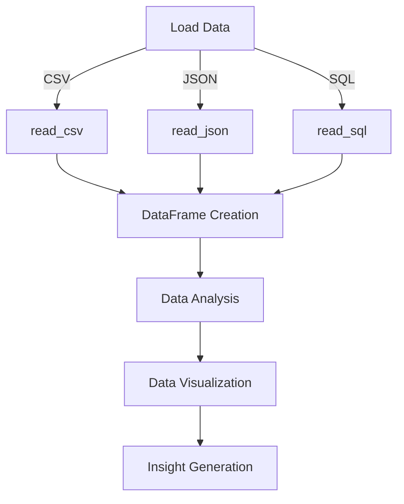

## Introduction
The **Pandas** library in **Python** provides data structures and functions for efficiently handling structured data, including tabular data such as spreadsheets and SQL tables. The `read_csv`, `read_json`, and `read_sql` functions are essential for loading data from various sources into Pandas DataFrames. In this study note, we will delve into the details of these functions, exploring their usage, internal mechanics, and real-world applications.

> **Note:** Pandas is a foundational library for data science and analysis in Python, and mastering its functions is crucial for any data professional.

## Core Concepts
- **DataFrames**: Two-dimensional labeled data structures with columns of potentially different types.
- **Series**: One-dimensional labeled array of values.
- **read_csv**: Function to read a CSV file into a DataFrame.
- **read_json**: Function to read a JSON file into a DataFrame.
- **read_sql**: Function to read a SQL database table into a DataFrame.

> **Tip:** When working with large datasets, it's essential to consider the data types and structures to optimize memory usage and performance.

## How It Works Internally
The `read_csv`, `read_json`, and `read_sql` functions work by parsing the input data and creating a DataFrame based on the parsed data. Here's a step-by-step breakdown of the internal mechanics:

1. **File Loading**: The function loads the input file into memory.
2. **Data Parsing**: The function parses the loaded data into a structured format.
3. **DataFrame Creation**: The function creates a DataFrame based on the parsed data.

> **Warning:** When working with large files, it's crucial to consider the available memory to avoid memory errors.

## Code Examples
### Example 1: Basic Usage of `read_csv`
```python
import pandas as pd

# Load the CSV file into a DataFrame
df = pd.read_csv('data.csv')

# Print the first few rows of the DataFrame
print(df.head())
```

### Example 2: Real-World Pattern with `read_json`
```python
import pandas as pd
import json

# Load the JSON file into a DataFrame
df = pd.read_json('data.json', orient='records')

# Print the first few rows of the DataFrame
print(df.head())
```

### Example 3: Advanced Usage of `read_sql`
```python
import pandas as pd
import sqlite3

# Connect to the SQLite database
conn = sqlite3.connect('database.db')

# Load the SQL table into a DataFrame
df = pd.read_sql_query('SELECT * FROM table_name', conn)

# Print the first few rows of the DataFrame
print(df.head())

# Close the database connection
conn.close()
```

## Visual Diagram

The diagram illustrates the process of loading data from various sources using the `read_csv`, `read_json`, and `read_sql` functions and creating a DataFrame for further analysis and visualization.

## Comparison
| Function | Time Complexity | Space Complexity | Pros | Cons |
| --- | --- | --- | --- | --- |
| `read_csv` | O(n) | O(n) | Fast and efficient | Limited to CSV files |
| `read_json` | O(n) | O(n) | Flexible and versatile | Slower than `read_csv` |
| `read_sql` | O(n) | O(n) | Powerful and flexible | Requires database connection |

> **Interview:** What is the time complexity of the `read_csv` function? (Answer: O(n))

## Real-world Use Cases
1. **Data Analysis**: Companies like **Google** and **Amazon** use Pandas to analyze large datasets and gain insights into customer behavior.
2. **Data Science**: Researchers use Pandas to load and analyze data from various sources, including CSV files, JSON files, and SQL databases.
3. **Machine Learning**: Machine learning models often rely on Pandas DataFrames as input data, and companies like **Facebook** and **Netflix** use Pandas to build and train their models.

## Common Pitfalls
1. **Memory Errors**: Loading large files into memory can cause memory errors.
2. **Data Types**: Incorrect data types can lead to errors and inconsistencies.
3. **SQL Queries**: Incorrect SQL queries can lead to errors and data loss.
4. **JSON Parsing**: Incorrect JSON parsing can lead to errors and data loss.

> **Warning:** Always consider the available memory and data types when working with large datasets.

## Interview Tips
1. **What is the difference between `read_csv` and `read_json`?** (Answer: `read_csv` is faster and more efficient, but limited to CSV files, while `read_json` is more flexible and versatile.)
2. **How do you handle memory errors when loading large files?** (Answer: Use chunking or streaming to load the file in smaller chunks.)
3. **What is the time complexity of the `read_sql` function?** (Answer: O(n))

## Key Takeaways
* **Pandas** is a foundational library for data science and analysis in Python.
* **DataFrames** are two-dimensional labeled data structures with columns of potentially different types.
* **read_csv**, **read_json**, and **read_sql** functions are essential for loading data from various sources into Pandas DataFrames.
* **Time complexity** of the `read_csv`, `read_json`, and `read_sql` functions is O(n).
* **Space complexity** of the `read_csv`, `read_json`, and `read_sql` functions is O(n).
* **Chunking** and **streaming** can be used to handle memory errors when loading large files.
* **Data types** and **SQL queries** must be carefully considered to avoid errors and inconsistencies.