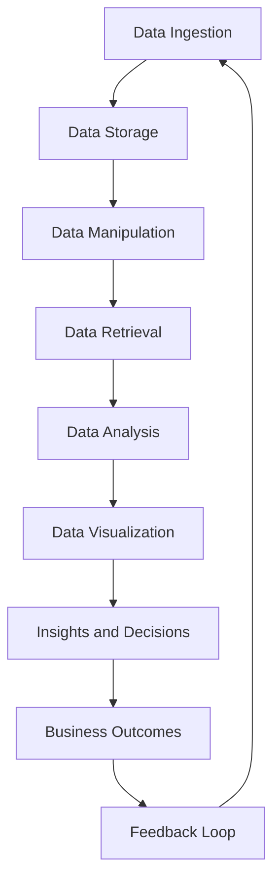

## Introduction
Polars is a **fast** and **efficient** DataFrame library written in **Rust** and providing a Python interface. It is designed to handle large datasets and provide high-performance data manipulation capabilities. Polars is particularly useful for data scientists and engineers working with big data, as it offers a more efficient and scalable alternative to traditional DataFrame libraries like Pandas.

> **Note:** Polars is built on top of the Rust programming language, which provides a safe and performance-oriented foundation for the library.

In real-world scenarios, Polars is used in various industries, including finance, healthcare, and e-commerce, where large datasets need to be processed and analyzed quickly. For example, companies like **Netflix** and **Airbnb** use Polars to handle their massive datasets and gain insights into user behavior.

## Core Concepts
The core concepts of Polars include:

* **DataFrames**: The primary data structure in Polars, which represents a two-dimensional table of data.
* **Series**: A one-dimensional array of data, which can be used to represent a single column of a DataFrame.
* **Index**: A data structure used to efficiently locate and retrieve data in a DataFrame.

> **Warning:** Polars uses a **columnar** storage format, which can lead to performance issues if not used correctly.

Mental models for understanding Polars include thinking of DataFrames as tables, where each row represents a single observation and each column represents a variable. Series can be thought of as a single column of a DataFrame, and Index can be thought of as a map that allows for efficient lookup of data.

## How It Works Internally
Polars works internally by using a combination of Rust and Python code. The Rust code provides the core functionality of the library, including data storage and manipulation, while the Python code provides a convenient interface for users to interact with the library.

Here is a step-by-step breakdown of how Polars works:

1. **Data Ingestion**: Data is loaded into Polars through a variety of methods, including reading from CSV files, JSON files, or other data sources.
2. **Data Storage**: The data is stored in a columnar format, which allows for efficient storage and retrieval of data.
3. **Data Manipulation**: Users can manipulate the data using various methods, such as filtering, sorting, and grouping.
4. **Data Retrieval**: The manipulated data can be retrieved and used for further analysis or processing.

> **Tip:** Polars provides a **lazy** evaluation mechanism, which allows for efficient processing of large datasets by only evaluating the necessary operations.

## Code Examples
### Example 1: Basic Usage
```python
import polars as pl

# Create a DataFrame
df = pl.DataFrame({
    "name": ["John", "Mary", "David"],
    "age": [25, 31, 42]
})

# Print the DataFrame
print(df)
```

### Example 2: Real-World Pattern
```python
import polars as pl

# Load a CSV file
df = pl.read_csv("data.csv")

# Filter the data
df = df.filter(pl.col("age") > 30)

# Group the data
df = df.groupby("name").agg(pl.col("age").mean())

# Print the result
print(df)
```

### Example 3: Advanced Usage
```python
import polars as pl

# Create a DataFrame with multiple columns
df = pl.DataFrame({
    "name": ["John", "Mary", "David"],
    "age": [25, 31, 42],
    "city": ["New York", "Los Angeles", "Chicago"]
})

# Perform a join operation
df = df.join(pl.DataFrame({
    "city": ["New York", "Los Angeles", "Chicago"],
    "population": [8405837, 3990456, 2720599]
}), on="city")

# Print the result
print(df)
```

## Visual Diagram


The diagram illustrates the data processing pipeline in Polars, from data ingestion to business outcomes.

## Comparison
| Library | Time Complexity | Space Complexity | Pros | Cons | Best For |
| --- | --- | --- | --- | --- | --- |
| Polars | O(1) | O(n) | High-performance, efficient storage | Steep learning curve | Large-scale data processing |
| Pandas | O(n) | O(n) | Easy to use, flexible data structures | Slow performance | Small-scale data analysis |
| NumPy | O(1) | O(n) | Fast numerical computations | Limited data structures | Numerical computations |
| Dask | O(1) | O(n) | Scalable parallel computing | Complex setup | Distributed computing |

## Real-world Use Cases
* **Netflix**: Uses Polars to process and analyze large datasets of user behavior and preferences.
* **Airbnb**: Uses Polars to handle and analyze massive datasets of user interactions and booking data.
* **Palantir**: Uses Polars to process and analyze large datasets of financial and economic data.

## Common Pitfalls
* **Incorrect data types**: Using incorrect data types can lead to performance issues and errors.
* **Inefficient data storage**: Using inefficient data storage mechanisms can lead to slow performance and high memory usage.
* **Insufficient error handling**: Not handling errors properly can lead to crashes and data corruption.
* **Inadequate testing**: Not testing code thoroughly can lead to bugs and errors.

> **Warning:** Using Polars without proper understanding of its internal workings can lead to performance issues and errors.

## Interview Tips
* **What is Polars and how does it work?**: The interviewer wants to assess your understanding of Polars and its internal mechanics.
* **How does Polars compare to other DataFrame libraries?**: The interviewer wants to evaluate your knowledge of the pros and cons of different DataFrame libraries.
* **How would you optimize the performance of a Polars DataFrame?**: The interviewer wants to assess your ability to optimize the performance of a Polars DataFrame.

> **Interview:** When answering these questions, be sure to provide specific examples and use cases to demonstrate your knowledge and understanding of Polars.

## Key Takeaways
* Polars is a high-performance DataFrame library written in Rust and providing a Python interface.
* Polars uses a columnar storage format, which allows for efficient storage and retrieval of data.
* Polars provides a lazy evaluation mechanism, which allows for efficient processing of large datasets.
* Polars is particularly useful for large-scale data processing and analysis.
* The time complexity of Polars operations is typically O(1), while the space complexity is typically O(n).
* Polars is best used for large-scale data processing and analysis, while Pandas is best used for small-scale data analysis.
* NumPy is best used for numerical computations, while Dask is best used for distributed computing.