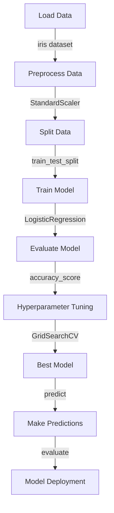

## Introduction
Scikit-learn is an open-source machine learning library for **Python** that provides a wide range of algorithms for classification, regression, clustering, and other tasks. It is widely used in industry and academia for data science and machine learning applications. Scikit-learn's simplicity and flexibility make it an ideal choice for rapid prototyping and production deployment. **Real-world relevance:** Scikit-learn is used by companies like **Google**, **Facebook**, and **Netflix** for tasks such as recommendation systems, natural language processing, and predictive modeling.

## Core Concepts
- **Preprocessing:** The process of transforming raw data into a suitable format for modeling. This includes **feature scaling**, **encoding categorical variables**, and **handling missing values**.
- **Models:** Mathematical representations of the relationships between variables in a dataset. Common models include **linear regression**, **decision trees**, and **support vector machines**.
- **Pipelines:** A sequence of data processing steps that can be composed together to create a workflow. Pipelines are useful for automating repetitive tasks and improving model performance.
- **GridSearchCV:** A tool for hyperparameter tuning that uses cross-validation to evaluate the performance of a model with different parameter settings.

## How It Works Internally
When you use scikit-learn to train a model, the following steps occur:
1. **Data loading:** The dataset is loaded into memory, and the features and target variable are separated.
2. **Preprocessing:** The data is transformed into a suitable format for modeling using techniques such as **StandardScaler** or **OneHotEncoder**.
3. **Model selection:** A model is chosen based on the problem type (e.g., classification or regression) and the characteristics of the dataset.
4. **Model training:** The model is trained on the preprocessed data using a suitable algorithm (e.g., **gradient descent** or **Newton's method**).
5. **Model evaluation:** The performance of the model is evaluated using metrics such as **accuracy**, **precision**, or **mean squared error**.
6. **Hyperparameter tuning:** The model's hyperparameters are adjusted using techniques such as **GridSearchCV** to improve its performance.

> **Note:** The choice of model and hyperparameters depends on the specific problem and dataset. **Tip:** Use **GridSearchCV** to automate hyperparameter tuning and improve model performance.

## Code Examples
### Example 1: Basic Preprocessing and Modeling
```python
from sklearn.datasets import load_iris
from sklearn.model_selection import train_test_split
from sklearn.preprocessing import StandardScaler
from sklearn.linear_model import LogisticRegression
from sklearn.metrics import accuracy_score

# Load the iris dataset
iris = load_iris()
X = iris.data
y = iris.target

# Split the data into training and testing sets
X_train, X_test, y_train, y_test = train_test_split(X, y, test_size=0.2, random_state=42)

# Preprocess the data using StandardScaler
scaler = StandardScaler()
X_train_scaled = scaler.fit_transform(X_train)
X_test_scaled = scaler.transform(X_test)

# Train a logistic regression model on the preprocessed data
model = LogisticRegression()
model.fit(X_train_scaled, y_train)

# Evaluate the model's performance on the testing set
y_pred = model.predict(X_test_scaled)
print("Accuracy:", accuracy_score(y_test, y_pred))
```

### Example 2: Using Pipelines for Automated Preprocessing and Modeling
```python
from sklearn.pipeline import Pipeline
from sklearn.svm import SVC
from sklearn.model_selection import GridSearchCV
from sklearn.datasets import load_iris
from sklearn.model_selection import train_test_split

# Load the iris dataset
iris = load_iris()
X = iris.data
y = iris.target

# Split the data into training and testing sets
X_train, X_test, y_train, y_test = train_test_split(X, y, test_size=0.2, random_state=42)

# Define a pipeline with preprocessing and modeling steps
pipeline = Pipeline([
    ("scaler", StandardScaler()),
    ("svm", SVC())
])

# Define a grid of hyperparameters to search
param_grid = {
    "svm__C": [1, 10, 100],
    "svm__kernel": ["linear", "rbf", "poly"]
}

# Perform grid search with cross-validation
grid_search = GridSearchCV(pipeline, param_grid, cv=5)
grid_search.fit(X_train, y_train)

# Evaluate the best model's performance on the testing set
y_pred = grid_search.predict(X_test)
print("Best parameters:", grid_search.best_params_)
print("Best score:", grid_search.best_score_)
```

### Example 3: Advanced Hyperparameter Tuning with GridSearchCV
```python
from sklearn.ensemble import RandomForestClassifier
from sklearn.model_selection import GridSearchCV
from sklearn.datasets import load_iris
from sklearn.model_selection import train_test_split

# Load the iris dataset
iris = load_iris()
X = iris.data
y = iris.target

# Split the data into training and testing sets
X_train, X_test, y_train, y_test = train_test_split(X, y, test_size=0.2, random_state=42)

# Define a random forest classifier
model = RandomForestClassifier()

# Define a grid of hyperparameters to search
param_grid = {
    "n_estimators": [10, 50, 100],
    "max_depth": [None, 5, 10],
    "min_samples_split": [2, 5, 10],
    "min_samples_leaf": [1, 5, 10]
}

# Perform grid search with cross-validation
grid_search = GridSearchCV(model, param_grid, cv=5)
grid_search.fit(X_train, y_train)

# Evaluate the best model's performance on the testing set
y_pred = grid_search.predict(X_test)
print("Best parameters:", grid_search.best_params_)
print("Best score:", grid_search.best_score_)
```

## Visual Diagram

This diagram illustrates the workflow of loading data, preprocessing, splitting, training, evaluating, and deploying a model using scikit-learn.

## Comparison
| Approach | Time Complexity | Space Complexity | Pros | Cons | Best For |
| --- | --- | --- | --- | --- | --- |
| Linear Regression | O(n) | O(n) | Simple, interpretable | Assumes linearity | Simple regression tasks |
| Decision Trees | O(n log n) | O(n) | Handles non-linear relationships | Can overfit | Complex classification tasks |
| Support Vector Machines | O(n^2) | O(n) | Robust to noise, handles high-dimensional data | Computationally expensive | High-dimensional classification tasks |
| Random Forests | O(n log n) | O(n) | Handles non-linear relationships, robust to overfitting | Computationally expensive | Complex classification tasks |

## Real-world Use Cases
1. **Google's Recommendation System:** Google uses scikit-learn to build a recommendation system that suggests videos to users based on their viewing history.
2. **Facebook's Friend Suggestion Algorithm:** Facebook uses scikit-learn to build a friend suggestion algorithm that recommends friends to users based on their social network.
3. **Netflix's Personalized Recommendation System:** Netflix uses scikit-learn to build a personalized recommendation system that suggests movies and TV shows to users based on their viewing history.

## Common Pitfalls
1. **Overfitting:** Models can overfit the training data, resulting in poor performance on unseen data. **Tip:** Use regularization techniques such as L1 or L2 regularization to prevent overfitting.
2. **Underfitting:** Models can underfit the training data, resulting in poor performance on both training and testing data. **Tip:** Use more complex models or increase the number of features to improve model performance.
3. **Data Leakage:** Models can be affected by data leakage, where information from the testing set is used to train the model. **Tip:** Use techniques such as cross-validation to prevent data leakage.
4. **Hyperparameter Tuning:** Hyperparameters can have a significant impact on model performance, but tuning them can be time-consuming and computationally expensive. **Tip:** Use automated hyperparameter tuning techniques such as GridSearchCV to improve model performance.

## Interview Tips
1. **What is the difference between supervised and unsupervised learning?** A weak answer might focus on the type of data used, while a strong answer would discuss the differences in model objectives and evaluation metrics.
2. **How do you handle missing values in a dataset?** A weak answer might suggest simply removing the missing values, while a strong answer would discuss the different strategies for handling missing values, such as imputation or interpolation.
3. **What is the purpose of cross-validation?** A weak answer might suggest that cross-validation is used to evaluate model performance, while a strong answer would discuss the importance of cross-validation in preventing overfitting and evaluating model generalizability.

## Key Takeaways
* Scikit-learn provides a wide range of algorithms for classification, regression, clustering, and other tasks.
* Preprocessing is an essential step in machine learning that can significantly impact model performance.
* Pipelines can be used to automate repetitive tasks and improve model performance.
* GridSearchCV is a powerful tool for hyperparameter tuning that can be used to improve model performance.
* Cross-validation is an essential technique for evaluating model performance and preventing overfitting.
* scikit-learn provides a wide range of tools and techniques for handling missing values, outliers, and other data issues.
* Model selection and hyperparameter tuning are critical steps in machine learning that can significantly impact model performance.
* scikit-learn provides a wide range of algorithms and tools for handling high-dimensional data and complex relationships.
* Model interpretability and explainability are essential considerations in machine learning that can be achieved using techniques such as feature importance and partial dependence plots.