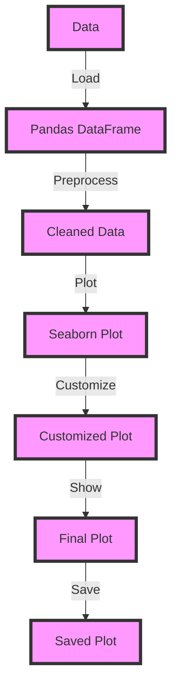

## Introduction
**Seaborn** is a Python data visualization library built on top of **Matplotlib**. It provides a high-level interface for drawing attractive and informative statistical graphics. Seaborn is particularly useful for visualizing datasets and creating informative and attractive statistical graphics. With Seaborn, you can create a variety of plots, including **bar plots**, **box plots**, **violin plots**, and **scatter plots**, among others. Seaborn is widely used in data science and scientific computing for its ability to create informative and attractive statistical graphics.

> **Note:** Seaborn is not a replacement for Matplotlib, but rather a complement to it. Seaborn provides a higher-level interface for creating statistical graphics, while Matplotlib provides a lower-level interface for creating a wide range of plots.

Seaborn is particularly useful for data scientists and analysts who need to quickly and easily create informative and attractive statistical graphics. It is also useful for researchers who need to create publication-quality figures. Seaborn is widely used in industry and academia for its ability to create informative and attractive statistical graphics.

## Core Concepts
Seaborn provides a number of core concepts that are essential for creating statistical graphics. These include:

* **Data**: Seaborn works with a variety of data types, including **Pandas DataFrames** and **NumPy arrays**.
* **Plots**: Seaborn provides a number of different plot types, including **bar plots**, **box plots**, **violin plots**, and **scatter plots**.
* **Aesthetics**: Seaborn provides a number of different aesthetics, including **color**, **size**, and **shape**, that can be used to customize the appearance of plots.
* **Faceting**: Seaborn provides a number of different faceting options, including **row** and **column** faceting, that can be used to create complex and informative plots.

> **Tip:** Seaborn is particularly useful for creating informative and attractive statistical graphics. It provides a high-level interface for drawing attractive and informative statistical graphics, making it easy to create a wide range of plots.

## How It Works Internally
Seaborn works internally by using a combination of **Matplotlib** and **Pandas**. When you create a plot with Seaborn, it uses Matplotlib to render the plot and Pandas to manipulate the data. Seaborn provides a number of different functions for creating plots, including **barplot**, **boxplot**, and **scatterplot**. These functions take in a variety of parameters, including **data**, **x**, and **y**, and use them to create the plot.

> **Warning:** Seaborn can be slow for large datasets. This is because Seaborn uses Matplotlib to render the plot, which can be slow for large datasets.

## Code Examples
### Example 1: Basic Bar Plot
```python
import seaborn as sns
import matplotlib.pyplot as plt

# Create a sample dataset
data = {'Category': ['A', 'B', 'C', 'A', 'B', 'C'],
        'Value': [10, 15, 7, 12, 18, 9]}

# Convert the dataset to a Pandas DataFrame
df = pd.DataFrame(data)

# Create a bar plot
sns.barplot(x='Category', y='Value', data=df)

# Show the plot
plt.show()
```
This code creates a basic bar plot using Seaborn. It first creates a sample dataset and converts it to a Pandas DataFrame. It then uses the **barplot** function to create the plot.

### Example 2: Advanced Scatter Plot
```python
import seaborn as sns
import matplotlib.pyplot as plt
import pandas as pd
import numpy as np

# Create a sample dataset
np.random.seed(0)
data = {'X': np.random.randn(100),
        'Y': np.random.randn(100),
        'Category': np.random.choice(['A', 'B', 'C'], 100)}

# Convert the dataset to a Pandas DataFrame
df = pd.DataFrame(data)

# Create a scatter plot
sns.scatterplot(x='X', y='Y', hue='Category', data=df)

# Show the plot
plt.show()
```
This code creates an advanced scatter plot using Seaborn. It first creates a sample dataset and converts it to a Pandas DataFrame. It then uses the **scatterplot** function to create the plot, customizing the appearance of the plot by using the **hue** parameter to color the points by category.

### Example 3: Faceted Plot
```python
import seaborn as sns
import matplotlib.pyplot as plt
import pandas as pd
import numpy as np

# Create a sample dataset
np.random.seed(0)
data = {'X': np.random.randn(100),
        'Y': np.random.randn(100),
        'Category': np.random.choice(['A', 'B', 'C'], 100),
        'Subcategory': np.random.choice(['D', 'E', 'F'], 100)}

# Convert the dataset to a Pandas DataFrame
df = pd.DataFrame(data)

# Create a faceted plot
sns.FacetGrid(df, col='Subcategory', hue='Category') \
  .map(plt.scatter, 'X', 'Y') \
  .add_legend()

# Show the plot
plt.show()
```
This code creates a faceted plot using Seaborn. It first creates a sample dataset and converts it to a Pandas DataFrame. It then uses the **FacetGrid** function to create the plot, customizing the appearance of the plot by using the **col** and **hue** parameters to facet the plot by subcategory and color the points by category.

## Visual Diagram

This diagram shows the general workflow for creating a plot with Seaborn. It starts with loading the data, preprocessing it, and then creating the plot. The plot can then be customized and shown.

> **Tip:** Seaborn provides a number of different options for customizing the appearance of plots. These options can be used to create informative and attractive statistical graphics.

## Comparison
| Library | Time Complexity | Space Complexity | Pros | Cons | Best For |
| --- | --- | --- | --- | --- | --- |
| Seaborn | O(n) | O(n) | High-level interface, informative and attractive plots | Slow for large datasets | Statistical graphics, data science |
| Matplotlib | O(n) | O(n) | Low-level interface, customizable | Steep learning curve | Publication-quality figures, scientific computing |
| Plotly | O(n) | O(n) | Interactive plots, customizable | Slow for large datasets | Interactive visualizations, data science |
| Bokeh | O(n) | O(n) | Interactive plots, customizable | Slow for large datasets | Interactive visualizations, data science |

> **Note:** The time and space complexity of the libraries can vary depending on the specific use case.

## Real-world Use Cases
* **Data science**: Seaborn is widely used in data science for its ability to create informative and attractive statistical graphics. Companies like **Google**, **Facebook**, and **Amazon** use Seaborn to visualize their data and create informative and attractive statistical graphics.
* **Scientific computing**: Seaborn is also widely used in scientific computing for its ability to create publication-quality figures. Researchers use Seaborn to create informative and attractive statistical graphics for their research papers.
* **Business intelligence**: Seaborn is also used in business intelligence for its ability to create interactive and informative visualizations. Companies like **Tableau** and **Power BI** use Seaborn to create interactive and informative visualizations for their customers.

## Common Pitfalls
* **Slow performance**: Seaborn can be slow for large datasets. This is because Seaborn uses Matplotlib to render the plot, which can be slow for large datasets.
* **Steep learning curve**: Seaborn has a steep learning curve, especially for users who are not familiar with Matplotlib.
* **Customization**: Seaborn provides a number of different options for customizing the appearance of plots, but it can be difficult to customize the plot exactly as desired.
* **Compatibility**: Seaborn is not compatible with all versions of Matplotlib and Pandas.

> **Warning:** Seaborn can be slow for large datasets. This is because Seaborn uses Matplotlib to render the plot, which can be slow for large datasets.

## Interview Tips
* **What is Seaborn?**: Seaborn is a Python data visualization library built on top of Matplotlib. It provides a high-level interface for drawing attractive and informative statistical graphics.
* **How do you use Seaborn?**: To use Seaborn, you first need to import the library and load the data. You can then use the **barplot**, **boxplot**, or **scatterplot** functions to create the plot.
* **What are some common use cases for Seaborn?**: Seaborn is widely used in data science, scientific computing, and business intelligence for its ability to create informative and attractive statistical graphics.

> **Interview:** What is the difference between Seaborn and Matplotlib? Seaborn is a high-level interface for creating statistical graphics, while Matplotlib is a low-level interface for creating a wide range of plots.

## Key Takeaways
* **Seaborn is a high-level interface**: Seaborn provides a high-level interface for creating statistical graphics, making it easy to create informative and attractive plots.
* **Seaborn is built on top of Matplotlib**: Seaborn uses Matplotlib to render the plot, which can be slow for large datasets.
* **Seaborn provides a number of different plot types**: Seaborn provides a number of different plot types, including **bar plots**, **box plots**, and **scatter plots**.
* **Seaborn provides a number of different customization options**: Seaborn provides a number of different customization options, including **color**, **size**, and **shape**, that can be used to customize the appearance of plots.
* **Seaborn is widely used in industry and academia**: Seaborn is widely used in industry and academia for its ability to create informative and attractive statistical graphics.
* **Seaborn has a steep learning curve**: Seaborn has a steep learning curve, especially for users who are not familiar with Matplotlib.
* **Seaborn can be slow for large datasets**: Seaborn can be slow for large datasets, which can be a problem for users who need to create plots with large amounts of data.
* **Seaborn provides a number of different faceting options**: Seaborn provides a number of different faceting options, including **row** and **column** faceting, that can be used to create complex and informative plots.
* **Seaborn is compatible with Pandas**: Seaborn is compatible with Pandas, which makes it easy to use with datasets that are stored in Pandas DataFrames.