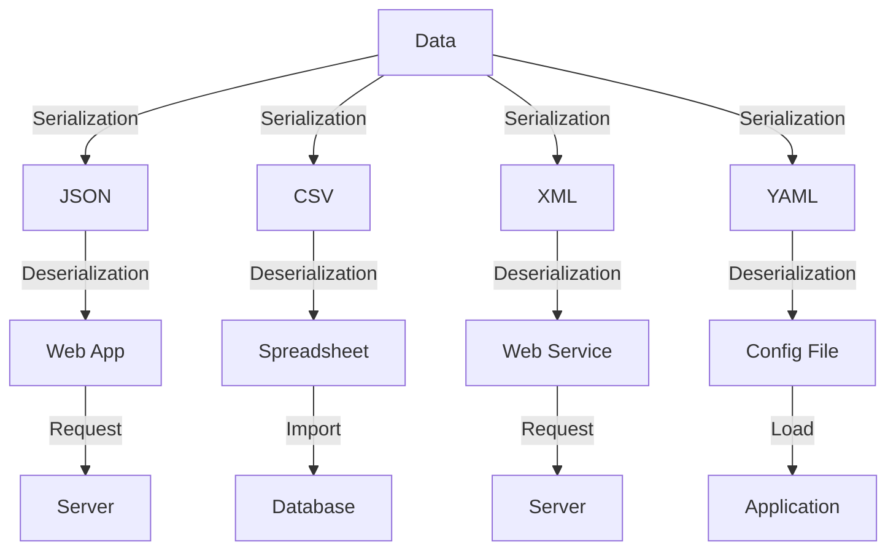

## Introduction
**Data serialization** is the process of converting data into a format that can be written to a file or transmitted over a network. This is crucial in software development, as it enables data exchange between different systems, languages, and platforms. In this section, we will explore four popular data serialization formats: **JSON (JavaScript Object Notation)**, **CSV (Comma Separated Values)**, **XML (Extensible Markup Language)**, and **YAML (YAML Ain't Markup Language)**. These formats are widely used in various industries, including web development, data science, and enterprise software.

> **Note:** Understanding data serialization is essential for any software engineer, as it is a fundamental concept in software development.

## Core Concepts
To work with data serialization, you need to understand the following core concepts:
* **Serialization**: The process of converting data into a format that can be written to a file or transmitted over a network.
* **Deserialization**: The process of converting serialized data back into its original form.
* **Data format**: The structure and syntax of the serialized data.

Key terminology includes:
* **JSON**: A lightweight, human-readable format for exchanging data between web servers, web applications, and mobile apps.
* **CSV**: A plain text format for exchanging tabular data, such as spreadsheets or databases.
* **XML**: A markup language for exchanging structured data between systems, often used in web services and enterprise software.
* **YAML**: A human-readable format for exchanging data between systems, often used in configuration files and data exchange.

> **Tip:** When choosing a data format, consider factors such as readability, performance, and compatibility with your target systems.

## How It Works Internally
Let's dive into the under-the-hood mechanics of each data format:
* **JSON**: JSON data is represented as a collection of key-value pairs, arrays, and objects. It is parsed and generated using a JSON parser, which can be implemented in various programming languages.
* **CSV**: CSV data is represented as a plain text file, with each row separated by a newline character and each column separated by a comma. CSV parsers can be implemented using regular expressions or dedicated CSV libraries.
* **XML**: XML data is represented as a tree-like structure, with elements, attributes, and text content. XML parsers can be implemented using recursive descent parsing or event-driven parsing.
* **YAML**: YAML data is represented as a collection of key-value pairs, lists, and dictionaries. YAML parsers can be implemented using recursive descent parsing or event-driven parsing.

> **Warning:** When working with data serialization, be aware of potential security risks, such as JSON injection attacks or XML external entity (XXE) attacks.

## Code Examples
Here are three complete and runnable code examples in Python, demonstrating basic to advanced usage of each data format:
### Example 1: Basic JSON Serialization
```python
import json

data = {'name': 'John', 'age': 30}
json_data = json.dumps(data)
print(json_data)  # Output: {"name": "John", "age": 30}
```
### Example 2: CSV Data Exchange
```python
import csv

data = [['Name', 'Age'], ['John', 30], ['Alice', 25]]
with open('data.csv', 'w', newline='') as csvfile:
    writer = csv.writer(csvfile)
    writer.writerows(data)
```
### Example 3: Advanced YAML Configuration
```python
import yaml

config = {
    'database': {
        'host': 'localhost',
        'port': 5432,
        'username': 'admin',
        'password': 'password'
    }
}
with open('config.yaml', 'w') as yamlfile:
    yaml.dump(config, yamlfile, default_flow_style=False)
```
## Visual Diagram

This diagram illustrates the data serialization process, showing how data is converted into different formats and exchanged between systems.

> **Tip:** When working with data serialization, consider using visualization tools to help understand the data flow and dependencies between systems.

## Comparison
Here is a comparison table for the four data formats:
| Format | Time Complexity | Space Complexity | Pros | Cons | Best For |
| --- | --- | --- | --- | --- | --- |
| JSON | O(n) | O(n) | Lightweight, human-readable, easy to parse | Limited support for complex data structures | Web development, data exchange |
| CSV | O(n) | O(n) | Simple, human-readable, easy to parse | Limited support for complex data structures, prone to errors | Data import/export, spreadsheets |
| XML | O(n^2) | O(n) | Supports complex data structures, widely adopted | Verbose, difficult to parse | Web services, enterprise software |
| YAML | O(n) | O(n) | Human-readable, easy to parse, supports complex data structures | Slow parsing, limited support for very large files | Configuration files, data exchange |

> **Note:** The time and space complexities listed are approximate and depend on the specific implementation and use case.

## Real-world Use Cases
Here are three real-world examples of data serialization in action:
* **Twitter**: Twitter uses JSON to serialize and deserialize data between its web servers and mobile apps.
* **Amazon**: Amazon uses XML to serialize and deserialize data between its web services and enterprise software.
* **GitHub**: GitHub uses YAML to serialize and deserialize configuration data for its web applications.

> **Interview:** When asked about data serialization, be prepared to discuss the trade-offs between different formats, such as performance, readability, and compatibility.

## Common Pitfalls
Here are four common mistakes to watch out for when working with data serialization:
* **Inconsistent data formatting**: Failing to follow a consistent data formatting scheme can lead to errors and difficulties in parsing and generating data.
* **Insufficient error handling**: Failing to handle errors and exceptions properly can lead to data corruption and system crashes.
* **Inadequate security measures**: Failing to implement adequate security measures, such as encryption and authentication, can lead to data breaches and security vulnerabilities.
* **Inefficient data structures**: Using inefficient data structures, such as nested arrays or dictionaries, can lead to performance issues and slow parsing times.

> **Warning:** When working with data serialization, be aware of potential security risks and take measures to protect your data and systems.

## Interview Tips
Here are three common interview questions related to data serialization, along with weak and strong answers:
* **Question 1:** What is the difference between JSON and XML?
	+ Weak answer: "JSON is smaller and faster than XML."
	+ Strong answer: "JSON is a lightweight, human-readable format that is well-suited for web development and data exchange, while XML is a more verbose format that supports complex data structures and is widely adopted in enterprise software."
* **Question 2:** How do you handle errors and exceptions when working with data serialization?
	+ Weak answer: "I just use try-catch blocks and log the errors."
	+ Strong answer: "I use a combination of try-catch blocks, error handling mechanisms, and logging to ensure that errors and exceptions are properly handled and reported, and that data is not corrupted or lost."
* **Question 3:** What are some common use cases for YAML in data serialization?
	+ Weak answer: "YAML is used for configuration files and data exchange."
	+ Strong answer: "YAML is a human-readable format that is well-suited for configuration files, data exchange, and debugging, due to its ease of use and flexibility in representing complex data structures."

## Key Takeaways
Here are ten key takeaways to remember when working with data serialization:
* **Choose the right format**: Select a data format that is well-suited to your use case and requirements.
* **Use consistent formatting**: Follow a consistent data formatting scheme to avoid errors and difficulties in parsing and generating data.
* **Implement error handling**: Use try-catch blocks, error handling mechanisms, and logging to ensure that errors and exceptions are properly handled and reported.
* **Optimize performance**: Use efficient data structures and algorithms to optimize parsing and generation times.
* **Consider security**: Implement adequate security measures, such as encryption and authentication, to protect your data and systems.
* **Use visualization tools**: Use visualization tools to help understand the data flow and dependencies between systems.
* **Test thoroughly**: Test your data serialization code thoroughly to ensure that it works correctly and efficiently.
* **Document your code**: Document your code and data formats clearly and concisely to ensure that others can understand and use your code.
* **Follow best practices**: Follow best practices and guidelines for data serialization, such as using consistent naming conventions and avoiding unnecessary complexity.
* **Stay up-to-date**: Stay up-to-date with the latest developments and trends in data serialization, such as new formats and tools.