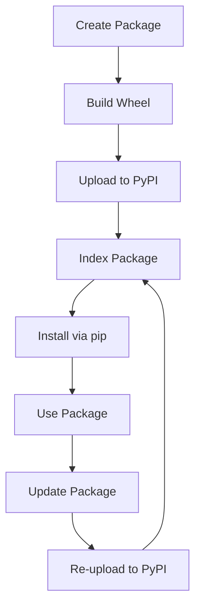

## Introduction
**Packaging and publishing to PyPI** is the process of preparing and distributing Python packages to the Python Package Index (PyPI), making them available for installation via pip. This is a crucial step in making Python projects accessible to a wider audience. Every Python developer needs to know how to package and publish their projects to PyPI, as it enables easy installation, updates, and dependencies management for their users. Real-world relevance can be seen in popular libraries like **NumPy**, **Pandas**, and **Requests**, which are all published on PyPI.

> **Note:** PyPI is the official repository of Python packages, and it's essential to follow best practices when publishing packages to ensure they are easily discoverable and installable.

## Core Concepts
- **Package:** A collection of Python modules, scripts, and other resources that can be distributed and installed as a single unit.
- **Distribution:** A packaged version of a project, which can be installed using pip.
- **Wheel:** A pre-built package that contains compiled code, making installation faster and more reliable.
- **Source Distribution:** A package that contains the source code, which is compiled during installation.

> **Warning:** When creating packages, it's essential to ensure that they are compatible with different Python versions and platforms to avoid installation issues.

## How It Works Internally
When publishing a package to PyPI, the following steps occur:
1. **Package creation:** The package is created using tools like **setuptools** or **poetry**, which generate the necessary metadata and package structure.
2. **Wheel creation:** The package is built into a wheel, which contains the compiled code and metadata.
3. **Upload:** The wheel is uploaded to PyPI using tools like **twine**.
4. **Indexing:** PyPI indexes the package, making it discoverable and installable via pip.

> **Tip:** Using tools like **poetry** can simplify the packaging and publishing process, as they handle many of the underlying details.

## Code Examples
### Example 1: Basic Packaging with Setuptools
```python
# setup.py
from setuptools import setup

setup(
    name='my_package',
    version='1.0',
    packages=['my_package'],
    install_requires=['requests']
)
```
This example demonstrates a basic `setup.py` file using **setuptools** to define a package named **my_package** with a dependency on **requests**.

### Example 2: Publishing a Package with Twine
```python
# publish.py
import os
from twine.upload import upload

# Build the package
os.system('python setup.py sdist bdist_wheel')

# Upload the package to PyPI
upload('dist/*')
```
This example shows how to use **twine** to upload a package to PyPI after building it with **setuptools**.

### Example 3: Advanced Packaging with Poetry
```python
# pyproject.toml
[tool.poetry]
name = "my_package"
version = "1.0"
description = "My package"

[tool.poetry.dependencies]
requests = "^2.25"

[tool.poetry.dev-dependencies]
pytest = "^6.2"
```
This example demonstrates how to use **poetry** to define a package with dependencies and dev-dependencies, making it easier to manage the package's dependencies and build process.

## Visual Diagram

This diagram illustrates the packaging and publishing process, from creating the package to updating it and re-uploading it to PyPI.

## Comparison
| Approach | Time Complexity | Space Complexity | Pros | Cons | Best For |
| --- | --- | --- | --- | --- | --- |
| Setuptools | O(n) | O(n) | Easy to use, widely adopted | Steep learning curve for advanced features | Small to medium-sized projects |
| Poetry | O(n) | O(n) | Simplifies packaging and dependencies management | Still evolving, may have compatibility issues | Medium to large-sized projects |
| Twine | O(1) | O(1) | Fast and reliable uploads | Requires separate setup and configuration | Large-scale deployments |

## Real-world Use Cases
- **NumPy:** Published on PyPI, NumPy is a widely-used library for numerical computing in Python.
- **Pandas:** Also published on PyPI, Pandas is a popular library for data manipulation and analysis.
- **Requests:** Published on PyPI, Requests is a lightweight library for making HTTP requests in Python.

## Common Pitfalls
- **Incompatible dependencies:** Failing to specify compatible dependencies can lead to installation issues.
- **Incorrect package structure:** Not following the standard package structure can cause issues with installation and discovery.
- **Insufficient testing:** Not thoroughly testing the package can lead to bugs and compatibility issues.
- **Poor documentation:** Failing to provide clear documentation can make it difficult for users to understand how to use the package.

> **Warning:** When publishing packages, it's essential to ensure that they are thoroughly tested and well-documented to avoid issues and provide a good user experience.

## Interview Tips
- **What is the difference between a package and a distribution?**
  - Weak answer: "A package is just a collection of files."
  - Strong answer: "A package is a collection of Python modules, scripts, and other resources, while a distribution is a packaged version of a project that can be installed using pip."
- **How do you handle dependencies in your packages?**
  - Weak answer: "I just include all the dependencies in the package."
  - Strong answer: "I use tools like **poetry** to manage dependencies and ensure that they are compatible with different Python versions and platforms."
- **What is the purpose of PyPI?**
  - Weak answer: "It's just a repository of Python packages."
  - Strong answer: "PyPI is the official repository of Python packages, making it easy to discover, install, and manage packages, and ensuring that they are compatible with different Python versions and platforms."

## Key Takeaways
- **Packages should be built with compatibility in mind:** Ensure that packages are compatible with different Python versions and platforms.
- **Use tools like **poetry** to simplify packaging and dependencies management:** **Poetry** can help simplify the packaging and publishing process.
- **Thoroughly test packages before publishing:** Ensure that packages are thoroughly tested before publishing to avoid issues and provide a good user experience.
- **Provide clear documentation:** Clear documentation is essential for users to understand how to use the package.
- **Use **twine** for fast and reliable uploads:** **Twine** can help simplify the upload process and ensure that packages are uploaded quickly and reliably.
- **Keep packages up-to-date:** Regularly update packages to ensure that they remain compatible with different Python versions and platforms.