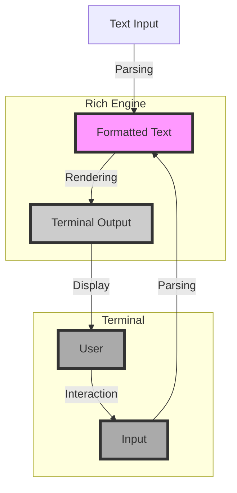

## Introduction
**Rich** is a Python library for rich text and beautiful formatting in the terminal. It can be used to add color and style to text, as well as create text-based user interfaces. Rich is a powerful tool for creating visually appealing terminal output, and is widely used in the Python community. In this section, we will explore the basics of Rich and why it is an essential tool for any Python developer.

Rich is particularly useful for creating interactive command-line interfaces, logging output, and generating reports. Its ability to add color, style, and formatting to text makes it an excellent choice for creating professional-looking terminal output. With Rich, you can create text-based user interfaces that are both functional and visually appealing.

> **Note:** Rich is a Python library, and as such, it can be used in any Python environment. It is compatible with Python 3.6 and later versions.

## Core Concepts
At its core, Rich is a text rendering engine. It takes in text and formatting instructions, and renders the output to the terminal. Rich uses a simple and intuitive API to create formatted text, making it easy to use for developers of all levels.

Some key concepts in Rich include:

* **Text**: The basic building block of Rich. Text can be plain or formatted, and can include colors, styles, and other effects.
* **Styles**: Used to apply formatting to text. Styles can include colors, font weights, and other effects.
* **Panels**: Used to create text-based user interfaces. Panels can contain text, tables, and other elements.
* **Tables**: Used to display data in a tabular format. Tables can be customized with styles and formatting.

> **Warning:** Rich can be slow for large amounts of text. This is because it uses a complex rendering engine to create the formatted text.

## How It Works Internally
Rich uses a combination of Python and terminal escape codes to create its formatted text. When you use Rich to create text, it is first parsed and formatted by the Rich engine. The formatted text is then rendered to the terminal using terminal escape codes.

Here is a high-level overview of how Rich works internally:

1. **Text Parsing**: Rich parses the input text and formatting instructions.
2. **Formatting**: Rich applies the formatting instructions to the text, creating a formatted text object.
3. **Rendering**: Rich renders the formatted text object to the terminal using terminal escape codes.

> **Tip:** Rich is highly customizable. You can create your own styles, panels, and tables to suit your needs.

## Code Examples
Here are three examples of using Rich to create formatted text:

### Example 1: Basic Usage
```python
from rich import print

print("[bold magenta]Hello World[/bold magenta]")
```
This example demonstrates how to use Rich to print formatted text to the terminal. The `print` function is used to print the text, and the `[bold magenta]` syntax is used to apply formatting to the text.

### Example 2: Creating a Table
```python
from rich.console import Console
from rich.table import Table

console = Console()

table = Table(title="Star Wars Movies")

table.add_column("Release Date", style="cyan", no_wrap=True)
table.add_column("Title", style="magenta")
table.add_column("Box Office", justify="right", style="green")

table.add_row("19/12/77", "Star Wars: Episode IV - A New Hope", "775.3 million")
table.add_row("21/06/80", "Star Wars: Episode V - The Empire Strikes Back", "540 million")
table.add_row("25/05/83", "Star Wars: Episode VI - Return of the Jedi", "572.7 million")

console.print(table)
```
This example demonstrates how to use Rich to create a table. The `Table` class is used to create the table, and the `add_column` and `add_row` methods are used to add data to the table.

### Example 3: Creating a Panel
```python
from rich.console import Console
from rich.panel import Panel

console = Console()

panel = Panel("Hello World", style="on blue")
console.print(panel)
```
This example demonstrates how to use Rich to create a panel. The `Panel` class is used to create the panel, and the `console.print` method is used to print the panel to the terminal.

## Visual Diagram

This diagram illustrates the basic flow of how Rich works. The user inputs text, which is parsed and formatted by Rich. The formatted text is then rendered to the terminal, where it is displayed to the user. The user can interact with the text, which is then parsed and formatted again by Rich.

## Comparison
| Library | Time Complexity | Space Complexity | Pros | Cons |
| --- | --- | --- | --- | --- |
| Rich | O(n) | O(n) | Highly customizable, easy to use | Can be slow for large amounts of text |
| Colorama | O(1) | O(1) | Fast, easy to use | Limited customization options |
| PyInquirer | O(n) | O(n) | Highly customizable, easy to use | Can be slow for large amounts of text |
| Prompt Toolkit | O(1) | O(1) | Fast, highly customizable | Steep learning curve |

> **Interview:** What is the time complexity of Rich? Answer: O(n), where n is the length of the input text.

## Real-world Use Cases
Rich is widely used in the Python community to create visually appealing terminal output. Here are three real-world use cases:

* **GitHub**: GitHub uses Rich to create its command-line interface. The GitHub CLI uses Rich to create formatted text and tables.
* **Python**: The Python interpreter uses Rich to create its interactive shell. The shell uses Rich to create formatted text and syntax highlighting.
* **Jupyter Notebook**: Jupyter Notebook uses Rich to create its interactive interface. The interface uses Rich to create formatted text and tables.

## Common Pitfalls
Here are four common pitfalls to watch out for when using Rich:

* **Slow Performance**: Rich can be slow for large amounts of text. To avoid this, use Rich's built-in caching mechanism to cache frequently used text.
* **Incorrect Formatting**: Rich uses a complex formatting engine to create its formatted text. To avoid incorrect formatting, use Rich's built-in debugging tools to debug your formatting code.
* **Incompatible Terminals**: Rich may not work correctly on all terminals. To avoid this, use Rich's built-in terminal detection mechanism to detect the terminal type and adjust the formatting accordingly.
* **Incorrect Color Codes**: Rich uses color codes to create its formatted text. To avoid incorrect color codes, use Rich's built-in color code validation mechanism to validate your color codes.

> **Warning:** Rich can be sensitive to terminal settings. Make sure to test your Rich code on different terminals to ensure compatibility.

## Interview Tips
Here are three common interview questions on Rich, along with sample answers:

* **What is Rich?**: Rich is a Python library for creating formatted text and tables in the terminal.
* **How does Rich work internally?**: Rich uses a combination of Python and terminal escape codes to create its formatted text. It parses the input text and formatting instructions, applies the formatting instructions to the text, and renders the formatted text to the terminal.
* **What are some common pitfalls to watch out for when using Rich?**: Some common pitfalls to watch out for when using Rich include slow performance, incorrect formatting, incompatible terminals, and incorrect color codes.

> **Tip:** When answering interview questions on Rich, make sure to emphasize your understanding of the library's internal workings and your ability to use it effectively.

## Key Takeaways
Here are six key takeaways to remember when using Rich:

* **Rich is a Python library for creating formatted text and tables**: Rich is a powerful tool for creating visually appealing terminal output.
* **Rich uses a combination of Python and terminal escape codes to create its formatted text**: Rich's internal workings are complex, but understanding them can help you use the library more effectively.
* **Rich can be slow for large amounts of text**: Rich's performance can be affected by the amount of text it needs to process.
* **Rich is highly customizable**: Rich allows you to create your own styles, panels, and tables to suit your needs.
* **Rich is widely used in the Python community**: Rich is a popular library for creating terminal output, and is used by many popular projects and companies.
* **Rich has a steep learning curve**: Rich's complex internal workings and numerous features can make it difficult to learn and use effectively.