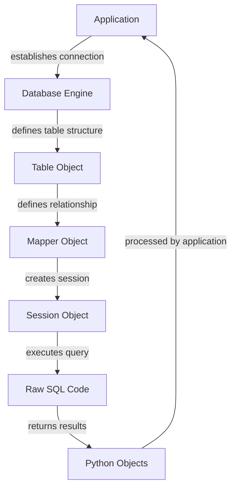

## Introduction
SQLAlchemy is a popular **SQL toolkit and Object-Relational Mapping (ORM) system** for Python. It provides a high-level interface for interacting with databases, allowing developers to define database structures and perform queries using Python code. SQLAlchemy Core and ORM are two distinct components of the library, with Alembic being a separate tool for managing database migrations. In this section, we will explore why SQLAlchemy matters, its real-world relevance, and why every engineer needs to know about it.

> **Note:** SQLAlchemy is often used in conjunction with other Python frameworks and libraries, such as Flask and Django, to build robust and scalable web applications.

SQLAlchemy Core provides a **database abstraction layer**, allowing developers to interact with various database engines, including MySQL, PostgreSQL, and SQLite, using a unified API. The ORM component, on the other hand, enables developers to define database structures and perform queries using Python objects, rather than writing raw SQL code. Alembic, the migration tool, helps manage changes to the database schema over time, ensuring that the database remains consistent with the application's code.

## Core Concepts
To understand SQLAlchemy, it's essential to grasp the following core concepts:

* **Dialects**: SQLAlchemy provides dialects for various database engines, allowing developers to interact with different databases using a unified API.
* **Table objects**: Table objects represent database tables, providing a way to define table structures and perform queries.
* **Mapper objects**: Mapper objects define the relationship between Python classes and database tables, enabling the use of ORM functionality.
* **Session objects**: Session objects manage the interaction between the application and the database, providing a way to perform queries and commit changes.

> **Tip:** When working with SQLAlchemy, it's essential to understand the differences between the various components, including Core, ORM, and Alembic, to ensure that you're using the right tool for the job.

## How It Works Internally
SQLAlchemy's internal mechanics involve the following steps:

1. **Connection establishment**: The application establishes a connection to the database using a dialect.
2. **Table definition**: The application defines table structures using Table objects.
3. **Mapper definition**: The application defines the relationship between Python classes and database tables using Mapper objects.
4. **Session creation**: The application creates a Session object to manage interaction with the database.
5. **Query execution**: The application performs queries using the Session object, which translates the query into raw SQL code.
6. **Result processing**: The application processes the results of the query, which are returned as Python objects.

> **Warning:** When using SQLAlchemy, it's essential to manage the session object correctly to avoid issues with transaction management and connection pooling.

## Code Examples
Here are three complete and runnable code examples demonstrating the use of SQLAlchemy Core and ORM:

### Example 1: Basic Usage
```python
from sqlalchemy import create_engine, Column, Integer, String
from sqlalchemy.ext.declarative import declarative_base
from sqlalchemy.orm import sessionmaker

# Create a database engine
engine = create_engine('sqlite:///example.db')

# Define a base class for declarative models
Base = declarative_base()

# Define a User class
class User(Base):
    __tablename__ = 'users'
    id = Column(Integer, primary_key=True)
    name = Column(String)
    email = Column(String)

# Create the tables
Base.metadata.create_all(engine)

# Create a session
Session = sessionmaker(bind=engine)
session = Session()

# Add a user
user = User(name='John Doe', email='john@example.com')
session.add(user)
session.commit()

# Query the users
users = session.query(User).all()
for user in users:
    print(user.name, user.email)
```

### Example 2: Real-World Pattern
```python
from sqlalchemy import create_engine, Column, Integer, String, ForeignKey
from sqlalchemy.ext.declarative import declarative_base
from sqlalchemy.orm import sessionmaker, relationship

# Create a database engine
engine = create_engine('sqlite:///example.db')

# Define a base class for declarative models
Base = declarative_base()

# Define a User class
class User(Base):
    __tablename__ = 'users'
    id = Column(Integer, primary_key=True)
    name = Column(String)
    email = Column(String)
    posts = relationship('Post', backref='author')

# Define a Post class
class Post(Base):
    __tablename__ = 'posts'
    id = Column(Integer, primary_key=True)
    title = Column(String)
    content = Column(String)
    user_id = Column(Integer, ForeignKey('users.id'))

# Create the tables
Base.metadata.create_all(engine)

# Create a session
Session = sessionmaker(bind=engine)
session = Session()

# Add a user and a post
user = User(name='John Doe', email='john@example.com')
post = Post(title='Hello World', content='This is a test post', author=user)
session.add(user)
session.add(post)
session.commit()

# Query the posts
posts = session.query(Post).all()
for post in posts:
    print(post.title, post.author.name)
```

### Example 3: Advanced Usage
```python
from sqlalchemy import create_engine, Column, Integer, String, ForeignKey
from sqlalchemy.ext.declarative import declarative_base
from sqlalchemy.orm import sessionmaker, relationship
from sqlalchemy.sql import func

# Create a database engine
engine = create_engine('sqlite:///example.db')

# Define a base class for declarative models
Base = declarative_base()

# Define a User class
class User(Base):
    __tablename__ = 'users'
    id = Column(Integer, primary_key=True)
    name = Column(String)
    email = Column(String)
    posts = relationship('Post', backref='author')

# Define a Post class
class Post(Base):
    __tablename__ = 'posts'
    id = Column(Integer, primary_key=True)
    title = Column(String)
    content = Column(String)
    user_id = Column(Integer, ForeignKey('users.id'))
    created_at = Column(DateTime, default=datetime.datetime.utcnow)

# Create the tables
Base.metadata.create_all(engine)

# Create a session
Session = sessionmaker(bind=engine)
session = Session()

# Add a user and a post
user = User(name='John Doe', email='john@example.com')
post = Post(title='Hello World', content='This is a test post', author=user)
session.add(user)
session.add(post)
session.commit()

# Query the posts with pagination
posts = session.query(Post).order_by(Post.created_at.desc()).offset(10).limit(10).all()
for post in posts:
    print(post.title, post.author.name)
```

## Visual Diagram

The diagram illustrates the internal mechanics of SQLAlchemy, showing how the application interacts with the database engine, defines table structures, and executes queries using the session object.

## Comparison
| Approach | Time Complexity | Space Complexity | Pros | Cons | Best For |
|----------|----------------|-----------------|------|------|----------|
| Raw SQL | O(1) | O(1) | Fast, flexible | Error-prone, difficult to maintain | Small applications, prototyping |
| SQLAlchemy Core | O(n) | O(n) | Robust, flexible | Steeper learning curve | Medium-sized applications, data-intensive tasks |
| SQLAlchemy ORM | O(n^2) | O(n^2) | High-level abstraction, easy to use | Performance overhead, limited flexibility | Large applications, complex business logic |
| Alembic | O(n) | O(n) | Easy to use, robust | Limited flexibility, requires additional setup | Database migrations, schema management |

> **Interview:** When asked about the trade-offs between using raw SQL, SQLAlchemy Core, and SQLAlchemy ORM, be prepared to discuss the pros and cons of each approach, including performance, maintainability, and flexibility.

## Real-world Use Cases
Here are three real-world examples of companies using SQLAlchemy:

1. **Reddit**: Reddit uses SQLAlchemy to manage its database schema and perform queries.
2. **Pinterest**: Pinterest uses SQLAlchemy to power its data pipeline and analytics platform.
3. **Airbnb**: Airbnb uses SQLAlchemy to manage its database schema and perform queries, as well as to power its data pipeline and analytics platform.

> **Tip:** When working on a large-scale application, consider using SQLAlchemy to manage your database schema and perform queries, as it provides a robust and flexible way to interact with your data.

## Common Pitfalls
Here are four common mistakes to avoid when using SQLAlchemy:

1. **Incorrect session management**: Failing to manage the session object correctly can lead to issues with transaction management and connection pooling.
2. **Inefficient query execution**: Failing to optimize queries can lead to performance issues and slow application response times.
3. **Incorrect table definition**: Failing to define table structures correctly can lead to data inconsistencies and errors.
4. **Inadequate error handling**: Failing to handle errors correctly can lead to application crashes and data corruption.

> **Warning:** When using SQLAlchemy, be sure to follow best practices for session management, query execution, and error handling to avoid common pitfalls.

## Interview Tips
Here are three common interview questions related to SQLAlchemy, along with weak and strong answers:

1. **What is the difference between SQLAlchemy Core and SQLAlchemy ORM?**
	* Weak answer: "SQLAlchemy Core is for defining table structures, and SQLAlchemy ORM is for defining relationships between tables."
	* Strong answer: "SQLAlchemy Core provides a database abstraction layer, allowing developers to define table structures and perform queries using a unified API. SQLAlchemy ORM, on the other hand, provides a high-level abstraction for defining relationships between tables and performing queries using Python objects."
2. **How do you manage database migrations using Alembic?**
	* Weak answer: "I use Alembic to create and apply migrations to my database schema."
	* Strong answer: "I use Alembic to manage database migrations by creating and applying migrations to my database schema, as well as to track changes to my schema over time. I also use Alembic to perform rollbacks and roll forwards, as needed."
3. **What are some best practices for using SQLAlchemy in a large-scale application?**
	* Weak answer: "I use SQLAlchemy to define table structures and perform queries."
	* Strong answer: "I use SQLAlchemy to define table structures and perform queries, as well as to manage database migrations using Alembic. I also follow best practices for session management, query execution, and error handling to ensure that my application is scalable and maintainable."

## Key Takeaways
Here are ten key takeaways to remember when working with SQLAlchemy:

* **SQLAlchemy Core provides a database abstraction layer** for defining table structures and performing queries.
* **SQLAlchemy ORM provides a high-level abstraction** for defining relationships between tables and performing queries using Python objects.
* **Alembic is used for managing database migrations** and tracking changes to the schema over time.
* **Session management is critical** for ensuring that transactions are managed correctly and connections are pooled efficiently.
* **Query execution can be optimized** using techniques such as caching and indexing.
* **Table definition is critical** for ensuring that data is consistent and accurate.
* **Error handling is essential** for preventing application crashes and data corruption.
* **SQLAlchemy is scalable** and can be used in large-scale applications.
* **Best practices should be followed** for session management, query execution, and error handling.
* **Alembic should be used** for managing database migrations and tracking changes to the schema over time.