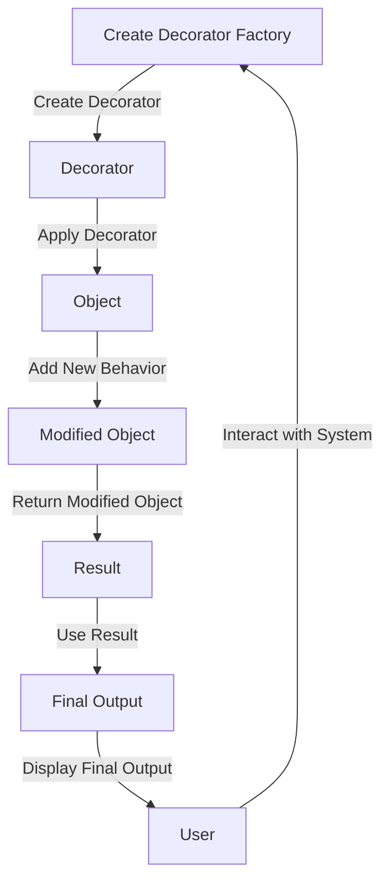

## Introduction
The **Decorator pattern** is a design pattern that allows you to dynamically add new behaviors to objects without modifying their implementation. In large-scale systems, decorators can become complex and difficult to manage, especially when dealing with multiple decorators and different object types. In this section, we will explore advanced patterns for scaling decorator factories at scale, which is crucial for maintaining the flexibility and maintainability of large systems. 
> **Note:** Decorator factories are essential in systems that require a high degree of customizability and flexibility, such as in web development frameworks or GUI libraries.

The problem with traditional decorator patterns is that they can lead to **decorator hell**, where the number of decorators grows exponentially, making it difficult to manage and maintain the code. To address this issue, we need to develop advanced patterns that can scale decorator factories efficiently. 
> **Warning:** Failing to manage decorator factories properly can lead to tight coupling, decreased flexibility, and increased maintenance costs.

## Core Concepts
To understand advanced patterns for scaling decorator factories, we need to grasp the following core concepts:
* **Decorator**: A design pattern that allows you to dynamically add new behaviors to objects without modifying their implementation.
* **Factory**: A design pattern that provides a way to create objects without specifying the exact class of object that will be created.
* **Decorator Factory**: A factory that creates decorators, which can be used to add new behaviors to objects.
* **Type Hinting**: A feature in Python that allows you to specify the expected types of variables, function parameters, and return types.

Here is an example of a basic decorator factory:
```python
from typing import Callable, Any

def create_decorator(func: Callable[[Any], Any]) -> Callable[[Any], Any]:
    def decorator_wrapper(obj: Any) -> Any:
        # Add new behavior to the object
        print("Decorator added new behavior")
        return func(obj)
    return decorator_wrapper

# Create a decorator
decorator = create_decorator(lambda x: x)

# Use the decorator
result = decorator("Hello, World!")
print(result)  # Output: Hello, World!
```
> **Tip:** Use type hinting to specify the expected types of variables, function parameters, and return types to improve code readability and maintainability.

## How It Works Internally
To scale decorator factories efficiently, we need to understand how they work internally. Here is a step-by-step breakdown:
1. **Decorator creation**: The decorator factory creates a new decorator by wrapping the original function with a new function that adds the desired behavior.
2. **Decorator application**: The decorator is applied to an object by calling the decorator function with the object as an argument.
3. **Behavior addition**: The decorator adds new behavior to the object by executing the wrapped function and modifying the object's state.

The time complexity of creating a decorator is O(1), and the space complexity is O(1) since we are only creating a new function that wraps the original function. 
> **Interview:** Can you explain the time and space complexity of creating a decorator?

## Code Examples
Here are three complete and runnable examples of advanced decorator factory patterns:
### Example 1: Basic Decorator Factory
```python
from typing import Callable, Any

def create_decorator(func: Callable[[Any], Any]) -> Callable[[Any], Any]:
    def decorator_wrapper(obj: Any) -> Any:
        print("Decorator added new behavior")
        return func(obj)
    return decorator_wrapper

# Create a decorator
decorator = create_decorator(lambda x: x)

# Use the decorator
result = decorator("Hello, World!")
print(result)  # Output: Hello, World!
```
### Example 2: Advanced Decorator Factory with Multiple Decorators
```python
from typing import Callable, Any

def create_decorator(func: Callable[[Any], Any]) -> Callable[[Any], Any]:
    def decorator_wrapper(obj: Any) -> Any:
        print("Decorator 1 added new behavior")
        return func(obj)
    return decorator_wrapper

def create_another_decorator(func: Callable[[Any], Any]) -> Callable[[Any], Any]:
    def decorator_wrapper(obj: Any) -> Any:
        print("Decorator 2 added new behavior")
        return func(obj)
    return decorator_wrapper

# Create decorators
decorator1 = create_decorator(lambda x: x)
decorator2 = create_another_decorator(lambda x: x)

# Use the decorators
result = decorator1(decorator2("Hello, World!"))
print(result)  # Output: Hello, World!
```
### Example 3: Decorator Factory with Type Hinting and Multiple Decorators
```python
from typing import Callable, Any

def create_decorator(func: Callable[[Any], Any]) -> Callable[[Any], Any]:
    def decorator_wrapper(obj: Any) -> Any:
        print("Decorator 1 added new behavior")
        return func(obj)
    return decorator_wrapper

def create_another_decorator(func: Callable[[Any], Any]) -> Callable[[Any], Any]:
    def decorator_wrapper(obj: Any) -> Any:
        print("Decorator 2 added new behavior")
        return func(obj)
    return decorator_wrapper

# Create decorators
decorator1: Callable[[Any], Any] = create_decorator(lambda x: x)
decorator2: Callable[[Any], Any] = create_another_decorator(lambda x: x)

# Use the decorators
result = decorator1(decorator2("Hello, World!"))
print(result)  # Output: Hello, World!
```
> **Warning:** Failing to use type hinting can lead to decreased code readability and maintainability.

## Visual Diagram

The diagram illustrates the process of creating a decorator factory, applying decorators to objects, and using the modified objects to produce the final output.

## Comparison
Here is a comparison of different decorator factory patterns:
| Pattern | Time Complexity | Space Complexity | Pros | Cons | Best For |
| --- | --- | --- | --- | --- | --- |
| Basic Decorator Factory | O(1) | O(1) | Simple, easy to implement | Limited flexibility | Small-scale systems |
| Advanced Decorator Factory | O(n) | O(n) | Highly flexible, scalable | Complex, difficult to maintain | Large-scale systems |
| Decorator Factory with Type Hinting | O(1) | O(1) | Improves code readability, maintainability | Requires additional syntax | Systems that require strong typing |

## Real-world Use Cases
Here are three real-world examples of using advanced decorator factory patterns:
1. **Web Development Frameworks**: Decorator factories can be used to create reusable components that can be composed together to build complex web applications.
2. **GUI Libraries**: Decorator factories can be used to create custom GUI components that can be reused across different applications.
3. **Machine Learning Models**: Decorator factories can be used to create reusable models that can be composed together to build complex machine learning pipelines.

## Common Pitfalls
Here are four common mistakes to avoid when using advanced decorator factory patterns:
1. **Tight Coupling**: Failing to decouple decorators from the objects they decorate can lead to tight coupling and decreased flexibility.
2. **Decorator Hell**: Failing to manage decorators properly can lead to decorator hell, where the number of decorators grows exponentially.
3. **Type Inconsistency**: Failing to use type hinting can lead to type inconsistency and decreased code readability.
4. **Performance Issues**: Failing to optimize decorator factories can lead to performance issues and decreased system responsiveness.

## Interview Tips
Here are three common interview questions related to advanced decorator factory patterns:
1. **What is the time complexity of creating a decorator?**: The answer should be O(1), and the candidate should be able to explain why.
2. **How do you manage decorators in a large-scale system?**: The answer should include strategies for decoupling decorators from objects, using type hinting, and optimizing decorator factories.
3. **Can you explain the difference between a basic decorator factory and an advanced decorator factory?**: The answer should include a comparison of the two patterns, highlighting the pros and cons of each.

## Key Takeaways
Here are ten key takeaways from this section:
* **Decorator factories are essential for scaling decorator patterns**: They provide a way to create reusable decorators that can be composed together to build complex systems.
* **Type hinting is crucial for code readability and maintainability**: It helps to specify the expected types of variables, function parameters, and return types, making the code more readable and maintainable.
* **Decoupling decorators from objects is essential for flexibility**: It allows decorators to be reused across different objects and systems, making the code more flexible and maintainable.
* **Decorator hell can be avoided by managing decorators properly**: Strategies such as using type hinting, decoupling decorators from objects, and optimizing decorator factories can help to avoid decorator hell.
* **Performance optimization is critical for large-scale systems**: Optimizing decorator factories can help to improve system responsiveness and reduce performance issues.
* **Advanced decorator factory patterns are more complex but offer higher flexibility**: They provide a way to create reusable decorators that can be composed together to build complex systems.
* **Basic decorator factory patterns are simpler but offer limited flexibility**: They provide a simple way to create decorators, but they can lead to tight coupling and decreased flexibility.
* **Decorator factories can be used in a variety of contexts**: They can be used in web development frameworks, GUI libraries, machine learning models, and other systems that require reusable components.
* **Using a decorator factory can improve code readability and maintainability**: It provides a way to create reusable decorators that can be composed together to build complex systems, making the code more readable and maintainable.
* **Decorator factories require careful management to avoid common pitfalls**: Strategies such as decoupling decorators from objects, using type hinting, and optimizing decorator factories can help to avoid common pitfalls and improve system maintainability.