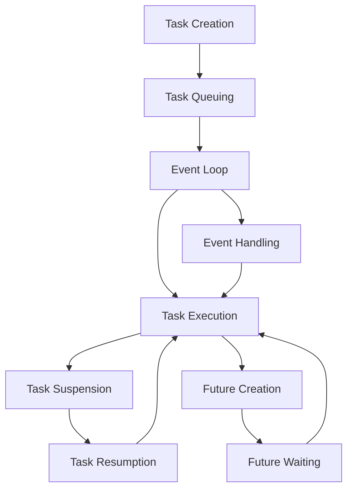

## Introduction
The **Asyncio Event Loop** is a critical component in Python's asynchronous programming framework, allowing developers to write single-threaded concurrent code using coroutines, multiplexing I/O access over sockets and other resources, and implementing network clients and servers. It's essential to understand the **Asyncio Event Loop** because it enables efficient handling of concurrent tasks, which is crucial in real-world applications where responsiveness and performance are vital. For example, in web development, the **Asyncio Event Loop** can handle multiple requests concurrently, improving the overall responsiveness of the application. Every engineer needs to know how to work with the **Asyncio Event Loop** to write efficient and scalable asynchronous code.

## Core Concepts
The **Asyncio Event Loop** is built around several core concepts:
- **Event Loop**: The event loop is the core of the **Asyncio Event Loop**, responsible for managing the execution of tasks and handling events. It's essentially a loop that runs indefinitely, waiting for events to occur and then executing the corresponding tasks.
- **Tasks**: Tasks are the basic units of execution in the **Asyncio Event Loop**, representing a single operation that needs to be executed. Tasks can be created using the `asyncio.create_task()` function.
- **Coroutines**: Coroutines are special types of functions that can suspend and resume their execution, allowing other tasks to run in the meantime. Coroutines are defined using the `async def` syntax.
- **Futures**: Futures represent the result of a task, allowing tasks to wait for the completion of other tasks. Futures are created using the `asyncio.Future()` function.

## How It Works Internally
The **Asyncio Event Loop** works by maintaining a queue of tasks to be executed. When a task is created, it's added to the queue. The event loop then runs indefinitely, executing tasks from the queue and handling events. Here's a step-by-step breakdown of how the **Asyncio Event Loop** works:
1. **Task Creation**: A task is created using the `asyncio.create_task()` function.
2. **Task Queuing**: The task is added to the event loop's queue.
3. **Event Loop**: The event loop runs indefinitely, waiting for events to occur.
4. **Task Execution**: When an event occurs, the event loop executes the corresponding task from the queue.
5. **Task Suspension**: If a task needs to wait for the completion of another task, it's suspended, allowing other tasks to run.
6. **Task Resumption**: When the suspended task's dependency is completed, the task is resumed, and its execution continues.

## Code Examples
### Example 1: Basic Usage
```python
import asyncio

async def hello_world():
    print("Hello")
    await asyncio.sleep(1)
    print("World")

async def main():
    task = asyncio.create_task(hello_world())
    await task

asyncio.run(main())
```
This example demonstrates the basic usage of the **Asyncio Event Loop**, creating a task that prints "Hello" and "World" with a 1-second delay.

### Example 2: Real-World Pattern
```python
import asyncio

async def fetch_data(url):
    # Simulate a network request
    await asyncio.sleep(2)
    return f"Data from {url}"

async def main():
    urls = ["url1", "url2", "url3"]
    tasks = [fetch_data(url) for url in urls]
    results = await asyncio.gather(*tasks)
    for result in results:
        print(result)

asyncio.run(main())
```
This example demonstrates a real-world pattern, fetching data from multiple URLs concurrently using the **Asyncio Event Loop**.

### Example 3: Advanced Usage
```python
import asyncio

async def worker(queue):
    while True:
        task = await queue.get()
        try:
            await task
        except Exception as e:
            print(f"Error: {e}")
        finally:
            queue.task_done()

async def main():
    queue = asyncio.Queue()
    tasks = [queue.put(lambda: asyncio.sleep(1)) for _ in range(10)]
    workers = [worker(queue) for _ in range(5)]
    await asyncio.gather(*tasks)
    await queue.join()

asyncio.run(main())
```
This example demonstrates an advanced usage of the **Asyncio Event Loop**, using a queue to manage tasks and multiple workers to execute them concurrently.

## Visual Diagram

This diagram illustrates the core concepts of the **Asyncio Event Loop**, including task creation, task queuing, event loop, task execution, task suspension, and future creation.

## Comparison
| Approach | Time Complexity | Space Complexity | Pros | Cons | Best For |
| --- | --- | --- | --- | --- | --- |
| **Asyncio Event Loop** | O(1) | O(n) | Efficient, scalable | Complex | Real-time systems, web development |
| **Thread Pool** | O(n) | O(n) | Easy to implement | Limited concurrency | CPU-bound tasks |
| **Process Pool** | O(n) | O(n) | Easy to implement | Limited concurrency | CPU-bound tasks |
| **Green Threads** | O(1) | O(n) | Efficient, scalable | Complex | Real-time systems, web development |

## Real-world Use Cases
1. **Web Development**: The **Asyncio Event Loop** is widely used in web development to handle concurrent requests, improving the overall responsiveness of the application. Companies like Google and Facebook use the **Asyncio Event Loop** in their web frameworks.
2. **Real-time Systems**: The **Asyncio Event Loop** is used in real-time systems to handle concurrent tasks, ensuring predictable and efficient execution. Companies like NASA and Lockheed Martin use the **Asyncio Event Loop** in their real-time systems.
3. **Network Programming**: The **Asyncio Event Loop** is used in network programming to handle concurrent connections, improving the overall performance of the application. Companies like Cisco and Juniper Networks use the **Asyncio Event Loop** in their network programming frameworks.

## Common Pitfalls
1. **Not Using await**: Not using `await` when calling a coroutine can lead to unexpected behavior, as the coroutine will not be executed correctly.
```python
# Wrong
async def hello_world():
    print("Hello")
    asyncio.sleep(1)  # Missing await
    print("World")

# Right
async def hello_world():
    print("Hello")
    await asyncio.sleep(1)
    print("World")
```
> **Warning:** Not using `await` can lead to unexpected behavior and errors.

2. **Not Handling Exceptions**: Not handling exceptions in a coroutine can lead to crashes and unexpected behavior.
```python
# Wrong
async def hello_world():
    try:
        await asyncio.sleep(1)
    except Exception as e:
        pass  # Missing error handling

# Right
async def hello_world():
    try:
        await asyncio.sleep(1)
    except Exception as e:
        print(f"Error: {e}")
```
> **Tip:** Always handle exceptions in a coroutine to ensure robustness and reliability.

3. **Not Using async/await**: Not using `async/await` when calling a coroutine can lead to unexpected behavior, as the coroutine will not be executed correctly.
```python
# Wrong
def hello_world():
    asyncio.sleep(1)  # Missing async/await

# Right
async def hello_world():
    await asyncio.sleep(1)
```
> **Note:** Always use `async/await` when calling a coroutine to ensure correct execution.

4. **Not Using asyncio.run()**: Not using `asyncio.run()` to run the event loop can lead to unexpected behavior, as the event loop will not be executed correctly.
```python
# Wrong
async def hello_world():
    await asyncio.sleep(1)

# Right
async def hello_world():
    await asyncio.sleep(1)

asyncio.run(hello_world())
```
> **Interview:** What is the purpose of `asyncio.run()` in the **Asyncio Event Loop**?

## Interview Tips
1. **What is the purpose of the Asyncio Event Loop?**: The **Asyncio Event Loop** is used to handle concurrent tasks, improving the overall responsiveness and performance of the application.
2. **How does the Asyncio Event Loop work internally?**: The **Asyncio Event Loop** works by maintaining a queue of tasks to be executed, executing tasks from the queue, and handling events.
3. **What is the difference between async/await and asyncio.sleep()?**: `async/await` is used to define a coroutine, while `asyncio.sleep()` is used to simulate a delay in a coroutine.

## Key Takeaways
* The **Asyncio Event Loop** is used to handle concurrent tasks, improving the overall responsiveness and performance of the application.
* The **Asyncio Event Loop** works by maintaining a queue of tasks to be executed, executing tasks from the queue, and handling events.
* `async/await` is used to define a coroutine, while `asyncio.sleep()` is used to simulate a delay in a coroutine.
* Always use `await` when calling a coroutine to ensure correct execution.
* Always handle exceptions in a coroutine to ensure robustness and reliability.
* The **Asyncio Event Loop** has a time complexity of O(1) and a space complexity of O(n).
* The **Asyncio Event Loop** is widely used in web development, real-time systems, and network programming.
* The **Asyncio Event Loop** is more efficient and scalable than thread pools and process pools.