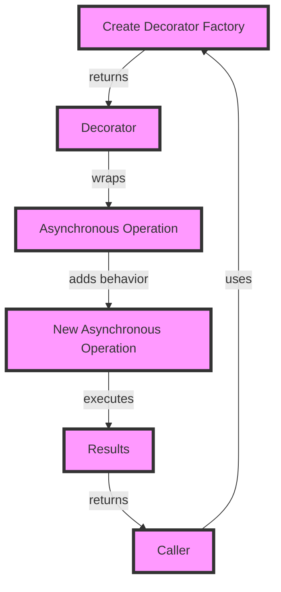

## Introduction
Asynchronous systems are becoming increasingly popular in modern software development, as they allow for more efficient and scalable applications. However, designing such systems can be complex, especially when it comes to managing asynchronous operations. This is where **Decorator Factories** come in – a design pattern that enables the creation of asynchronous systems with ease. In this article, we will explore the world of Decorator Factories and how they can be used to design asynchronous systems in Python.

> **Note:** Asynchronous systems are not just about performance; they also provide a better user experience by allowing for concurrent execution of tasks.

Real-world relevance can be seen in companies like Netflix, which uses asynchronous systems to handle massive amounts of user requests. Decorator Factories play a crucial role in designing such systems, allowing developers to create and manage asynchronous operations efficiently.

## Core Concepts
To understand Decorator Factories, we need to grasp some core concepts:

*   **Decorators:** A design pattern that allows behavior to be added to an object without affecting the behavior of other objects from the same class.
*   **Factories:** A design pattern that provides a way to create objects without specifying the exact class of object that will be created.
*   **Asynchronous Operations:** Operations that can be executed concurrently, without blocking the execution of other operations.

> **Tip:** When working with asynchronous systems, it's essential to consider the trade-offs between concurrency and synchronization.

Key terminology includes:

*   **Async/Await:** A syntax for writing asynchronous code that is easier to read and maintain.
*   **Coroutines:** Special types of functions that can be paused and resumed at specific points, allowing for efficient asynchronous execution.

## How It Works Internally
Decorator Factories work by creating a decorator that wraps an asynchronous operation, allowing for additional behavior to be added before or after the operation is executed. This is achieved through the use of a factory function that returns a decorator.

Here's a step-by-step breakdown of how it works:

1.  The factory function creates a decorator that wraps the asynchronous operation.
2.  The decorator adds additional behavior to the operation, such as logging or error handling.
3.  The decorator returns a new asynchronous operation that includes the added behavior.
4.  The new operation is executed, and the results are returned to the caller.

> **Warning:** When working with asynchronous systems, it's crucial to handle errors properly to avoid unexpected behavior.

## Code Examples
### Example 1: Basic Decorator Factory
```python
import asyncio

def decorator_factory(func):
    async def wrapper(*args, **kwargs):
        print("Before executing the function")
        result = await func(*args, **kwargs)
        print("After executing the function")
        return result
    return wrapper

@decorator_factory
async def my_function():
    await asyncio.sleep(1)
    return "Hello, World!"

async def main():
    print(await my_function())

asyncio.run(main())
```
This example demonstrates a basic decorator factory that adds logging behavior to an asynchronous operation.

### Example 2: Real-World Pattern
```python
import asyncio
import logging

logging.basicConfig(level=logging.INFO)

class LoggerDecorator:
    def __init__(self, func):
        self.func = func

    async def __call__(self, *args, **kwargs):
        logging.info(f"Before executing {self.func.__name__}")
        try:
            result = await self.func(*args, **kwargs)
            logging.info(f"After executing {self.func.__name__}")
            return result
        except Exception as e:
            logging.error(f"Error executing {self.func.__name__}: {e}")
            raise

def logger_decorator_factory(func):
    return LoggerDecorator(func)

@logger_decorator_factory
async def my_function():
    await asyncio.sleep(1)
    return "Hello, World!"

async def main():
    print(await my_function())

asyncio.run(main())
```
This example demonstrates a more realistic use case, where a logger decorator is created using a factory function.

### Example 3: Advanced Usage
```python
import asyncio
import logging
from functools import wraps

logging.basicConfig(level=logging.INFO)

def retry_decorator(max_retries=3):
    def decorator(func):
        @wraps(func)
        async def wrapper(*args, **kwargs):
            retries = 0
            while retries < max_retries:
                try:
                    return await func(*args, **kwargs)
                except Exception as e:
                    logging.error(f"Error executing {func.__name__}: {e}")
                    retries += 1
                    await asyncio.sleep(1)
            raise Exception(f"Failed to execute {func.__name__} after {max_retries} retries")
        return wrapper
    return decorator

@retry_decorator(max_retries=5)
async def my_function():
    import random
    if random.random() < 0.5:
        raise Exception("Simulated error")
    await asyncio.sleep(1)
    return "Hello, World!"

async def main():
    print(await my_function())

asyncio.run(main())
```
This example demonstrates an advanced use case, where a retry decorator is created using a factory function.

## Visual Diagram

This diagram illustrates the workflow of creating a decorator factory, wrapping an asynchronous operation, and executing the new operation.

## Comparison
| Approach | Time Complexity | Space Complexity | Pros | Cons | Best For |
| --- | --- | --- | --- | --- | --- |
| Decorator Factory | O(1) | O(1) | Easy to implement, flexible | Can be overused, may lead to tight coupling | Small to medium-sized projects |
| Async/Await | O(1) | O(1) | Easy to read and maintain, efficient | Limited control over asynchronous execution | Real-time applications, high-performance systems |
| Coroutines | O(1) | O(1) | Efficient, flexible | Steep learning curve, may lead to complexity | High-performance systems, concurrent programming |
| Callbacks | O(1) | O(1) | Simple to implement, efficient | Can lead to callback hell, may be difficult to maintain | Small projects, simple asynchronous operations |

> **Interview:** When asked about designing asynchronous systems, be sure to mention the importance of considering concurrency, synchronization, and error handling.

## Real-world Use Cases
*   **Netflix:** Uses asynchronous systems to handle massive amounts of user requests, providing a seamless viewing experience.
*   **Google:** Employs asynchronous systems in its search engine, allowing for fast and efficient processing of search queries.
*   **Amazon:** Utilizes asynchronous systems in its e-commerce platform, enabling concurrent execution of tasks and improving overall performance.

## Common Pitfalls
*   **Tight Coupling:** Decorators can lead to tight coupling between components, making it difficult to maintain and modify the system.
*   **Overuse:** Decorators can be overused, leading to complexity and making it difficult to understand the system's behavior.
*   **Error Handling:** Asynchronous systems require proper error handling to avoid unexpected behavior and ensure system reliability.
*   **Concurrency:** Asynchronous systems require careful consideration of concurrency to avoid issues like deadlocks and starvation.

> **Tip:** When working with asynchronous systems, it's essential to consider the trade-offs between concurrency and synchronization.

## Interview Tips
*   **What is the difference between asynchronous and synchronous systems?**
    *   Weak answer: Asynchronous systems are faster, while synchronous systems are slower.
    *   Strong answer: Asynchronous systems allow for concurrent execution of tasks, while synchronous systems execute tasks sequentially.
*   **How do you handle errors in asynchronous systems?**
    *   Weak answer: I use try-catch blocks to handle errors.
    *   Strong answer: I use a combination of try-catch blocks, error callbacks, and proper logging to handle errors and ensure system reliability.
*   **What is the purpose of Decorator Factories in designing asynchronous systems?**
    *   Weak answer: Decorator Factories are used to add logging behavior to asynchronous operations.
    *   Strong answer: Decorator Factories provide a way to create and manage asynchronous operations, allowing for additional behavior to be added before or after the operation is executed.

## Key Takeaways
*   **Decorator Factories:** Provide a way to create and manage asynchronous operations, allowing for additional behavior to be added before or after the operation is executed.
*   **Asynchronous Systems:** Allow for concurrent execution of tasks, improving system performance and responsiveness.
*   **Error Handling:** Requires proper consideration of error handling to avoid unexpected behavior and ensure system reliability.
*   **Concurrency:** Requires careful consideration of concurrency to avoid issues like deadlocks and starvation.
*   **Trade-offs:** Asynchronous systems involve trade-offs between concurrency and synchronization, and it's essential to consider these trade-offs when designing such systems.
*   **Real-world Relevance:** Asynchronous systems are used in real-world applications, such as Netflix, Google, and Amazon, to improve system performance and responsiveness.